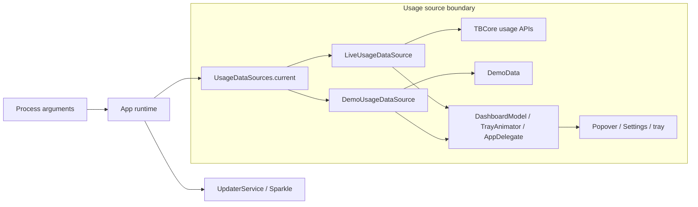

# Synthetic `--demo` usage mode

> `--demo` 是 maintainer-only 的隱藏啟動旗標，用來在不需要 usage-provider network 或 OAuth credentials 的情況下驗證 UI 與截圖；它不是一般使用者功能，也不改變正式資料來源。

## 目錄

- [文件目的](#文件目的)
- [旗標與建置範圍](#旗標與建置範圍)
- [資料邊界](#資料邊界)
- [啟動命令](#啟動命令)
- [Synthetic 資料語意](#synthetic-資料語意)
- [驗證方式](#驗證方式)

---

## 文件目的

這份文件記錄 native TokenBar 的 synthetic usage mode：旗標如何選擇資料來源、哪些 usage surface 會被替換、哪些服務維持正常 runtime，以及 maintainer 應如何取得 selftest 與 GUI evidence。Synthetic fixture 位於 `Sources/TokenBar/DemoData.swift`，不依賴本機 usage logs、usage-provider network 或 Rust usage FFI。

## 旗標與建置範圍

`--demo` 在 process 啟動時由 `UsageDataSources.current` 只選一次。所有可啟動 TokenBar 的 build 形態都接受同一個旗標；旗標不寫入 `UserDefaults`，重新啟動時必須再次傳入。

| Build 形態 | 入口 | 用途 |
|---|---|---|
| Debug SwiftPM | `swift run TokenBar --demo` | 日常開發；啟動後點擊新增的 status item 驗證 popover |
| Debug settings | `swift run TokenBar --demo --settings` | 驗證 Settings preview、quota 與 trace |
| Release SwiftPM | `swift run -c release TokenBar --demo` | 驗證 release optimization 下的資料流 |
| Bundled `.app` | `open dist/TokenBar.app --args --demo` | 驗證實際 Sparkle、resource bundle 與 menu-bar app |

> **注意：** `--demo` 是 maintainer-only hidden flag。不要在公開設定頁、README 或一般使用者文件中把它描述成支援的產品模式。

## 資料邊界

正常 app runtime 不再由各個 view 或 poller 直接呼叫 `TBCore`。所有 usage API 都經過 app-level `UsageDataSource`；live source 由 `LiveUsageDataSource` 集中處理 FFI，demo source 只讀 `DemoData`。



| Surface | `--demo` 行為 | 是否呼叫 live FFI |
|---|---|---:|
| Graph、model、hourly、agents | 回傳 synthetic payload/report | 否 |
| Agent quota | 回傳所有 registered clients 的 synthetic windows | 否 |
| Live trace、tokens/min | 回傳非空 synthetic rows 與正值 rate | 否 |
| Popover、Settings | 使用注入的 `DashboardModel` source | 否 |
| Tray title、gauge、animation | 使用同一 process source 的 graph、quota、rate | 否 |
| Sparkle update service | 維持原本 updater 行為 | 不屬於 usage source |
| `--smoke` CLI | 仍執行明確的 live FFI smoke flow | 是 |

`Smoke.swift` 是刻意保留的 CLI gate，不是正常 menu-bar runtime。這個邊界讓 `grep` 對 app usage call sites 時，直接的八個 `TBCore` usage API 只會出現在 `LiveUsageDataSource` 與 smoke gate。

## 啟動命令

先以 repo root 建置 Rust staticlib 與 Swift executable，再傳入旗標。一般 Debug 截圖先啟動 app，再點擊新增的 TokenBar status item 開啟 popover：

```bash
make build
swift run TokenBar --demo
```

Settings window 可獨立啟動：

```bash
swift run TokenBar --demo --settings
```

> **注意：** 既有 `--open-popover` launch-time screenshot hook 在 remote-hosted status item 尚未建立可用 anchor 時可能不會開啟 popover，不能作為 demo mode 的 correctness gate。GUI 驗證以啟動 `--demo` 後實際點擊該測試 process 的 status item 為準。

要驗證實際 `.app` bundle，先走既有 bundle build，再以 `open` 傳入旗標：

```bash
make bundle
open dist/TokenBar.app --args --demo
```

要同時預選 year 或 client tab，可把既有 debug flags 接在 `--demo` 後面：

```bash
swift run TokenBar --demo --year=2025 --tab=claude
```

## Synthetic 資料語意

Fixture 以 `ClientRegistry.allIds` 為唯一 client universe。每個 contribution day 都有每個 registered client 的 stripe，因此 summary、contributions、model report、hourly report、agents report、trace 與 quota snapshots 可以在同一集合上交叉驗證。

| 操作 | Synthetic 行為 |
|---|---|
| All years（`year == nil`） | 產生 14 天 rolling window，最後一天是 local today |
| Current year | 以 local today 為結尾，從 Jan 1 起最多 14 天；年初可能少於 14 天 |
| 其他明確 year | 產生該年內連續 14 天，結尾固定在該年年末，避免跨年 |
| Manual refresh | 重新經過 `DemoUsageDataSource.refreshGraph` 讀取 synthetic source，不會觸碰 live logs |
| Models lens | 每個 registered client 有非空 model row |
| Daily lens | 使用 contribution stripes 與同一組 client IDs |
| Hourly lens | 每個 client 有非空 hourly slot；client filter 仍在 source 邊界套用 |
| Agents lens | 每個 client 有非空 synthetic agent row |
| Live session lens | 每個 client 有正值 trace bucket 與 tokens/min |
| Tray title | graph title、tokens/min title、quota title 都有可顯示資料 |
| Tray gauge / animation | quota windows 與正值 rate 讓 gauge、frame speed 不會停在空資料狀態 |

Year filter 的重要條件是：其他 year 也一定產生包含所選 year 的 `payload.years`。因此 `DashboardModel.apply` 不會把 synthetic year 判定為空資料後清回 All years。

## 驗證方式

`SelfTest` 是 hermetic data-contract gate，不會啟動 AppKit GUI，也不需要本機 usage logs。它會透過 `DemoData` 與 `DemoUsageDataSource` 檢查 source factory、14 天排序與連續性、summary totals、client 集合、四種 reports、trace、quota windows、positive rate，以及 nil/current/other year semantics。

```bash
swift run TokenBar --selftest
```

GUI evidence 則需要明確啟動 app，點擊該測試 process 的 status item，並確認六個 lenses、client tabs、quota card、trace card、tray title、gauge 與 animation 實際渲染；Settings 可用第二個命令自動開啟：

```bash
swift run TokenBar --demo
swift run TokenBar --demo --settings
```

> **限制：** `swift run TokenBar --demo --smoke` 會先命中 `main.swift` 的 `--smoke` 分支，執行 live FFI smoke，而不是啟動 demo source。這個組合只能用來驗證 FFI smoke；它不能證明 demo mode 的 no-live 邊界，也不應用作 GUI evidence。

Selftest 綠燈代表 synthetic contract 與 source wiring 通過；它不取代實際 menu-bar runtime、Sparkle bundle、AppKit rendering 或 resource loading 的 GUI 檢查。
