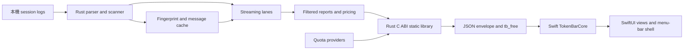
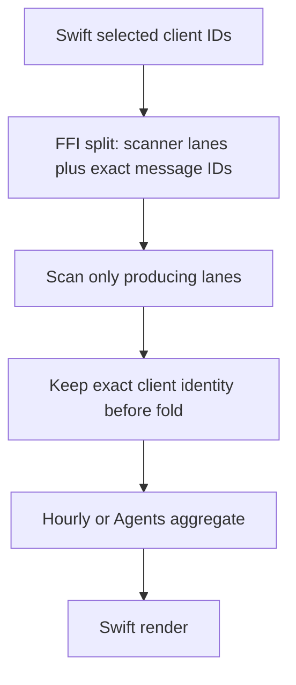

# Runtime architecture and data flow

## 文件目的

這份文件描述 TokenBar native app 的資料 ownership、Rust 到 Swift 的邊界，以及 streaming、cache、pricing、quota 與預聚合報表如何共同形成 UI 可讀的資料。它是架構摘要，不取代 `ctb.h`、FFI 實作或 shared-engine source code。

## 目錄

- [Ownership map](#ownership-map)
- [FFI data flow](#ffi-data-flow)
- [Windows downstream consumer](#windows-downstream-consumer)
- [Streaming and cache](#streaming-and-cache)
- [Pre-aggregation filters](#pre-aggregation-filters)
- [Pricing and quota boundaries](#pricing-and-quota-boundaries)
- [Swift presentation layer](#swift-presentation-layer)
- [Change checklist](#change-checklist)

---

## Ownership map

| Layer | Source of truth | Responsibility | Must not become |
|---|---|---|---|
| Shared Rust engine | Public `tokscale-core`; pinned at `vendor/tokscale-core/` | Session discovery, parsing, deduplication, pricing, aggregation, and cache-compatible domain values | Consumer-local source edits or an unreviewed gitlink advance |
| Rust FFI | `crates/tb_core_ffi/` | Stable C-callable entry points, report options, quota-history sampling and evaluation, panic boundary, JSON serialization, and static-library linkage | A second Swift-side parser or an implicit UI filter |
| C ABI | `Sources/CTB/include/ctb.h` | Function signatures, ownership notes, JSON envelope contract, and `tb_free` declaration | An autogenerated contract whose drift is not reviewed |
| Swift core | `Sources/TokenBarCore/` | Decode FFI payloads and own UI-free calculations such as day bars, grid layout, pace, quota selection, and display formatting | A place to recompute Rust aggregates from raw sessions |
| Swift app | `Sources/TokenBar/` | AppKit menu-bar shell, SwiftUI views, polling lifecycle, settings, and Sparkle integration | A place to silently correct an upstream aggregate after it is already mixed |
| Landing site | `landing/` | Static product presentation and localized copy | A duplicate source for runtime behavior |

## FFI data flow



Rust owns the raw-session interpretation and all expensive aggregation. Swift calls the blocking FFI entry points away from the main actor, decodes the returned heap JSON, and frees the pointer through `tb_free`. Successful calls use `{"ok":true,"data":...}`; failures use `{"ok":false,"err":"..."}`. `tb_probe` keeps its legacy shape for the smoke path.

> **核心不變量：** Rust 產生的 payload 是跨語言契約。Swift 可以格式化、排序或選擇顯示視角，但不能假設自己能從已預聚合的數字反推出每個 client 的貢獻。

Provider diagnostics and `publicationGeneration` are additive optional wire data. PT0 does not change C ABI signatures or pointer ownership; existing envelope and `tb_free` semantics remain authoritative. Rust assigns the generation with a checked increment at process-wide publication-gate entry before the provider run, then keeps that gate through JSON serialization, envelope construction, and raw pointer creation. Exhaustion fails the outer call instead of publishing a duplicate generation. The gate is released before the extern function returns, so it orders publication generations but cannot guarantee C return order. A process-lifetime `@MainActor` publication coordinator is shared by DashboardModel, Settings, the independent tray poller, and snapshot restore; it resolves a lower generated payload to the latest complete payload before any consumer applies scalar or presentation state. Dashboard polling immediately reconciles an accepted payload into the shared scalar, and TrayAnimator reads the coordinator's latest generated payload even before its own five-minute poll returns, so presentation and persistence cannot remain on an older generation. The scalar is part of TrayAnimator's icon-settings signature, making its UserDefaults notification synchronously invalidate the gauge instead of waiting for the 30-second appearance loop. Payloads without a generation remain legacy/demo pass-through.

The issue-107 `tb_filter_parity_probe` is a separate additive diagnostic. Rust owns one `LocalSourceContext`, obtains a fresh graph (never `graph_cached`) to derive the full client list, and brackets `hourly(nil)`, `hourly(full)`, `agents(nil)`, and `agents(full)` with the opaque `local_source_change_token` sequence `token0…token5`. Stable pairs classify as `match` or bounded integer/message aggregate `mismatch`; cost remains in the diagnostic delta but cannot decide parity because pricing refreshes independently from the source-generation token. Any known adjacent token difference classifies the affected result as `sourceChanged`, while a token-probe failure classifies it as `tokenUnavailable`. An Agents-only later change does not rewrite an already stable hourly result. The payload contains only aggregate counts/tokens/cost and status fields; it does not cross raw client, model, agent, workspace, message, cache, credential, provider, or path text. Swift decodes the typed envelope and smoke output is limited to `MATCH`, `MISMATCH`, `SOURCE_CHANGED / SKIP`, or `TOKEN_UNAVAILABLE / SKIP` labels.

## Windows downstream consumer

C ABI 有第二個消費者：Windows port（[Nanako0129/TokenBar-Windows](https://github.com/Nanako0129/TokenBar-Windows)，WinUI 3 + C#）。兩個 default branch 現在都 pin reviewed engine commit `84e0d66413d4e0d87b734f66f7a848b3bc323258`；Windows 於 [PR #20](https://github.com/Nanako0129/TokenBar-Windows/pull/20)（merge `eb3a7f3`）完成其 consumer migration 與 gates。Shared parser／cache／aggregation changes belong in `tokscale-core`; each app repository owns its own `tb_core_ffi`、C header、Swift／C# bridge and build wiring. Windows 的 `vendor/ENGINE.md` records its consumer pin and historical sync provenance.

| 不變量 | 規則 |
|---|---|
| Sync 方向 | Shared-engine fixes land in `tokscale-core`; each consumer advances only a reviewed gitlink. App-owned FFI／header changes land in Native, then are ported and independently verified in Windows |
| `crate-type` | `tb_core_ffi` 的 `["cdylib", "staticlib"]` 兩者都必須保留：cdylib 供 C# P/Invoke（與 Windows repo 在 macOS 上的測試迴圈）載入，staticlib 供 SwiftPM 連結。單獨移除任何一個都會斷一邊 |
| `ctb.h` 簽名 | 簽名變更＝跨 repo breaking change。P/Invoke 綁定沒有編譯期檢查，參數數量錯誤到執行期才以垃圾指標顯現（先例：`tb_hourly_report`/`tb_agents_report` 新增 `clients` 參數）。變更 `ctb.h` 時把 Windows port 視為必須通知的消費者 |
| Build-infra 選型 | The engine's reqwest TLS selection（0.13 `rustls`＝rustls-platform-verifier）partly reflects Windows build constraints（vendored OpenSSL requires Perl+NASM）；the exact rationale remains in the engine's immutable [`UPSTREAM.md`](https://github.com/Nanako0129/tokscale-core/blob/84e0d66413d4e0d87b734f66f7a848b3bc323258/UPSTREAM.md) |
| 邏輯層對拍 | `Sources/TokenBarCore` 在 Windows 側有 C# 逐檔移植；語意變更後的跨語言驗證見 [`verification.md`](verification.md) |
| Additive payload fields | `publicationGeneration` is an unknown-field-compatible optional addition; the M19-B1 Windows production-decoder fixture passed without adding the field to the Windows DTO or changing a C ABI signature |
| Secure local quota storage | `agent_storage_windows` is cfg-gated shared Rust source, not a Windows-repo-only patch. Production account scope and v3 history use CNG randomness, an exact protected DACL for the current user plus LocalSystem, final-component no-reparse opens, disk/type checks, volume plus full 128-bit file identity, no-delete-share exclusive locks, verified atomic replacement, and collision-safe hard-link quarantine. Ancestor reparse points remain allowed only below the trusted per-user platform data-directory anchor; same-SID malicious processes are outside the claim |

M19-B0 canonicalized this storage ownership in Native without changing `ctb.h`, Swift, provider transport, or serialized cache behavior. M19-B1 then merged the final Native corrections in [PR #102](https://github.com/Nanako0129/TokenBar/pull/102) at `4dfed5ff` and pinned that exact source in [Windows PR #7](https://github.com/Nanako0129/TokenBar-Windows/pull/7), merged at `f29d3b35`. At that checkpoint the 17 shared crate files、63 runtime engine files、header 與兩份 provider-v3 fixture copies were byte-identical; Windows added only its provenance file and retained no shared-tree local patch. Hosted x64 runtime／cross-check gates and a separate real ARM64 run of 351 Rust tests、12 provider-v3 CrossCheck cases、PE checks與 synthetic WinUI startup passed.

The later shared-engine extraction preserved that exact source in `tokscale-core`. Native PR #114 merge checkpoint `704426e8df9acfb8e82fe4bf3b7ed3e5adbc2fea` and Windows PR #12 merge checkpoint `26492a5b615fed9378034e7bb56bc5aeccf5d368` pin the same engine commit. Windows PR #12 also passed the GitHub ARM64 cross-package gate and a separate native ARM64 run of the packaged FFI surfaces. Same-pin equality proves shared-source parity, but app-owned FFI／Swift／C# changes still require the cross-port checks in [`verification.md`](verification.md).

## Streaming and cache

The local streaming path is a cache-aware, per-file pass. Each client lane parses only the sources selected for the report, applies its own dedup semantics, and feeds report sinks without materializing the entire history into one `Vec`. The materialized APIs remain where they are needed for compatibility, but new report consumers should use the streaming driver when the local implementation provides it.

| Stage | Decision | Why it matters |
|---|---|---|
| Source identity | Fingerprint the source and relevant siblings | A metadata-only rewrite must invalidate a cached parse |
| Change probe | Compare the latest source mtime, including SQLite WAL or parser-specific siblings | A cache hit must not hide a live-tail write |
| Mtime pruning | Keep append-only and SQLite-backed lanes according to their source semantics | Main-file mtime is not sufficient for WAL or sibling updates |
| Message cache | Rebuild when serialized parser output or resume state changes | Cache schema is **32** after the Grok `turn_completed.usage` path (was 31 after M16); the counter belongs to the shared engine and must not mirror tokscale upstream numbers |
| Report fold | Feed filtered, deduped, priced messages into report-specific sinks | All report consumers need a documented arithmetic and client-set contract |

A parser that reads a secondary file must update all four related seams together: fingerprint, active lane, latest-mtime probe, and mtime pruning. SQLite lanes also probe the WAL. This is the sibling rule captured in [`verification.md`](verification.md) and [`vendor-tokscale.md`](vendor-tokscale.md).

### Kiro globalStorage precedence

The M15-A macOS Kiro IDE lane is a special multi-source lane, not a normal per-file dedup pass. The scanner discovers the two macOS `globalStorage/kiro.kiroagent` casing roots and follows the known storage layouts: direct `<workspace>/*.chat` snapshots, `.json` or extensionless execution records one store directory deeper, and `workspace-sessions/<workspace>/*.json`. Deeper mirrored-project trees, root-level JSON/extensionless artifacts, index databases, and unrelated extensions are excluded. Generic role/content traversal is `.chat`-only; JSON and extensionless sources must match an execution shape, and workspace-session parsing is gated to the exact `workspace-sessions/<workspace>/*.json` subtree. Parsing keeps snapshots, successful execution records (including status-bearing non-`.chat` `context.messages` records without an `actions` array), and workspace-session records as separate raw source messages. Numeric-string execution epochs use the same seconds-versus-milliseconds discrimination as JSON numbers. A legacy `.chat` snapshot is not reclassified as an execution by `status` alone. Workspace-session attribution comes from the nested workspace component rather than the literal `workspace-sessions` directory.

The source of truth for precedence is the raw batch, not a downstream report. Materialized and streaming consumers follow the same order:

```text
scan -> fingerprint/cache raw messages per source -> collect every Kiro source
     -> suppress snapshots covered by successful executions
     -> cohort-scoped exact dedup -> refresh derived fields -> reprice
     -> exact client gate -> report/date filter -> sink/report fold
```

Suppressed snapshots are never written as an aggregate cache value. A later execution failure, rewrite, or removal can therefore invalidate only that execution source and reveal the still-cached raw snapshot. Source paths remain attached through suppression and exact deduplication, so only execution messages parsed from globalStorage or `.chat` sources seed suppression and only IDE-cohort messages are eligible suppression targets, while identical dedup strings are scoped to the IDE or CLI cohort and successful execution dedup is additionally workspace-scoped; Kiro CLI and SQLite keys cannot be suppressed by, suppress, or collide with IDE snapshots, and repeated execution IDs in different workspaces remain distinct usage. Count and representative model/monthly/hourly/Agents reports consume the same post-suppression identity, preserving model, session, workspace, timestamp, duration, and message-count parity. Kiro globalStorage has no related JSONL sibling, so each primary file mtime is its change signal. Because precedence crosses files, `modified_after` retains the complete IDE cohort whenever any IDE source passes the threshold; this keeps older authoritative executions available to suppress newer snapshots. Kiro CLI sources remain independently prunable, and missing-file stat remains fail-open.

## Pre-aggregation filters

A filter is correct only when it reaches the layer that still has client identity. Graph and model reports can filter at their message or lane boundary. Hourly and Agents reports may otherwise contain mixed buckets that have already combined several clients; a Swift membership test on the final bucket cannot subtract one client from that total.

`TBCore.withYearAndClients` passes a non-empty client selection through the C ABI to Rust, where the hourly and Agents scans filter before folding mixed buckets. The `ctb.h` contract defines `nil` or an empty client list as all clients. The all-hidden case is rejected by the Swift lens's strict membership view rather than encoded as an empty FFI deny-list.



Dynamic IDs need explicit vocabulary handling. For example, `cc-mirror/*` is a produced message ID rather than a scanner lane, so the request expands to the producing Claude lane and retains only the exact requested IDs at the fold gate. Canonical IDs, trace IDs, aliases, and quota aliases must not be conflated by a generic suffix strip.

> **預聚合警告：** 「隱藏 client 等於不存在」不能靠 view 層過濾完成。對 `TBCore.withYearAndClients` 對應的 hourly／Agents 報表，non-empty partial selection 必須在 Rust fold 前排除未選 client；`ctb.h` 的 `nil`／empty clients 明定為 all clients。all-hidden 狀態由 Swift lens 的 strict membership 阻擋。若要改變 empty semantics，必須同步遷移 Swift、C ABI、Rust 與 tests。

## Pricing and quota boundaries

Pricing and quota are separate flows. Shared-engine tokscale pricing resolves model cost and cache rates for parsed messages; the FFI quota modules fetch provider windows and return a quota payload. A quota card does not imply that the provider stores local token history, and a local parser does not imply that a provider quota endpoint is available.

| Data | Computed by | Swift expectation |
|---|---|---|
| Token counts, model cost, active days | Rust core and FFI reports | Decode and display; do not reprice raw sessions |
| Price freshness | Shared-engine pricing service | Show the timestamp supplied by the model report |
| OAuth or subscription windows | Rust FFI provider modules | Preserve only same-binding last-good data for transient failures and display the current actionable error alongside fallback windows；without a trusted fallback, display the error-only snapshot |
| Quota account scope | Rust `agent_account_scope` | Treat the opaque scope as history identity only；do not derive it from labels、paths or token hashes |
| Duration lifecycle and historical pace | Rust `agent_quota_duration` and `agent_quota_history` | Decode typed `paceStatus` and the optional coherent expected／ETA／will-last／risk result；do not recompute historical output |
| Tray quota selection | Swift `QuotaResolver` | Select from already decoded windows by `clientId|cardId`；do not make a second provider request |
| Linear pace policy | Swift `TokenBarCore` | Use Rust-owned positive `durationSeconds` only for explicit Linear mode or `learningHistory`；never revive `learningDuration`、`unavailable` or legacy payloads from `windowMinutes` |

Authoritative provider-reported costs use the shared engine's cost-provenance contract. The engine cache schema must be bumped whenever serialized message output changes, while report-time-only arithmetic changes do not require a cache bump.

Provider quota transport has one Rust source of truth. Process-memory last-good snapshots are keyed by canonical client plus opaque `ProviderCacheBinding`; fallback is allowed only for a structural same-binding transient on an actual request-bearing credential and route: timeout, connect, body I/O, rate limit, or 5xx. A fallback keeps the clean display-ready snapshot's `updatedAt`, windows, identity, credits, pace, and source, and adds the current user-visible `error` plus optional `transportDiagnostic`; account scope becomes untrusted, and the result is not enriched, written to history, or re-cached. Terminal, absent/logout, 401/403/other 4xx, schema contradiction, invalid required meters, unbound transient, and binding mismatch clear the snapshot. Refresh write-back is optimistic and target-bound: Claude, Codex, Grok, and Antigravity re-read the current credential store, refuse a stale target after logout or account switch, and preserve unrelated sibling changes. Claude, Grok, and Antigravity make an unchanged-target persistence failure fresh but uncacheable. Codex keeps save failure terminal, persists the validated current root before lineage transfer, and attempts a compare-then-rollback if transfer fails. External writers can still race the rollback comparison and atomic rename, and credentials plus metadata do not claim filesystem CAS or cross-resource crash atomicity. Grok monthly data remains additive best-effort; absent Copilot or Grok data is not revived.

The Claude plan label is live provider state, not credential state. `claudeAiOauth.subscriptionType` in the `Claude Code-credentials` store is a login-time snapshot the Claude CLI never rewrites on a subscription change, and the `oauth/usage` body carries no plan field, so an upgraded account would otherwise display its old plan forever. The OAuth path reads `oauth/profile` and derives the label from `organization.organization_type` plus the multiplier suffix of `organization.rate_limit_tier`; the credential snapshot remains the fallback, and the `setup-token` header-probe path keeps using it because those tokens lack `user:profile`. The lookup is optional enrichment on the shared publication path, so it is bounded by its own 5s timeout inside the 30s usage request, and both plans and failures are cached for one hour keyed on the verified `AccountScope` rather than the access token. Caching the failure is what prevents an unreachable endpoint from re-costing a request on every poll, and the account-scoped key keeps a routine token refresh from discarding the last known live plan while still refusing to serve another account's. A live response naming no plan is not a failure and does not resurrect the cached label. A rotation performed externally by the Claude CLI fragments the scope by design, so the retained plan is dropped and that window falls back to the credential snapshot.

The diagnostic wire is additive and bounded to `{category,status?,osCode?}`. Categories are limited to `timeout`, `dns`, `tls`, `connectionRefused`, `connectionReset`, `connect`, `request`, `responseBody`, `rateLimited`, and `serverError`; `status` is accepted only as `429` for `rateLimited` or `500...599` for `serverError`, and those HTTP categories do not carry `osCode`. Non-HTTP categories do not carry `status`; unknown categories produce a category-only `unknown` candidate. Swift drops malformed optional integer fields individually, while a non-object diagnostic or missing/non-string category produces no candidate. Free-form causes, bodies, URLs or queries, headers, tokens, emails, account IDs, and credential paths do not cross the boundary. `tb_agent_usage` is process-wide single-flight across the complete provider run, JSON serialization, envelope construction, and raw C-pointer publication; its Rust gate assigns `publicationGeneration` with a checked increment and returns an outer error on exhaustion rather than reusing a value. The gate releases before the extern function returns, so it does not guarantee C return order. The shared `@MainActor` publication coordinator owns stale-generation rejection for dashboard, Settings, tray, and snapshot consumers; providers may still run concurrently within one invocation.

Provider-wide history uses `quota-pace-history-v3.json` keyed by provider、opaque account scope and semantic window key. Rust owns duration evidence、sampling、retention、expected pace、ETA、will-last and risk；Swift owns mode selection、display stage and copy. The installation HMAC key is an exact 32-byte owner-only file in the hardened per-user application-data directory, creation is atomic and cross-process locked, and every resolution reloads the persisted winner without a process cache. On macOS／Unix the directory is `0700` and files are `0600`; on Windows the key is generated by system-preferred CNG and the directory, key, metadata, refresh locks, and v3 history use the exact protected current-user／LocalSystem DACL plus secure-handle identity contract. Existing Windows objects are never repaired in place: an insecure preferred root selects the sticky `.secure` sibling, and insecure legacy v2 input remains untouched and is not imported. The old development Keychain item is ignored. Codex v2 remains read-only migration input only when it satisfies the active platform storage contract and matches the current account byte-for-byte；v1 is never imported and both legacy files remain untouched.

Pricing metadata is refreshable rather than frozen for the process lifetime; the current refresh cadence is approximately one hour. When provider-hinted lookup selects an entry without cache rates, local cache-rate backfill preserves the correct cache pricing.

## Swift presentation layer

SwiftUI owns the seven dashboard lenses, settings, menu-bar title, quota icon, animation, and lifecycle of the popover and settings window. `DashboardModel` coordinates initial load, lazy hourly and Agents reports, year selection, snapshot reuse, stale-data retention, and poll cancellation. A process-lifetime `@MainActor` publication coordinator applies the Rust `publicationGeneration` guard across the popover and Settings models, snapshot restore, and TrayAnimator's independent poller before any payload or scalar is stored. Dashboard polling reconciles the accepted payload into the shared scalar, while TrayAnimator's payload getter prefers the coordinator's latest generated payload over an older result from its own poller. The persistent scalar participates in the tray icon signature, so that write triggers immediate gauge rendering and the app-level defaults observer refreshes the title; missing generations remain direct demo/legacy values and are not persisted. Settings reconciliation is keyed by generation plus selection/exclusions, or by generated timestamp plus resolved-scalar fingerprint for legacy payloads, so distinct payloads cannot collide on `generatedAt` alone. The app shell must stop hidden-window polling when the window is closed; otherwise an apparently idle menu-bar utility can keep rendering and consuming CPU.

Individual client status items remain an app-owned presentation layer. `ClientTray` reads exactly two bounded defaults (`tokenbar.tray.clients.enabled` and `tokenbar.tray.clients.quotaSelections`), derives shell existence from the last successful graph's canonical clients plus tab visibility and loadable official-brand assets, and resolves display values only from `TrayAnimator.quota`'s latest accepted payload. Settings pins its independent `DashboardModel` to the all-time graph (`initialYear: nil`), matching AppDelegate's tray-reconciliation universe even when the dashboard's persisted year is scoped；it treats an agent entry in the quota payload as the capability signal even when the current snapshot contains only an error and zero windows, so supported clients remain configurable during a temporary provider outage and show `—%`. The one explicit quota lookup alias maps the `antigravity-cli` usage identity to the shared `antigravity` provider snapshot; process identity, tab visibility, route, placement, preference key, and icon identity remain the exact `antigravity-cli` ID. Shell existence is deliberately independent from quota success: a temporarily missing client snapshot or explicit card keeps the enabled item and displays `—%`; no per-client scalar, provider fetch, timer, animator, popover, or `DashboardModel` is created. Auto selection is scoped to one mapped provider snapshot, while an explicit stable `cardId` may use that same binding's fallback window and never falls back to Auto or a legacy label；when that fallback comes from an error snapshot, runtime status, tooltip, and accessibility copy identify the percentage as last-known rather than current.

`StatusItemController` owns the main item, every static client `NSStatusItem`, and the single shared `NSPopover`. Client identity uses the exact canonical ID (`client:<id>` in-process and `tokenbar-client-<id>` for AppKit autosave placement); icon aliases affect resource lookup only. One process-lifetime route memory holds two disjoint per-client lens maps, one owned by the main item and one by the individual items, and records into whichever surface currently owns the popover. Navigating either surface therefore never decides what the other opens on: the main item restores its own client-plus-lens route (including its own last lens for each client tab it has visited), while an individual item restores only that client item's own lens and defaults to Overview until that item itself has been opened. A single shared map cannot express this — whichever surface moved last would win, and a first click on a client item would inherit the lens the previous session persisted for the main item. The memory adds no third default and resets on app relaunch. Settings mutates the two M2 raw values through its observed `@AppStorage` properties, and the app-level defaults observer coalesces tray reconciliation onto the next main-queue turn；the switch state therefore commits before potentially slower `NSStatusItem` creation and static 1x／2x image rendering. `SMAppService.mainApp.status` must not run in a SwiftUI stored-property initializer：`SettingsPanel` value reconstruction occurs on every observed setting change, and direct measurement on macOS 26.5.2 showed each status query taking approximately 0.5～0.9 seconds. Autostart state starts inert and is queried once per panel appearance from a utility detached task；a successful user mutation marks the in-flight read stale before the view task may commit it. Re-anchoring retains the live popover and re-clamps its height against the destination item's screen, while the main item's left-click toggle and right-click global quota menu remain unchanged. Official status icons are one static `NSImage` containing 1x and 2x representations generated at item creation, with no display observer or continuous renderer.

`Package.swift` links the Rust static library from `target/release`, so the build must run from the repository root after Rust has produced the library. The Makefile is the local build-order source and contains the stale-executable relink guard for SwiftPM's incomplete static-library dependency tracking.

Swift treats a successful outer payload's finite quota scalar as authoritative: fresh values replace both memory and persistent scalar; terminal, absent, unresolved, or hidden-all results clear them; selection or exclusion changes re-resolve the same successful payload before render; only an outer FFI failure or missing payload retains the old scalar. Explicit selection may use same-binding fallback windows with an error, while Auto excludes providers carrying an error. Diagnostic decoding is lossy: malformed optional integer fields are dropped individually; non-object diagnostics or missing/non-string categories produce no candidate; unknown categories and client strings normalize to `unknown`, and public logs contain only bounded fields. An `ok:false` agent-usage envelope is classified as a fixed bridge failure, while malformed JSON or `ok:true` without data is a fixed decode failure; associated bridge, panic, decode, and provider error text is not public-logged.

## Localization

翻譯以 legacy `.strings` 提供，來源是 `Sources/TokenBar/Resources/Localizations/<lang>.lproj/Localizable.strings`（例如 [`zh-Hant`](../../Sources/TokenBar/Resources/Localizations/zh-Hant.lproj/Localizable.strings)）。[`scripts/bundle.sh`](../../scripts/bundle.sh) 將它們安裝進 `TokenBar.app/Contents/Resources/`；[`Makefile`](../../Makefile) 複製到 `.build/<config>/`，而裸 `swift run` 會在啟動前從 SwiftPM 的 `TokenBar_TokenBar.bundle` 將 `.lproj` 暫存到執行檔旁，讓 SwiftUI 的 `LocalizedStringKey` 與 `Bundle.main` 都能查到。`String.localized` 另外會查找該 SwiftPM resource bundle，供 direct run 與 cross-module pace 文案共用同一份查表來源。

| 契約 | 規則 |
|---|---|
| Key | 英文原文即 key。缺項時原樣顯示英文，因此不存在「翻一半壞掉」的狀態；`Format` 的兩個日期樣板在英文下同形（都是 `%1$@ %2$lld`），只有這類無法以原文當 key 的情況才用語意 key 搭 `NSLocalizedString(value:)` 的英文 fallback |
| 自動 vs 手動 | SwiftUI 的字串**字面值**選到 `LocalizedStringKey` overload，自動查表；`Text(someString)` 選到的是 verbatim overload，永遠不會在地化。收 `String` 的共用 helper（`SettingsPanel` 的 `section`／`row`／`hint`／`radioGroup`、`Cards.swift` 的 `DashCard`）在 helper 內部收斂一次 `.localized`，勝過每個呼叫端各加一次 |
| 識別碼不譯 | `window.label` 參與 `QuotaResolver` 的 legacy selection 遷移，client／model 名是資料。一律只在**顯示端**查表，payload 與持久化值保持英文原文 |
| 語序 | 整句一個 key，不可拆成單詞各自翻譯——中文需要量詞與不同語序。英文單複數以兩個完整 key 分支表達 |
| 工具位置 | `String.localized` 系列住在 [`Sources/TokenBarCore/Localization.swift`](../../Sources/TokenBarCore/Localization.swift)（`public`），因為 pace 文案在 `UsagePace` 組成，且 `CrossCheckHarness` 連結該模組即可取得，不需額外 symlink。`AppLanguage`（語言選單）留在 TokenBar target |
| 多片段組合 | pace 文案由 `status`／`label`／`etaText`／`riskText` 各自查表後以 `" · "` 串接。分隔符與語言無關，因此逐**片段**翻譯是安全的——每個片段是完整語意單元，與被禁止的逐**單詞**拆解不同 |
| 語系鎖定 | `Format` 與 `UsagePace.durationText` 具語系相依，而後者是 cross-check 案例。selftest 與 cross-check 一律以 `-AppleLanguages "(en)"` 執行；harness 對此 fail closed（只認該選項並驗證 `preferredLocalizations`），寧可拒跑也不產生對不上的在地化輸出 |

## Change checklist

| Question | Evidence required |
|---|---|
| Does the change add user-facing copy? | 英文原文可當 key（或有 `value:` fallback）、整句未被拆詞、識別碼未被翻譯 |
| Does the change alter parsed messages, dedup keys, agent attribution, or cost provenance? | Hermetic old-fail/new-pass fixture and an intentional cache-schema decision |
| Does the change cross Rust, C, and Swift? | `ctb.h`, FFI mapper, additive-generation Swift decoder/apply guard, nested payload parity test or smoke evidence, and downstream Windows handoff |
| Does a report hide or select clients? | Source-to-consumer matrix, ID vocabulary check, and pre-aggregation filter test |
| Does a parser read siblings or WAL? | Fingerprint, lane, mtime, and pruning coverage |
| Does a UI lifecycle change start or stop polling? | Closed-window CPU/render evidence and cancellation regression |
