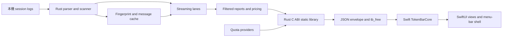
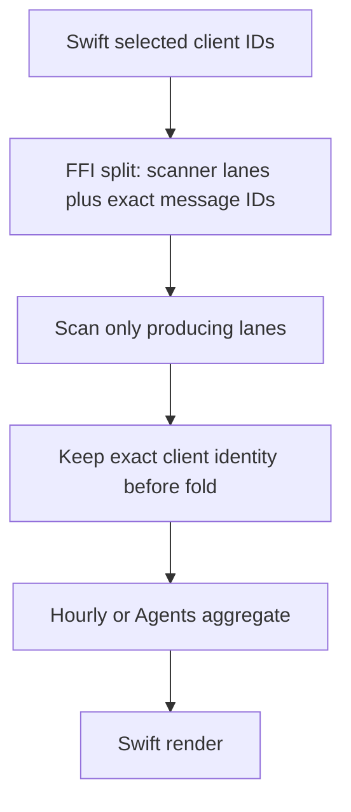

# Runtime architecture and data flow

## 文件目的

這份文件描述 TokenBar native app 的資料 ownership、Rust 到 Swift 的邊界，以及 streaming、cache、pricing、quota 與預聚合報表如何共同形成 UI 可讀的資料。它是架構摘要，不取代 `ctb.h`、FFI 實作或 shared-engine source code。

## 目錄

- [Ownership map](#ownership-map)
- [FFI data flow](#ffi-data-flow)
- [Windows downstream consumer](#windows-downstream-consumer)
- [Streaming and cache](#streaming-and-cache)
- [Pre-aggregation filters](#pre-aggregation-filters)
- [Pricing and quota boundaries](#pricing-and-quota-boundaries)
- [Usage attribution](#usage-attribution)
- [Swift presentation layer](#swift-presentation-layer)
- [Change checklist](#change-checklist)

---

## Ownership map

| Layer | Source of truth | Responsibility | Must not become |
|---|---|---|---|
| Shared Rust engine | Public `tokscale-core`; pinned at `vendor/tokscale-core/` | Session discovery, parsing, deduplication, pricing, aggregation, and cache-compatible domain values | Consumer-local source edits or an unreviewed gitlink advance |
| Rust FFI | `crates/tb_core_ffi/` | Stable C-callable entry points, report options, quota-history sampling and evaluation, panic boundary, JSON serialization, and static-library linkage | A second Swift-side parser or an implicit UI filter |
| C ABI | `Sources/CTB/include/ctb.h` | Function signatures, ownership notes, JSON envelope contract, and `tb_free` declaration | An autogenerated contract whose drift is not reviewed |
| Swift core | `Sources/TokenBarCore/` | Decode FFI payloads and own UI-free calculations such as day bars, grid layout, pace, quota selection, and display formatting | A place to recompute Rust aggregates from raw sessions |
| Swift app | `Sources/TokenBar/` | AppKit menu-bar shell, SwiftUI views, polling lifecycle, settings, and Sparkle integration | A place to silently correct an upstream aggregate after it is already mixed |
| Landing site | `landing/` | Static product presentation and localized copy | A duplicate source for runtime behavior |

## FFI data flow



Rust owns the raw-session interpretation and all expensive aggregation. Swift calls the blocking FFI entry points away from the main actor, decodes the returned heap JSON, and frees the pointer through `tb_free`. Successful calls use `{"ok":true,"data":...}`; failures use `{"ok":false,"err":"..."}`. `tb_probe` keeps its legacy shape for the smoke path.

> **核心不變量：** Rust 產生的 payload 是跨語言契約。Swift 可以格式化、排序或選擇顯示視角，但不能假設自己能從已預聚合的數字反推出每個 client 的貢獻。

Provider diagnostics and `publicationGeneration` are additive optional wire data. PT0 does not change C ABI signatures or pointer ownership; existing envelope and `tb_free` semantics remain authoritative. Rust assigns the generation with a checked increment at process-wide publication-gate entry before the provider run, then keeps that gate through JSON serialization, envelope construction, and raw pointer creation. Exhaustion fails the outer call instead of publishing a duplicate generation. The gate is released before the extern function returns, so it orders publication generations but cannot guarantee C return order. A process-lifetime `@MainActor` publication coordinator is shared by DashboardModel, Settings, the independent tray poller, and snapshot restore; it resolves a lower generated payload to the latest complete payload before any consumer applies scalar or presentation state. Dashboard polling immediately reconciles an accepted payload into the shared scalar, and TrayAnimator reads the coordinator's latest generated payload even before its own five-minute poll returns, so presentation and persistence cannot remain on an older generation. The scalar is part of TrayAnimator's icon-settings signature, making its UserDefaults notification synchronously invalidate the gauge instead of waiting for the 30-second appearance loop. Payloads without a generation remain legacy/demo pass-through.

`tb_set_extra_scan_paths` wires the consumer side of tokscale-core's per-client extra-scan-roots mechanism (`ScannerSettings.extra_scan_paths`, `vendor/tokscale-core/src/scanner.rs:60`) into TokenBar. The upstream mechanism — canonical-path dedup via `push_unique_scan_task`, an out-of-home warning, and merge into the scan queue — was already complete; Native's addition is a process-wide `RwLock<BTreeMap<String, Vec<PathBuf>>>` static in `crates/tb_core_ffi/src/extra_scan_paths.rs` that `LocalSourceContext::report_options`/`parse_options` reads on every call, plus the setter that writes it. A `RwLock`, not `TOKSCALE_EXTRA_DIRS`/`setenv`: the FFI process keeps a resident rayon scan pool (`RAYON_INIT`), and `std::env::set_var` is unsafe once other threads may be running, so an env-var-based setting could only take effect after a restart — a real regression for a Settings toggle. `json` is `{"<public-client-id>": ["<absolute-dir-path>", ...]}`; the call is full-replace (an empty object clears the registry). Path handling separates "unusable right now" from "unusable forever", because collapsing the two produces a data bug in whichever direction it collapses. A directory that exists but cannot be read at this moment — an unmounted volume, a config dir Claude has not populated yet — is still registered and reported in `data.unreadable`; the next scan retries it with no further call. Dropping it instead would strand the account until an app restart, since nothing re-registers an unchanged `UserDefaults` value. A path that can never be a scan root — empty, relative, or something that exists and is not a directory — is reported in `data.rejected` and kept out of the registry, because `scan_directory` only checks `exists()` before handing the root to `WalkDir`, which yields a regular file as its own entry: a `*.jsonl` transcript passed as a root would otherwise be ingested into the totals while the envelope described it as merely unreadable. Neither list is ever silently dropped, so Settings can distinguish "this will fix itself" from "you need to act". A successful replace also clears `GRAPH_CACHE` and unstamps the live-tail tick (`invalidate_scan_caches`), because both can answer a report without rescanning: `graph_cached` serves any entry younger than `ONESHOT_MAX_AGE_SECS` outright and only consults `local_source_change_token` after that window expires, so without the clear a Settings edit would keep reporting a removed account's usage — or keep omitting a just-added one — for up to half a minute, contradicting the setter's own next-call contract. Clearing alone loses to a scan that is already running, because a scan snapshots its roots at the top (`LocalSourceContext::current()`) and publishes after: its old-root result would land after the clear and be served from there. `ROOT_GENERATION` closes that: the setter bumps it before either clear, and both publishers (`publish_graph`, `stamp_tick_if_current`) re-read it inside the same lock they publish under and drop their result if it moved — reading it outside would just relocate the race to between the check and the write. A refused graph is still returned to its caller, since it answers a request made before the change; it is only kept out of the cache, so the next call recomputes. `tb_set_claude_config_dirs` is the sibling registry for **quota**, and is deliberately not the same input as the scan roots: it carries the `CLAUDE_CONFIG_DIR` paths the user configured (`tokenbar.claude.extraConfigDirs`), not the subset the scanner accepted (`tokenbar.claude.extraRootsApplied`). Those answer different questions — one is "whose credential fetched this quota", the other is "which directories did the engine walk" — and the second is empty until the launch-time apply lands, which is a truthful answer for scanning and a wrong one for account identity. Each path derives the Keychain service `Claude Code-credentials-<sha256(path)[..8]>` that Claude Code itself uses, which is also why the path is admissible as a durable history identity: it does not sit beside the credential, it selects which one is read. The registry starts empty every process launch — it is in-memory, not core-persisted — so Swift owns re-applying it from `UserDefaults` at launch and after every edit (`ClaudeExtraRoots.apply()`, called from `AppDelegate.applicationDidFinishLaunching` and the value-gated `UserDefaults.didChangeNotification` handler). A process that never calls the setter is byte-identical to pre-feature behavior: `scanner_settings.extra_scan_paths` defaults to the same empty `BTreeMap` `ScannerSettings::default()` produces. The only currently wired client id is `claude`; the mechanism itself is generic per-client and the upstream `supports_extra_dir_scanning` allowlist already covers most others, so extending to another client is a UI-only change, not a new FFI entry point. For Claude specifically, `ClaudeExtraRoots.expand` turns one user-entered `CLAUDE_CONFIG_DIR`-style path into the two sub-roots the engine actually scans for the primary `$HOME/.claude` root — `<dir>/projects` and `<dir>/transcripts` (`clients.rs:187`, `scanner.rs:443`) — because a config dir that produces `transcripts` but only registers `projects` would leave that half of a second account's usage exactly as invisible as before this feature existed. Claude's dedup key is `{message.id}:{requestId}` and does not include the source root (`lib.rs:2960`, `sessions/claudecode.rs:619`), so an extra root's contribution only adds to the total when its message/request ids are disjoint from the primary root's — two roots covering the same underlying session (e.g. a symlink or a copied directory) correctly do not double-count.

The issue-107 `tb_filter_parity_probe` is a separate additive diagnostic. Rust owns one `LocalSourceContext`, obtains a fresh graph (never `graph_cached`) to derive the full client list, and brackets `hourly(nil)`, `hourly(full)`, `agents(nil)`, and `agents(full)` with the opaque `local_source_change_token` sequence `token0…token5`. Stable pairs classify as `match` or bounded integer/message aggregate `mismatch`; cost remains in the diagnostic delta but cannot decide parity because pricing refreshes independently from the source-generation token. Any known adjacent token difference classifies the affected result as `sourceChanged`, while a token-probe failure classifies it as `tokenUnavailable`. An Agents-only later change does not rewrite an already stable hourly result. The payload contains only aggregate counts/tokens/cost and status fields; it does not cross raw client, model, agent, workspace, message, cache, credential, provider, or path text. Swift decodes the typed envelope and smoke output is limited to `MATCH`, `MISMATCH`, `SOURCE_CHANGED / SKIP`, or `TOKEN_UNAVAILABLE / SKIP` labels.

## Windows downstream consumer

C ABI 有第二個消費者：Windows port（[Nanako0129/TokenBar-Windows](https://github.com/Nanako0129/TokenBar-Windows)，WinUI 3 + C#）。Native reviewed pin 為 `434b95ff987c638d4f005bd1f625a1d9b9dcdebe`；Windows current pin 與 consumer state 由 Windows repo 自己擁有，Native 不重述。這次 consumer 除了 exact gitlink，同時修改 app-owned C ABI：`tb_window_usage` 由 `(from_ms, until_ms)` 變為 `(account_key, from_ms, until_ms)`，NULL 為主帳號、其餘為 extra Claude account 的 `CLAUDE_CONFIG_DIR`。依本表的 `ctb.h` 簽名規則，Windows 是必須通知的消費者：其 `feat/quota-lens-folds` 分支已有兩參數的 `LibraryImport` 綁定（`src/TokenBar.Interop/NativeMethods.cs`），main 尚未有；Windows 自行以一次改動同步 header、C# 宣告與 Rust 端。Rust staticlib 與 Swift decoders 隨之更新，build-decoder compatibility 由各自的 consumer gates 重驗。LocalOnly、CostCoverage、embedded-cost 與 partial-estimation 語意尚未宣稱已經 C ABI 抵達 Swift。Parser consequence 是 global cache format 與 serialized layout 不變，但 Amp／Cursor／OpenClaw／MiMoCode／Mux identity 由 1 變 2，必要時 cold rebuild。Shared parser／cache／aggregation changes belong in `tokscale-core`; each app repository owns its own `tb_core_ffi`、C header、Swift／C# bridge and build wiring. Windows 的 `vendor/ENGINE.md` records its consumer pin and historical sync provenance.

| 不變量 | 規則 |
|---|---|
| Sync 方向 | Shared-engine fixes land in `tokscale-core`; each consumer advances only a reviewed gitlink. App-owned FFI／header changes land in Native, then are ported and independently verified in Windows |
| `crate-type` | `tb_core_ffi` 的 `["cdylib", "staticlib"]` 兩者都必須保留：cdylib 供 C# P/Invoke（與 Windows repo 在 macOS 上的測試迴圈）載入，staticlib 供 SwiftPM 連結。單獨移除任何一個都會斷一邊 |
| `ctb.h` 簽名 | 簽名變更＝跨 repo breaking change。P/Invoke 綁定沒有編譯期檢查，參數數量錯誤到執行期才以垃圾指標顯現（先例：`tb_hourly_report`/`tb_agents_report` 新增 `clients` 參數）。變更 `ctb.h` 時把 Windows port 視為必須通知的消費者 |
| Build-infra 選型 | The engine's reqwest TLS selection（0.13 `rustls`＝rustls-platform-verifier）partly reflects Windows build constraints（vendored OpenSSL requires Perl+NASM）；the exact rationale remains in the engine's immutable [`UPSTREAM.md`](https://github.com/Nanako0129/tokscale-core/blob/84e0d66413d4e0d87b734f66f7a848b3bc323258/UPSTREAM.md) |
| 邏輯層對拍 | `Sources/TokenBarCore` 在 Windows 側有 C# 逐檔移植；語意變更後的跨語言驗證見 [`verification.md`](verification.md) |
| Additive payload fields | `publicationGeneration` is an unknown-field-compatible optional addition; the M19-B1 Windows production-decoder fixture passed without adding the field to the Windows DTO or changing a C ABI signature |
| Secure local quota storage | `agent_storage_windows` is cfg-gated shared Rust source, not a Windows-repo-only patch. Production account scope and v3 history use CNG randomness, an exact protected DACL for the current user plus LocalSystem, final-component no-reparse opens, disk/type checks, volume plus full 128-bit file identity, no-delete-share exclusive locks, verified atomic replacement, and collision-safe hard-link quarantine. Ancestor reparse points remain allowed only below the trusted per-user platform data-directory anchor; same-SID malicious processes are outside the claim |

M19-B0 canonicalized this storage ownership in Native without changing `ctb.h`, Swift, provider transport, or serialized cache behavior. M19-B1 then merged the final Native corrections in [PR #102](https://github.com/Nanako0129/TokenBar/pull/102) at `4dfed5ff` and pinned that exact source in [Windows PR #7](https://github.com/Nanako0129/TokenBar-Windows/pull/7), merged at `f29d3b35`. At that checkpoint the 17 shared crate files、63 runtime engine files、header 與兩份 provider-v3 fixture copies were byte-identical; Windows added only its provenance file and retained no shared-tree local patch. Hosted x64 runtime／cross-check gates and a separate real ARM64 run of 351 Rust tests、12 provider-v3 CrossCheck cases、PE checks與 synthetic WinUI startup passed.

The later shared-engine extraction preserved that exact source in `tokscale-core`. Native PR #114 merge checkpoint `704426e8df9acfb8e82fe4bf3b7ed3e5adbc2fea` and Windows PR #12 merge checkpoint `26492a5b615fed9378034e7bb56bc5aeccf5d368` pin the same engine commit. Windows PR #12 also passed the GitHub ARM64 cross-package gate and a separate native ARM64 run of the packaged FFI surfaces. Same-pin equality proves shared-source parity, but app-owned FFI／Swift／C# changes still require the cross-port checks in [`verification.md`](verification.md).

## Streaming and cache

The local streaming path is a cache-aware, per-file pass. Each client lane parses only the sources selected for the report, applies its own dedup semantics, and feeds report sinks without materializing the entire history into one `Vec`. The materialized APIs remain where they are needed for compatibility, but new report consumers should use the streaming driver when the local implementation provides it.

| Stage | Decision | Why it matters |
|---|---|---|
| Source identity | Fingerprint the source and relevant siblings | A metadata-only rewrite must invalidate a cached parse |
| Change probe | Compare the latest source mtime, including SQLite WAL or parser-specific siblings | A cache hit must not hide a live-tail write |
| Mtime pruning | Keep append-only and SQLite-backed lanes according to their source semantics | Main-file mtime is not sufficient for WAL or sibling updates |
| Message cache | Rebuild when serialized parser output or resume state changes | Cache schema is **32** after the Grok `turn_completed.usage` path (was 31 after M16); the counter belongs to the shared engine and must not mirror tokscale upstream numbers |
| Report fold | Feed filtered, deduped, priced messages into report-specific sinks | All report consumers need a documented arithmetic and client-set contract |

A parser that reads a secondary file must update all four related seams together: fingerprint, active lane, latest-mtime probe, and mtime pruning. SQLite lanes also probe the WAL. This is the sibling rule captured in [`verification.md`](verification.md) and [`vendor-tokscale.md`](vendor-tokscale.md).

### Kiro globalStorage precedence

The M15-A macOS Kiro IDE lane is a special multi-source lane, not a normal per-file dedup pass. The scanner discovers the two macOS `globalStorage/kiro.kiroagent` casing roots and follows the known storage layouts: direct `<workspace>/*.chat` snapshots, `.json` or extensionless execution records one store directory deeper, and `workspace-sessions/<workspace>/*.json`. Deeper mirrored-project trees, root-level JSON/extensionless artifacts, index databases, and unrelated extensions are excluded. Generic role/content traversal is `.chat`-only; JSON and extensionless sources must match an execution shape, and workspace-session parsing is gated to the exact `workspace-sessions/<workspace>/*.json` subtree. Parsing keeps snapshots, successful execution records (including status-bearing non-`.chat` `context.messages` records without an `actions` array), and workspace-session records as separate raw source messages. Numeric-string execution epochs use the same seconds-versus-milliseconds discrimination as JSON numbers. A legacy `.chat` snapshot is not reclassified as an execution by `status` alone. Workspace-session attribution comes from the nested workspace component rather than the literal `workspace-sessions` directory.

The source of truth for precedence is the raw batch, not a downstream report. Materialized and streaming consumers follow the same order:

```text
scan -> fingerprint/cache raw messages per source -> collect every Kiro source
     -> suppress snapshots covered by successful executions
     -> cohort-scoped exact dedup -> refresh derived fields -> reprice
     -> exact client gate -> report/date filter -> sink/report fold
```

Suppressed snapshots are never written as an aggregate cache value. A later execution failure, rewrite, or removal can therefore invalidate only that execution source and reveal the still-cached raw snapshot. Source paths remain attached through suppression and exact deduplication, so only execution messages parsed from globalStorage or `.chat` sources seed suppression and only IDE-cohort messages are eligible suppression targets, while identical dedup strings are scoped to the IDE or CLI cohort and successful execution dedup is additionally workspace-scoped; Kiro CLI and SQLite keys cannot be suppressed by, suppress, or collide with IDE snapshots, and repeated execution IDs in different workspaces remain distinct usage. Count and representative model/monthly/hourly/Agents reports consume the same post-suppression identity, preserving model, session, workspace, timestamp, duration, and message-count parity. Kiro globalStorage has no related JSONL sibling, so each primary file mtime is its change signal. Because precedence crosses files, `modified_after` retains the complete IDE cohort whenever any IDE source passes the threshold; this keeps older authoritative executions available to suppress newer snapshots. Kiro CLI sources remain independently prunable, and missing-file stat remains fail-open.

## Pre-aggregation filters

A filter is correct only when it reaches the layer that still has client identity. Graph and model reports can filter at their message or lane boundary. Hourly and Agents reports may otherwise contain mixed buckets that have already combined several clients; a Swift membership test on the final bucket cannot subtract one client from that total.

`TBCore.withYearAndClients` passes a non-empty client selection through the C ABI to Rust, where the hourly and Agents scans filter before folding mixed buckets. The `ctb.h` contract defines `nil` or an empty client list as all clients. The all-hidden case is rejected by the Swift lens's strict membership view rather than encoded as an empty FFI deny-list.



Dynamic IDs need explicit vocabulary handling. For example, `cc-mirror/*` is a produced message ID rather than a scanner lane, so the request expands to the producing Claude lane and retains only the exact requested IDs at the fold gate. Canonical IDs, trace IDs, aliases, and quota aliases must not be conflated by a generic suffix strip.

> **預聚合警告：** 「隱藏 client 等於不存在」不能靠 view 層過濾完成。對 `TBCore.withYearAndClients` 對應的 hourly／Agents 報表，non-empty partial selection 必須在 Rust fold 前排除未選 client；`ctb.h` 的 `nil`／empty clients 明定為 all clients。all-hidden 狀態由 Swift lens 的 strict membership 阻擋。若要改變 empty semantics，必須同步遷移 Swift、C ABI、Rust 與 tests。

## Pricing and quota boundaries

Pricing and quota are separate flows. Shared-engine tokscale pricing resolves model cost and cache rates for parsed messages; the FFI quota modules fetch provider windows and return a quota payload. A quota card does not imply that the provider stores local token history, and a local parser does not imply that a provider quota endpoint is available.

| Data | Computed by | Swift expectation |
|---|---|---|
| Token counts, model cost, active days | Rust core and FFI reports | Decode and display; do not reprice raw sessions |
| Price freshness | Shared-engine pricing service | Show the timestamp supplied by the model report |
| OAuth or subscription windows | Rust FFI provider modules | Preserve only same-binding last-good data for transient failures and display the current actionable error alongside fallback windows；without a trusted fallback, display the error-only snapshot |
| Quota account scope | Rust `agent_account_scope` | `AccountScope` is the **cache and account-attribute** identity — it keys `ProviderCacheBinding` and the Claude plan-label cache, where fragmenting on a credential change is the correct, safe invalidation. Do not derive it from labels、paths or token hashes |
| Quota history identity | Rust `agent_account_scope::resolve_history_scope` | `HistoryScope` is a **distinct, non-convertible** type that keys durable pace history: the authoritative identifier where one exists, otherwise a per-installation per-provider constant that survives external credential rotation. Never key durable history on `AccountScope`, and never key a cache or a live account attribute on `HistoryScope` |
| Duration lifecycle and historical pace | Rust `agent_quota_duration` and `agent_quota_history` | Decode typed `paceStatus` and the optional coherent expected／ETA／will-last／risk result；do not recompute historical output |
| Quota curve snapshot | Rust `tb_quota_curve` over the publication-owned binding table | Request by `clientId`、`windowKey` and `publicationGeneration`；treat expiry and an unavailable binding as errors, `null` as absent history, and never reconstruct the series identity in Swift |
| Tray quota selection | Swift `QuotaResolver` | Select from already decoded windows by `clientId|cardId`；do not make a second provider request |
| Linear pace policy | Swift `TokenBarCore` | Use Rust-owned positive `durationSeconds` only for explicit Linear mode or `learningHistory`；never revive `learningDuration`、`unavailable` or legacy payloads from `windowMinutes` |

Authoritative provider-reported costs use the shared engine's cost-provenance contract. The engine cache schema must be bumped whenever serialized message output changes, while report-time-only arithmetic changes do not require a cache bump.

Provider quota transport has one Rust source of truth. Process-memory last-good snapshots are keyed by canonical client plus opaque `ProviderCacheBinding`; fallback is allowed only for a structural same-binding transient on an actual request-bearing credential and route: timeout, connect, body I/O, rate limit, or 5xx. A fallback keeps the clean display-ready snapshot's `updatedAt`, windows, identity, credits, pace, and source, and adds the current user-visible `error` plus optional `transportDiagnostic`; account scope becomes untrusted, and the result is not enriched, written to history, or re-cached. Terminal, absent/logout, 401/403/other 4xx, schema contradiction, invalid required meters, unbound transient, and binding mismatch clear the snapshot. Grok monthly data remains additive best-effort; absent Copilot or Grok data is not revived.

Credential refresh is provider-local, optimistic, and target-bound. Claude and Grok hold the provider refresh lock across this fixed sequence: reload exact target A → `Reloaded` → resolve A → network → `NetworkReturned` → validate the response → preflight the exact durable target → transfer lineage → `MetadataHandled` → typed save with a second exact re-read／compare followed by the persistence attempt → `CredentialsPersisted` → branch on the typed result. `CredentialsPersisted` therefore means the save attempt returned, not that the write succeeded. `TargetMissing`、`TargetChanged`、`TargetMalformed` and `TargetUnverified` are terminal and cannot reach Claude usage or Grok's required weekly retry. A preflight target error occurs before transfer, leaves the pre-established A metadata baseline byte-identical, and observes only `Reloaded` plus `NetworkReturned`; a post-preflight target error occurs inside the second compare after transfer, keeps the external writer's durable state, observes both after-attempt checkpoints, and may leave an inert new-marker mapping in A's lineage, but still cannot continue usage. Only a failure in the persistence stage after that second compare succeeds is fresh-but-uncacheable: the in-memory credential and transferred scope may serve exactly one required continuation with no reusable cache binding. Success persists the merged current root, resolves a reusable binding, and preserves current siblings. Claude File pins the exact `claudeAiOauth` object, Claude Keychain pins the captured account and exact item, and Grok pins the captured `auth.x.ai::<client_id>` entry; a mid-refresh mcpOAuth-only Claude store is `TargetMissing` and never takes the top-level setup-token fallback. Codex and Antigravity retain their existing provider-specific ordering and failure policy: Codex save failure is terminal, persists before transfer, and conditionally rolls back after transfer failure; Antigravity keeps unchanged-target persistence fail-soft. None of these flows claims filesystem CAS, Keychain `security -U` CAS, exclusion of a same-user writer in the compare-to-write window, or credentials／metadata cross-resource atomicity.

The Claude plan label is live provider state, not credential state. `claudeAiOauth.subscriptionType` in the `Claude Code-credentials` store is a login-time snapshot the Claude CLI never rewrites on a subscription change, and the `oauth/usage` body carries no plan field, so an upgraded account would otherwise display its old plan forever. The OAuth path reads `oauth/profile` and derives the label from `organization.organization_type` plus the multiplier suffix of `organization.rate_limit_tier`; the credential snapshot remains the fallback, and the `setup-token` header-probe path keeps using it because those tokens lack `user:profile`. The lookup is optional enrichment on the shared publication path, so it is bounded by its own 5s timeout inside the 30s usage request, and both plans and failures are cached for one hour keyed on the verified `AccountScope` rather than the access token. Caching the failure is what prevents an unreachable endpoint from re-costing a request on every poll, and the account-scoped key keeps a routine token refresh from discarding the last known live plan while still refusing to serve another account's. A live response naming no plan is not a failure and does not resurrect the cached label. A rotation performed externally by the Claude CLI fragments the scope by design, so the retained plan is dropped and that window falls back to the credential snapshot.

The diagnostic wire is additive and bounded to `{category,status?,osCode?}`. Categories are limited to `timeout`, `dns`, `tls`, `connectionRefused`, `connectionReset`, `connect`, `request`, `responseBody`, `rateLimited`, and `serverError`; `status` is accepted only as `429` for `rateLimited` or `500...599` for `serverError`, and those HTTP categories do not carry `osCode`. Non-HTTP categories do not carry `status`; unknown categories produce a category-only `unknown` candidate. Swift drops malformed optional integer fields individually, while a non-object diagnostic or missing/non-string category produces no candidate. Free-form causes, bodies, URLs or queries, headers, tokens, emails, account IDs, and credential paths do not cross the boundary. `tb_agent_usage` is process-wide single-flight across the complete provider run, JSON serialization, envelope construction, and raw C-pointer publication; its Rust gate assigns `publicationGeneration` with a checked increment and returns an outer error on exhaustion rather than reusing a value. The gate releases before the extern function returns, so it does not guarantee C return order. The shared `@MainActor` publication coordinator owns stale-generation rejection for dashboard, Settings, tray, and snapshot consumers; providers may still run concurrently within one invocation.

Outbound publication to a third party is allowlisted and bounded the same way, and the bound is tighter because the destination is outside the machine and outside the user's control. The Discord Rich Presence path is the only such egress in the Swift layer; it is opt-in, default-off, and its single authority for the switch is `DiscordPresence.enabled()` reading `tokenbar.discord.enabled` as an explicit `Bool`. Any `--demo`, `--smoke`, or `--selftest` argument refuses the connection outright and outranks every preference, because the manual acceptance flow sets preferences from the command line on the same defaults domain as the real app. The surface derived from the user is at most `DiscordPresence.Payload.fields` — a coarse token band, a client label, and a cost — built only by `DiscordPresence.payload(graph:hidden:today:costStyle:components:selection:)` from `ClientRegistry.hiddenClients()`-filtered stripes. Which of the three are published is the user's choice, so that list is a ceiling rather than a fixed set: the single authority is `DiscordPresence.components()` reading `tokenbar.discord.components` as a comma-separated string, parsed against the fixed `Component` allowlist so an unrecognized token is dropped and never echoed, since that preference is itself a user-controlled string flowing toward the profile. An absent key means all three, because it is an upgrade from before the preference existed and must not silently empty a presence already consented to; a key present with any non-string value is a malformed write and yields the empty set, the same answer a string of only unknown tokens gives. The first selected component becomes `details` and the rest join into `state`, in a fixed order so the published text does not depend on the order the user chose them; `state` is omitted entirely rather than published blank when one component is selected, and an empty selection publishes nothing at all on the same path as a zero-usage day. The non-finite cost guard applies only to a composition that actually publishes cost. That is the allowlist for anything about the user; the complete wire surface is those fields plus the four constant or process-derived leaves the transport adds, enumerated at the end of this paragraph. An audit needs both halves: the first bounds what can be said about the person, the second bounds what else can ride along. The cost is a logarithmic band with an open tail (`<$10` through `$1000+`) unless the user opts in to a whole-dollar figure, whose single authority is `DiscordPresence.costStyle()` reading `tokenbar.discord.wholeDollars` as an explicit `Bool` through the same strict reader as the on/off switch. That style reaches the payload only as a parameter: `DiscordPresence` performs no preference lookup, because the manual acceptance flow writes preferences into the same defaults domain the selftest runs in. The figure is rounded to the dollar and never carries cents, since a fractional daily figure is close to a unique fingerprint across a month. Which client's usage is published is also the user's choice: `DiscordPresence.selection()` reads `tokenbar.discord.client`, empty or absent meaning the busiest visible client and any other value naming one agent. The allowlist is enforced at the PRODUCER for both modes — `payload()` derives a positive `only` set and passes it to `trayTotals`, where a stripe survives only when `id ∈ only && id ∉ hidden`. Both conditions must hold, which makes "a selection cannot defeat hiding" structural rather than guarded, and the filter is positive rather than a complement because the aggregator emits ids outside `ClientRegistry.allIds` — `cc-mirror/<name>`, and any agent detected before the registry catches up — that a complement cannot subtract and would therefore aggregate in. A selection the registry does not know publishes nothing rather than falling back to most-used, which would silently widen one agent to all of them on a rename. Because the allowlist now runs at the producer, an unregistered id contributes neither figures nor label, so the presence total can differ from the tray total whenever one has usage; that is a decision, stated in the Settings copy, not a defect. A preference change that leaves something published waits for the next publish-floor boundary rather than going out immediately, and the Settings copy states that wait. One that publishes NOTHING does not wait: a clear carries no new information, and delaying it would keep a stale presence public after the user withdrew what produced it — the same exemption a restore after reconnect gets, and both are decided by `carriesNewInformation` rather than by any classification of the change. There is no bypass: an earlier design let a hide skip the floor, which required classifying each change and owning a one-shot grant across the transport's queue boundary, and five review rounds found defects in that handoff. Discord shows whatever was last pushed, so what a change still needs is only that work computed BEFORE it must not be written AFTER it — `VisibilityChange.retires` carries exactly that, and nothing else. The client label comes from a fixed allowlist of registered ids and otherwise falls back to a neutral constant; that neutral branch is unreachable from `payload()` and is kept as defence only, asserted dead against a graph of only unregistered ids. `ClientRegistry.style()`'s title-case fallback must never reach the wire, since a graph id can be `cc-mirror/<user-chosen name>`. Raw counts, cent-precision costs, model, agent, project, session, account, provider identity, quota, paths, and any `startTimestamp` do not cross the boundary, a zero-usage day publishes nothing at all, and the only field read from an inbound frame is `evt`. Transport may rename a field on the way out and may not drop one or alter a value. It adds exactly four leaves of its own, all independent of the user: the pid, a bare UUID nonce, and the label and URL of a single button linking to this project's repository. Those two are compile-time constants carried at the transport layer rather than as payload fields, because a value inside `Payload.fields` is admitted by the wire assertion's own expected value and a constant has no input for the value scans to poison — so a URL that later grew a query parameter would pass every payload check. Carried here they are pinned by literal assertions, and the button's shape is asserted against Discord's limits: at most two buttons, label 1-32 characters, URL 1-512, and no query, fragment or credentials. The button rides only with a real activity, never with the clear that withdraws one.

`tb_quota_curve` is the one read-only entry point into that history. Every other entry point is a `record_observation*` write transaction and `load_store` stays private to them, so this call exists to let a consumer draw the retained samples for one series without opening a transaction. The series identity `(provider_id, account_scope, window_key)` never crosses the ABI. Instead each successful `tb_agent_usage` publication replaces a process-lifetime binding table keyed by `(client_id, account_key, window_key)`, and the caller passes `(clientId, accountKey, windowKey, generation)` — `accountKey` NULL or empty meaning the primary account. The account element is not decorative: two accounts of one client publishing the same window collide on `(client_id, window_key)` alone, the later insert wins, and the call then answers with the other account's curve under a generation that validates, which neither side of the ABI can detect. `PROVIDER_LAST_GOOD` is keyed the same way and for the same reason, and `CLAUDE_USAGE_GATE` and `CLAUDE_PROFILE_CACHE` likewise hold one entry per account rather than one slot compared against the caller's. `AgentUsagePayload::quota_curve_series` decides what becomes a binding: a trusted `account_scope` alone is not sufficient, because a provider that failed keeps serving its last-good windows alongside `error` and a degraded transport is reported through `transportDiagnostic`, so those windows may predate this publication; the filter mirrors the same three conditions the last-good cache uses. Claude's model-scoped weekly windows enter the table like any other identified window, both the frozen flat-successor keys and the dynamic `weekly_scoped.{slug}.v1` lane.

The table is replaced only after serialization succeeds, so a failed publication leaves the previous tuple intact rather than half-swapping identity, and it is non-persistent so a process restart serves nothing until the next publication. A generation mismatch is an error, never a silent fallback. The binding lock is released before the history read, which means a publication can replace the tuple while a read is in the file system; the read therefore re-resolves the binding afterwards and fails closed when the resolved key moved, because a generation-only recheck cannot see a same-generation account switch. Absent history and an empty sample set are `{"ok":true,"data":null}` rather than errors — the only call with that shape, so Swift decodes it through a dedicated optional-envelope path instead of the shared unwrap.

Provider-wide history uses `quota-pace-history-v3.json` keyed by provider、opaque account scope and semantic window key. `v3` there is the file family, fixed when the store was introduced; the store's own schema is `HISTORY_SCHEMA_VERSION`, now **4**, which added `QuotaSample.plan`. That field is always `None` for now — the schema bump and its migration land ahead of the contract that decides where a plan value may be read from, and nothing backfills it, because a value inferred for a sample taken before the field existed would record a plan change that never happened while every downstream check kept working on the wrong answer. `load_store_at_with_mode` upgrades a v3 store between deserialization and `validate_store`, which is left exactly as strict: it demands an exact version match and is also the gate a transaction applies before writing, so relaxing it would let a store still stamped 3 reach the writer and produce a file whose version says 3 while its samples carry `plan` — a shape nothing can read back. **The upgrade is lazy.** A bare version bump does not make the store differ from the snapshot the transaction compares against, so loading never writes; the file stays `"schemaVersion": 3` on disk and re-upgrades in memory on every load until the next transaction that had its own reason to write. That was chosen over an eager upgrade because writing is the only irreversible act here and because a file still stamped 3 is one an older build can still read — the downgrade window closes when the file is rewritten, not when this code ships. Anyone inspecting the file and finding `3` is looking at a working install, not a failed migration. Rust owns duration evidence、sampling、irregular-reset close／store-wide cycle repair、retention、expected pace、ETA、will-last and risk，全部在 v3-family store（檔名 `quota-pace-history-v3.json`，schema 4）內完成；Swift 只 decode，不得重算 historical pace。Close 發生在 `activeResetAt` 更新與第一次 retain 之前，只 restamp 檔內剩餘樣本，不發明已 prune 的 cycle；schema 4 的 0% 仍是新 cycle 起點。被提前重置切短的 cycle 保留並計入 `complete_cycles`，但在 `evaluate_current_from_series` 內被排除於擬合之外——過濾刻意不放在 `historical_cycles`，因為其長度即 `complete_cycles`，跨 FFI 進 Swift 與 cross-check fixture。 The installation HMAC key is an exact 32-byte owner-only file in the hardened per-user application-data directory, creation is atomic and cross-process locked, and every resolution reloads the persisted winner without a process cache. On macOS／Unix the directory is `0700` and files are `0600`; on Windows the key is generated by system-preferred CNG and the directory, key, metadata, refresh locks, and v3 history use the exact protected current-user／LocalSystem DACL plus secure-handle identity contract. Existing Windows objects are never repaired in place: an insecure preferred root selects the sticky `.secure` sibling, and insecure legacy v2 input remains untouched and is not imported. The old development Keychain item is ignored. Codex v2 remains read-only migration input only when it satisfies the active platform storage contract and matches the current account byte-for-byte；v1 is never imported and both legacy files remain untouched.

Pricing metadata is refreshable rather than frozen for the process lifetime; the current refresh cadence is approximately one hour. When provider-hinted lookup selects an entry without cache rates, local cache-rate backfill preserves the correct cache pricing.

## Usage attribution

本機用量與 quota 卡片並置時隱含「這些 token 消耗了那個訂閱」的宣稱，而本機資料沒有任何欄位記錄計費關係。歸屬因此是**使用者宣告**，不是推論：推論只能產生建議，未經確認一律 `unassigned`，且三態（`assigned`／`excluded`／`unassigned`）各自可見、相加等於該 client 的本機總量。文案不得宣稱扣抵。

分類必須在會遺失對應鍵維度的聚合之前生效，所以歸屬頁消費的是 provider-split 的原始列；`modelLevelEntries` 會把 provider 摺回去，只供不分類的顯示端使用。

| 不變量 | 規則 |
|---|---|
| 對應單位 | 主鍵 `(client, provider)`，選配 `(client, provider, model)` override，override 優先 |
| 來源與目標的約束不同 | 目標必須是註冊 client（它命名一個 quota bucket）；來源是報表觀察到的任意 id，`cc-mirror/*` 這類動態 id 必須可分類 |
| Provider 比對 | 逐字比對來源送出的字串。正規化是 per-parser 而非全域，套 `canonical_provider` 會把 `openai-codex` 併進 `openai`，那是兩個可獨立分類的來源 |
| 跨 client 建議的政策 | `crossAgentSubscriptionProviders` 允許從其他 agent 使用，涵蓋三類：第一方賣跨 agent 存取的（`openai`、`xai`）、coding plan 本身就是賣給別的 agent 用的中國廠商（`deepseek`、`moonshot`、`minimax`、`zhipu`、`alibaba`）、以及根本不涉及廠商關係的（`open-weights` 產品自行代管、`own` 產品自訓、`microsoft`／`amazon` 只在別人的 bundle 裡賣）。`subscriptionBoundProviders`（`anthropic`、`google`）不允許。兩者必須互斥，且每個訂閱服務的 provider 都要落在其一——self-test 對此 fail closed |
| Bound 的對象是訂閱而非 provider | `providerOwnClient` 指出每個 provider 自己的訂閱屬於哪個 client。bound 規則只排除該 client 作為跨 agent 目標；轉售同一 provider 的訂閱（Copilot 服務 `anthropic`）不受限 |
| opencode 的第二個所有權來源 | `opencodeSubscriptions` 以顯示標籤報告已 oauth 的 provider。解析三段：四個改名（`Codex`／`Claude`／`Copilot`／`Gemini`）走 `subscriptionLabelAliases` 顯式反查；其餘標籤是大寫的 provider key，先去掉方案後綴（`Minimax-coding-plan` → `minimax`），再查 `providerOwnClient`——**不是** `subscriptionProviderMap`，因為多數 provider 有多個轉售商，「唯一涵蓋者」對 `Xai` 之類已無法判定，而 oauth 條目代表使用者直接簽入該廠商，答案必然是它的第一方 client。查不到時退而接受該段本身為 client，但僅限它確實賣方案（`Kimi-for-coding` → `kimi`，因為 key 命名產品而非廠商）；否則不成為目標 |
| 已知不可分 | 呼叫 `provider_identity::n` 的 parser 會使 `openai_codex`／`openai`、`vertex`／`anthropic` 在資料裡同鍵。**但正規化是 per-parser**（見上一列）：14 個 session parser 從不呼叫它，同一組別名在那些來源仍是可獨立分類的兩列。UI 必須明載這件事會發生，且必須寫成條件句——「一律合併」與「一律不合併」都是錯的 |
| 帳號變更 | `agent_usage` wire 不帶 account scope，Swift 端偵測不到帳號更換，因此不宣稱對應會隨帳號失效 |

> **政策來源：** 上述 provider 分組是可稽核的產品知識，不是從本機用量或 quota payload 推論而得。新增 provider 時必須選邊，self-test 對此 fail closed。

### 各訂閱涵蓋的模型廠商

`subscriptionProviderMap` 記錄「每個訂閱的方案實際付錢買了哪些廠商的模型」。**這是會過期的外部事實**，各家陣容持續變動——2026 上半年 Copilot 改 AI Credits、Antigravity 2.0 重build、Cursor 併入聯訓的 Grok，都改變過這張表的正確內容。

> **歸屬建議明顯不對時，先懷疑這張表，再懷疑讀它的判定邏輯。** 這條寫在這裡是有代價換來的：一次 Cursor 的 Anthropic 用量被建議計入 Copilot 訂閱，連續五輪審查都在修判定邏輯，而錯的自始至終是表——它當時只涵蓋 5 個 client，且是照「TokenBar 有沒有該 client 的 quota API」建的，不是照「誰在賣訂閱」建的。

兩條決定什麼能進表的規則，兩條都曾被弄錯：

| 規則 | 理由 |
|---|---|
| **BYO-key 不計入** | 產品「支援」某廠商但要你自帶 API key 時，付錢的是你對廠商，不是訂閱。Cursor 的 BYOK 路徑、Warp 的自帶 key 模式都據此排除 |
| **他人代管的開放權重不算原廠訂閱** | Antigravity 提供 `gpt-oss-120b`，那是 Apache-2.0 權重跑在 Google 的算力上，錢進 Google。記為 `open-weights`，**絕不是** `openai` |

`open-weights`（產品自行代管的開放模型）與 `own`（產品自訓模型，如 Cursor Composer）是一等公民的 provider 值。少了它們，這些用量只能塞進 `excluded`，而那個文案是「不是訂閱」——對訂閱涵蓋的用量是錯的。

查證日期 **2026-08-07**（僅列 TokenBar 註冊表內的 client；調查涵蓋的產品比這多）：

| client | 產品 | 涵蓋廠商 | 信心 | 來源 |
|---|---|---|---|---|
| `amp` | Amp | `openai`, `anthropic`, `zhipu`, `open-weights` | medium | [來源](https://ampcode.com/pricing) |
| `antigravity` | Google Antigravity | `google`, `anthropic`, `open-weights` | high | [來源](https://antigravity.google/pricing) |
| `claude` | Claude Code | `anthropic` | high | [來源](https://claude.com/pricing) |
| `cline` | Cline | `zhipu`, `moonshot`, `deepseek`, `minimax`, `alibaba`, `open-weights` | high | [來源](https://cline.bot/) |
| `codex` | Codex (ChatGPT) | `openai` | high | [來源](https://chatgpt.com/codex/pricing/) |
| `copilot` | GitHub Copilot | `openai`, `anthropic`, `google`, `xai`, `microsoft`, `moonshot` | high | [來源](https://docs.github.com/en/copilot/reference/ai-models/supported-models) |
| `cursor` | Cursor | `anthropic`, `openai`, `google`, `xai`, `own`, `moonshot`, `zhipu` | high | [來源](https://cursor.com/docs/models-and-pricing) |
| `droid` | Factory Droid | `anthropic`, `openai`, `google`, `moonshot`, `zhipu`, `open-weights` | high | [來源](https://factory.ai/pricing) |
| `grok` | Grok (SuperGrok / X Premium+) | `xai` | high | [來源](https://x.ai/news/grok-build-cli) |
| `junie` | JetBrains Junie | `openai`, `anthropic`, `google`, `xai`, `amazon` | high | [來源](https://www.jetbrains.com/help/ai-assistant/supported-llms.html) |
| `kilo`／`kilocode` | Kilo Code | `anthropic`, `openai`, `google`, `xai`, `deepseek`, `moonshot`, `minimax`, `zhipu`, `alibaba`, `open-weights` | medium | [來源](https://kilo.ai/) |
| `kimi` | Kimi for Coding | `moonshot` | high | [來源](https://www.moonshot.ai/) |
| `kiro` | Kiro (AWS) | `anthropic`, `open-weights`, `alibaba`, `deepseek`, `minimax` | high | [來源](https://kiro.dev/pricing/) |
| `micode` | MiniMax coding plan | `minimax` | high | [來源](https://platform.minimax.io/docs/guides/pricing-token-plan) |
| `qwen` | Qwen Code | `alibaba`, `zhipu`, `moonshot`, `minimax` | high | [來源](https://www.alibabacloud.com/help/en/model-studio/coding-plan) |
| `trae` | Trae (ByteDance) | `openai`, `anthropic`, `minimax` | medium | [來源](https://www.trae.ai/pricing) |
| `warp` | Warp | `openai`, `anthropic`, `google`, `xai`, `open-weights`, `zhipu`, `moonshot`, `minimax`, `alibaba`, `deepseek` | high | [來源](https://docs.warp.dev/agents/inference/model-choice/) |
| `zed` | Zed | `anthropic`, `openai`, `google` | high | [來源](https://zed.dev/docs/account/zed-hosted-models.html) |

**不在表裡的 client 代表尚未調查，不代表它不賣訂閱。** 這兩者的差別是承重的：`suggestionTarget` 對表裡沒有的來源回傳 nil（不建議），而非 `excluded`（斷言那是 API 支出）。缺席是無知，不是證據。

**Router 不進表。** OpenRouter、LiteLLM、opencode、Roo Code、Goose 用的是你自己的 key 或別人的訂閱，自己不賣方案。opencode 是唯一有例外處理的：它的 `auth.json` oauth 條目經 `opencodeSubscriptions` 上報，`routedSubscriptions` 據此判定它實際簽入哪個訂閱——那是宣告的事實，不是推論。其餘 router 沒有等價訊號，因此不建議。

## Swift presentation layer

SwiftUI owns the seven dashboard lenses, settings, menu-bar title, quota icon, animation, and lifecycle of the popover and settings window. `DashboardModel` coordinates initial load, lazy hourly and Agents reports, year selection, snapshot reuse, stale-data retention, and poll cancellation. A process-lifetime `@MainActor` publication coordinator applies the Rust `publicationGeneration` guard across the popover and Settings models, snapshot restore, and TrayAnimator's independent poller before any payload or scalar is stored. Dashboard polling reconciles the accepted payload into the shared scalar, while TrayAnimator's payload getter prefers the coordinator's latest generated payload over an older result from its own poller. The persistent scalar participates in the tray icon signature, so that write triggers immediate gauge rendering and the app-level defaults observer refreshes the title; missing generations remain direct demo/legacy values and are not persisted. Settings reconciliation is keyed by generation plus selection/exclusions, or by generated timestamp plus resolved-scalar fingerprint for legacy payloads, so distinct payloads cannot collide on `generatedAt` alone. The app shell must stop hidden-window polling when the window is closed; otherwise an apparently idle menu-bar utility can keep rendering and consuming CPU.

Individual client status items remain an app-owned presentation layer. `ClientTray` reads exactly two bounded defaults (`tokenbar.tray.clients.enabled` and `tokenbar.tray.clients.quotaSelections`), derives shell existence from the last successful graph's canonical clients plus tab visibility and loadable official-brand assets, and resolves display values only from `TrayAnimator.quota`'s latest accepted payload. Settings pins its independent `DashboardModel` to the all-time graph (`initialYear: nil`), matching AppDelegate's tray-reconciliation universe even when the dashboard's persisted year is scoped；it treats an agent entry in the quota payload as the capability signal even when the current snapshot contains only an error and zero windows, so supported clients remain configurable during a temporary provider outage and show `—%`. The one explicit quota lookup alias maps the `antigravity-cli` usage identity to the shared `antigravity` provider snapshot; process identity, tab visibility, route, placement, preference key, and icon identity remain the exact `antigravity-cli` ID. Shell existence is deliberately independent from quota success: a temporarily missing client snapshot or explicit card keeps the enabled item and displays `—%`; no per-client scalar, provider fetch, timer, animator, popover, or `DashboardModel` is created. Auto selection is scoped to one mapped provider snapshot, while an explicit stable `cardId` may use that same binding's fallback window and never falls back to Auto or a legacy label；when that fallback comes from an error snapshot, runtime status, tooltip, and accessibility copy identify the percentage as last-known rather than current.

`StatusItemController` owns the main item, every static client `NSStatusItem`, and the single shared `NSPopover`. Client identity uses the exact canonical ID (`client:<id>` in-process and `tokenbar-client-<id>` for AppKit autosave placement); icon aliases affect resource lookup only. One process-lifetime route memory holds two disjoint per-client lens maps, one owned by the main item and one by the individual items, and records into whichever surface currently owns the popover. Navigating either surface therefore never decides what the other opens on: the main item restores its own client-plus-lens route (including its own last lens for each client tab it has visited), while an individual item restores only that client item's own lens and defaults to Overview until that item itself has been opened. A single shared map cannot express this — whichever surface moved last would win, and a first click on a client item would inherit the lens the previous session persisted for the main item. The memory adds no third default and resets on app relaunch. Settings mutates the two M2 raw values through its observed `@AppStorage` properties, and the app-level defaults observer coalesces tray reconciliation onto the next main-queue turn；the switch state therefore commits before potentially slower `NSStatusItem` creation and static 1x／2x image rendering. `SMAppService.mainApp.status` must not run in a SwiftUI stored-property initializer：`SettingsPanel` value reconstruction occurs on every observed setting change, and direct measurement on macOS 26.5.2 showed each status query taking approximately 0.5～0.9 seconds. Autostart state starts inert and is queried once per panel appearance from a utility detached task；a successful user mutation marks the in-flight read stale before the view task may commit it. Re-anchoring retains the live popover and re-clamps its height against the destination item's screen, while the main item's left-click toggle and right-click global quota menu remain unchanged. Official status icons are one static `NSImage` containing 1x and 2x representations generated at item creation, with no display observer or continuous renderer.

`Package.swift` links the Rust static library from `target/release`, so the build must run from the repository root after Rust has produced the library. The Makefile is the local build-order source and contains the stale-executable relink guard for SwiftPM's incomplete static-library dependency tracking.

Swift treats a successful outer payload's finite quota scalar as authoritative: fresh values replace both memory and persistent scalar; terminal, absent, unresolved, or hidden-all results clear them; selection or exclusion changes re-resolve the same successful payload before render; only an outer FFI failure or missing payload retains the old scalar. Explicit selection may use same-binding fallback windows with an error, while Auto excludes providers carrying an error. Diagnostic decoding is lossy: malformed optional integer fields are dropped individually; non-object diagnostics or missing/non-string categories produce no candidate; unknown categories and client strings normalize to `unknown`, and public logs contain only bounded fields. An `ok:false` agent-usage envelope is classified as a fixed bridge failure, while malformed JSON or `ok:true` without data is a fixed decode failure; associated bridge, panic, decode, and provider error text is not public-logged.

The restart snapshot is an app-owned disk cache of the dashboard, separate from the process-lifetime reopen cache. Only the aggregated graph payload is persisted, alongside `snapshotSchemaVersion`, the official bundle identifier, short version, exact build, `savedAt`, `selectedYear`, and `knownYears`. The disk envelope is a distinct type from the in-memory `DashboardSnapshot`, which carries `agentUsage` and `trace`; that struct must never become `Codable`, and the separation makes the exclusion structural rather than a rule someone has to remember. Quota identity, provider errors, trace, hourly, Agents, source paths, session ids, `stats` and `colors` are never written；`stats` and `colors` are recomputed from the payload, and the hidden-lens preference is re-read at restore so a change made while the app was closed applies immediately. The model report is deliberately not persisted: keying it on the graph generation freezes pricing whenever local logs are idle, so it is re-requested each launch through the same deferred path the model lenses already use on a cold open. Persisted graph value types carry explicit `CodingKeys`, so a property added later cannot reach disk through synthesised `Encodable` without a decision；adding one without updating the keys fails the recursive exact-key check rather than leaking silently.

Restore requires schema, bundle identifier, short version and exact build to all match, so the first launch after an update reloads instead of rendering a payload an older shape produced. A restored payload without a current model report installs a restore gate in `DashboardModel.init`, before any view task can run, and `load`／`reload`／`pollGraph` fulfil it from inside the gated fetch；that makes model-versus-graph ordering structural rather than dependent on task scheduling. `apply` reports `.applied`、`.redirectedToAllYears` or `.rejected`, and only `.applied` counts as a live success for clearing the restored age. Identity is not the bundle identifier alone: `scripts/bundle.sh` stamps the production identifier by default, so `--selftest`、`--smoke`、`--demo` and `--icon-gallery` yield no shipping identity and therefore never resolve the production directory. Storage is descriptor-relative — the app subdirectory is opened `O_DIRECTORY | O_NOFOLLOW | O_CLOEXEC` and `fstat`-verified for type, owner and `0700`, and every later read, temp creation, cleanup and replacement runs against that descriptor；`O_NOFOLLOW` constrains only the final component, so intermediate caches-path components are followed and trusted as being inside the user's own home. Durability is explicitly not claimed: no `fsync` is issued and post-crash corruption is a cold fallback. Writes deduplicate on the complete encoded bytes and carry a monotonic capture sequence advanced on accepted writes, digest skips and failures alike, so a delayed older capture cannot replace a newer one.

### Menu bar text color

Menu bar 的「Font color」由 [`MenuBarTextColor`](../../Sources/TokenBar/MenuBarTextColor.swift) 管理偏好與輸入驗證，沿用 `ClientRegistry`／`ModelColors` 的 `#RRGGBB` 格式與 [`Color(hex:)`](../../Sources/TokenBar/ColorHex.swift) 解析器，實際 status item 透過 `NSColor` 橋接使用。`tokenbar.tray.textColor.mode` 預設為 `automatic`，維持主項目百分比的額度健康色與其他文字的系統色；`custom` 依各項目的剩餘額度選擇正常（>25%）、偏低（>10% 且 ≤25%）、不足（≤10%）三色，與 [`TrayIcons`](../../Sources/TokenBar/TrayIcons.swift) 的自動 gauge 共用 `QuotaColorLevel` 門檻。主項目傳入目前額度，用戶端各自使用其 `remainingPercent`；非額度文字與無法取得的額度使用正常色。

正常色沿用 `tokenbar.tray.textColor.hex` 與預設 `#21C55E`，保留舊版的單色設定；偏低與不足分別儲存於 `tokenbar.tray.textColor.warning.hex`、`tokenbar.tray.textColor.critical.hex`，預設 `#F59E0B`、`#EF4444`。無效顏色只讓該檔位回到原本自動策略；未知模式也回到自動。切回自動仍保留三個已選顏色。自訂顏色列顯示三個獨立色塊，共用位於該列下方的小面板，切換色塊只更新編輯檔位，不疊加面板；面板提供 16 個常用色與 HEX 輸入；色碼可省略 `#`、使用小寫或帶首尾空白，通過六位 RGB 驗證後正規化為 `#RRGGBB` 並立即套用，未完成或無效輸入不覆寫已保存顏色，失去焦點時清空無效草稿。設定預覽共用門檻與解析器；現有 defaults observer 立即更新實際 status items，個別項目的差異判定納入各自字色，數值不變時也會更新，無須新增輪詢。圖示配色維持獨立。

## Localization

翻譯以 legacy `.strings` 提供，來源是 `Sources/TokenBar/Resources/Localizations/<lang>.lproj/Localizable.strings`（例如 [`zh-Hant`](../../Sources/TokenBar/Resources/Localizations/zh-Hant.lproj/Localizable.strings)）。[`scripts/bundle.sh`](../../scripts/bundle.sh) 將它們安裝進 `TokenBar.app/Contents/Resources/`；[`Makefile`](../../Makefile) 複製到 `.build/<config>/`，而裸 `swift run` 會在啟動前從 SwiftPM 的 `TokenBar_TokenBar.bundle` 將 `.lproj` 暫存到執行檔旁，讓 SwiftUI 的 `LocalizedStringKey` 與 `Bundle.main` 都能查到。`String.localized` 另外會查找該 SwiftPM resource bundle，供 direct run 與 cross-module pace 文案共用同一份查表來源。

| 契約 | 規則 |
|---|---|
| Key | 英文原文即 key。缺項時原樣顯示英文，因此不存在「翻一半壞掉」的狀態；`Format` 的兩個日期樣板在英文下同形（都是 `%1$@ %2$lld`），只有這類無法以原文當 key 的情況才用語意 key 搭 `NSLocalizedString(value:)` 的英文 fallback |
| 自動 vs 手動 | SwiftUI 的字串**字面值**選到 `LocalizedStringKey` overload，自動查表；`Text(someString)` 選到的是 verbatim overload，永遠不會在地化。收 `String` 的共用 helper（`SettingsPanel` 的 `section`／`row`／`hint`／`radioGroup`、`Cards.swift` 的 `DashCard`）在 helper 內部收斂一次 `.localized`，勝過每個呼叫端各加一次 |
| 識別碼不譯 | `window.label` 參與 `QuotaResolver` 的 legacy selection 遷移，client／model 名是資料。一律只在**顯示端**查表，payload 與持久化值保持英文原文 |
| 語序 | 整句一個 key，不可拆成單詞各自翻譯——中文需要量詞與不同語序。英文單複數以兩個完整 key 分支表達 |
| 工具位置 | `String.localized` 系列住在 [`Sources/TokenBarCore/Localization.swift`](../../Sources/TokenBarCore/Localization.swift)（`public`），因為 pace 文案在 `UsagePace` 組成，且 `CrossCheckHarness` 連結該模組即可取得，不需額外 symlink。`AppLanguage`（語言選單）留在 TokenBar target |
| 多片段組合 | pace 文案由 `status`／`label`／`etaText`／`riskText` 各自查表後以 `" · "` 串接。分隔符與語言無關，因此逐**片段**翻譯是安全的——每個片段是完整語意單元，與被禁止的逐**單詞**拆解不同 |
| 語系鎖定 | `Format` 與 `UsagePace.durationText` 具語系相依，而後者是 cross-check 案例。selftest 與 cross-check 一律以 `-AppleLanguages "(en)"` 執行；harness 對此 fail closed（只認該選項並驗證 `preferredLocalizations`），寧可拒跑也不產生對不上的在地化輸出 |

## Change checklist

| Question | Evidence required |
|---|---|
| Does the change add user-facing copy? | 英文原文可當 key（或有 `value:` fallback）、整句未被拆詞、識別碼未被翻譯 |
| Does the change alter parsed messages, dedup keys, agent attribution, or cost provenance? | Hermetic old-fail/new-pass fixture and an intentional cache-schema decision |
| Does the change cross Rust, C, and Swift? | `ctb.h`, FFI mapper, additive-generation Swift decoder/apply guard, nested payload parity test or smoke evidence, and downstream Windows handoff |
| Does a report hide or select clients? | Source-to-consumer matrix, ID vocabulary check, and pre-aggregation filter test |
| Does a parser read siblings or WAL? | Fingerprint, lane, mtime, and pruning coverage |
| Does a UI lifecycle change start or stop polling? | Closed-window CPU/render evidence and cancellation regression |
