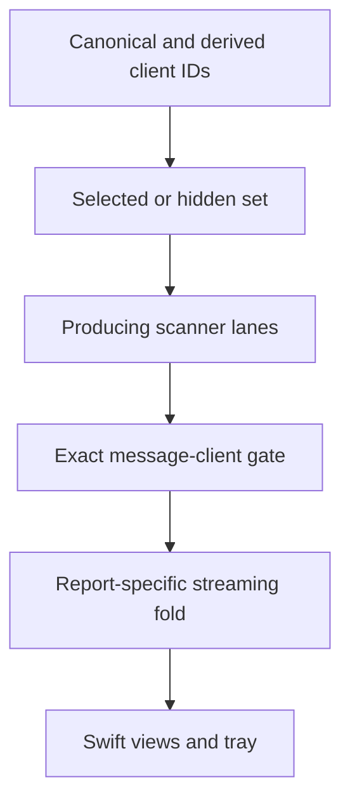

# ADR 0002: Streaming reports and pre-aggregation filtering

## Decision

TokenBar report consumers use the cache-aware streaming path where the local implementation provides it. Client selection is applied before any mixed report bucket is folded. A hidden client therefore contributes no tokens, cost, message count, streak, chart point, tray total, live rate, or quota-derived display that is defined as selected-client data.

## Context

Moving graph, model, monthly, and hourly reports to streaming removed whole-history materialization and made per-client dedup explicit. The Agents report initially remained on a materialized path, producing different totals for clients with repeated keys. Later hidden-client work showed the same class of error at a different seam: filtering a final mixed hourly or Agents bucket cannot recover the hidden contribution.

## Data-flow rule

The request may need two representations: scanner lanes to visit and exact message IDs to retain. Dynamic IDs such as `cc-mirror/*` are produced by a Claude lane and are not themselves scanner lanes. Raw trace IDs and display aliases must be normalized through an explicit vocabulary, not a generic suffix rule.

## Consequences

| Consequence | Required practice |
|---|---|
| Reports share a deduped, priced stream | Compare Agents and model totals on duplicate fixtures |
| Mixed buckets cannot be filtered in Swift | Thread `ReportOptions.clients` through the C ABI and Swift decoder |
| Empty selection has semantics | Use a strict deny-list or explicit all-hidden path; never treat an empty allow-list as “allow all” by accident |
| New parser lanes affect every consumer | Update lane selection, fingerprint, mtime probe, pruning, and report parity together |
| Hidden state is cross-cutting | Sweep chart windows, date ranges, streaks, live traces, tray totals, and quota aliases before declaring completion |

## Verification

The canonical proof is a hermetic fixture that demonstrates the old mismatch and new parity, plus a no-duplicate fixture that preserves normal totals. Live smoke is a safety check, not the primary proof.
