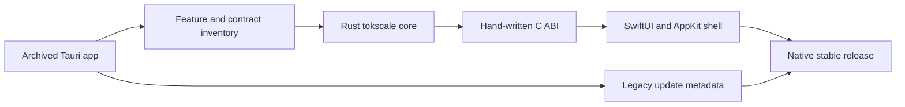

# From Tauri to native SwiftUI

## 文件目的

TokenBar native 是一次完整重寫，不是把舊 Tauri UI 直接包進 macOS shell。這份摘要保留重寫時形成的架構不變量、出貨遷移路徑與重要取捨。

## Rewrite shape

The Rust parser and aggregation engine stayed the durable data layer. A static library and a hand-written C header made the boundary explicit; Swift decodes JSON envelopes and owns the menu-bar shell, views, settings, animations, and update UI. The native app kept the product's local-first behavior and dashboard concepts while replacing the webview and Tauri runtime.

## Stable decisions

| Decision | Rationale |
|---|---|
| Minimum macOS 14 | SwiftPM and AppKit shell provide a stable baseline; newer Liquid Glass APIs use availability checks |
| Rust static library | Reuse parser, dedup, pricing, quota, and aggregation behavior without a sidecar process |
| C ABI with JSON | Keep the seam inspectable and decodable from Swift; expose ownership through `tb_free` |
| SceneKit graph | Provide a native 3D contribution view with render-on-demand rather than a continuous render loop |
| SwiftUI views | Make dashboard lenses, settings, menu-bar status, and accessibility behavior native |
| Sparkle updates | Provide an in-app stable update path alongside Homebrew and legacy migration metadata |

## Migration outcome

Stable bundle identity and data paths were preserved so existing users could migrate without re-entering product state. The old Tauri line became a legacy installation path; the native line became the shipping app. A retired beta identity could not be replaced by Sparkle when the bundle identity differed, so the bridge used an explicit Switch-to-stable path instead.

## Lessons retained

The rewrite made two boundaries visible. First, the FFI contract is a production API even though both sides live in one repository. Second, a native shell does not make parser correctness automatic: cache invalidation, streaming dedup, report filters, and stale-data retention still need deterministic evidence.
