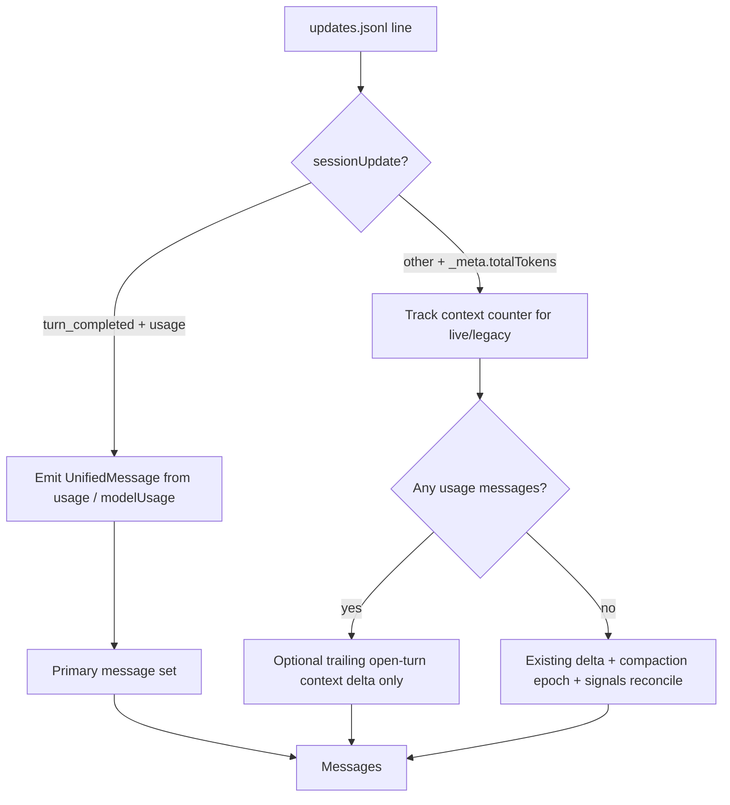

# Grok Build: prefer `turn_completed.usage` over context counters

## Outcome

TokenBar reports Grok Build usage from authoritative per-turn API usage
(`sessionUpdate: turn_completed` → `params.update.usage`), not from
`params._meta.totalTokens` context-window growth. Multi-turn / multi-call
sessions stop undercounting by roughly an order of magnitude on real data.

## Non-goals

| Out of scope | Why |
|---|---|
| Upstream PR to junhoyeo/tokscale in this change | Land locally first; report separately |
| Subscription quota card (`agent_grok` billing meters) | Different surface; already WIP elsewhere |
| Repricing every historical client | Grok lane only |
| Subagent `tokens_used` double-count | Parent `turn_completed.usage` already includes model calls |
| Exact `costUsdTicks` unit proof beyond documented divisor | Prefer provider cost when ticks present; tokens are the correctness goal |

## Problem evidence (2026-07-21 local probe)

| Source field | Real meaning on current Grok Build |
|---|---|
| `params._meta.totalTokens` | Context occupancy; tracks window fill, not cumulative API spend |
| `signals.json.contextTokensUsed` | Same class as context occupancy |
| `turn_completed.params.update.usage` | Authoritative per-turn input/output/reasoning/cache + `modelUsage` + `costUsdTicks` |

On 18 non-e2e local sessions:

| Algorithm | Total tokens |
|---|---|
| Current parser (`_meta.totalTokens` deltas) | ~1.66M |
| Sum of every `turn_completed.usage` (in+out+reasoning) | ~42.1M |
| Undercount factor | ~**25×** (long multi-turn sessions ~50–58×) |

Upstream `sessions/grok.rs` and TokenBar vendor share the same primary algorithm.
TokenBar-only divergences (compaction epochs, sibling fingerprint) do **not** fix
this semantic miss.

## Design

### Primary path (modern logs)

When at least one `turn_completed` carries a usage object with positive token
fields:

1. Emit one message per `modelUsage` entry when present; otherwise one message
   from the top-level usage object.
2. Map tokens (Grok's `inputTokens` **includes** cache reads; TokenBar totals
   sum every bucket, so net uncached input and put cache in its own field —
   do **not** map raw `inputTokens` into `input` or totals double-count):
   - `input` ← `inputTokens.saturating_sub(cachedReadTokens)` (floored at 0)
   - `output` ← `outputTokens`
   - `reasoning` ← `reasoningTokens`
   - `cache_read` ← `cachedReadTokens`
   - `cache_write` ← 0 (not observed)
3. Model id: `modelUsage` key, else metadata / streaming model / `grok-unknown`.
4. Cost: when `costUsdTicks > 0`, set `cost = ticks / 1e9` and
   `CostSource::ProviderReported`. Document the divisor; if later proven wrong,
   only cost changes.
5. Dedup key: `grok:{session}:turn:{prompt_id}` or
   `grok:{session}:turn:{index}` (+ model suffix when split).
6. `is_turn_start = true` on the first model row of each completed turn.
7. `duration_ms` from `apiDurationMs` when present.
8. After the last completed turn, if context counter advanced on an open user
   turn with no completed usage yet, emit a **live partial** context-delta row
   (legacy ActiveTurn math) so the live tail is not zero until the turn ends.
9. Skip `signals.json` undercount reconciliation on the primary path — signals
   measure context, not cumulative usage, and would either no-op or mislead.

### Legacy path (old logs / no usage objects)

Keep the existing behavior:

- Positive `_meta.totalTokens` deltas as input
- Compaction counter epochs (local)
- `signals.json` difference reconciliation
- Aggregate single-turn fallback when no user_message_chunk boundaries

### Cache

Bump `CACHE_SCHEMA_VERSION` **31 → 32**. Same-fingerprint schema-31 caches must
rebuild so users do not keep undercounted grok rows.

### Fingerprint / streaming

No fingerprint layout change required for this correctness fix: usage lives in
`updates.jsonl`. Keep local sibling fingerprint/mtime patches for model
metadata freshness.

## Owned files

| Path | Change |
|---|---|
| `vendor/tokscale-core/src/sessions/grok.rs` | Primary usage path + legacy fallback + tests |
| `vendor/tokscale-core/src/message_cache.rs` | Schema 31 → 32 |
| `vendor/README.md` | Local-patch / cherry-pick ledger entry |
| `docs/knowledge/plans/grok-turn-completed-usage.md` | This plan |
| `docs/knowledge/plans/README.md` | Registry row |

Exclusive ownership for the implementation session: the files above. Do not
edit dirty main WIP (`agent_grok` quota, unrelated rustfmt). Prefer branch
`fix/grok-turn-completed-usage` / isolated worktree.

## Sequence

1. Rewrite `parse_grok_updates_file` with dual path.
2. Preserve existing hermetic tests on the legacy path (old-fail/new-pass only
   for usage cases).
3. Add tests:
   - multi `turn_completed` sums usage (not context peak)
   - `modelUsage` split
   - live open turn after completed usage
   - legacy-only file still matches prior totals
   - signals ignored when usage path active
4. Schema bump + comment.
5. Update vendor ledger.
6. `cargo test -p tokscale-core grok` (and broader vendor tests if time).

## Verification

| Check | Pass criteria |
|---|---|
| Unit | New usage fixtures: sum(in+out+reason) matches fixture; context-only path unchanged |
| Schema | Schema-31 cache with same fingerprint is not silently reused as schema-32 |
| Regression | Existing grok unit tests pass |
| Real-data optional | Same pilotfish session: parser total ≈ sum of turn_completed usage (order of ~13.7M not ~237k) |

## Budgets and stop

| Budget | Limit |
|---|---|
| Scope | Grok session parser + schema + ledger + plan docs only |
| Stop | Do not push/merge/release without separate user instruction |
| Host session | Branch ready for review/PR in another session |

## Handoff

| Item | Value |
|---|---|
| Branch | `fix/grok-turn-completed-usage` |
| Worktree | isolated worktree on that branch (machine-local path not recorded) |
| Base | `f1b35a89` (local main at plan time; behind `origin/main` — rebase before PR) |
| Authorization | Plan + implement authorized by user; push/merge not authorized |
| Upstream follow-up | Report that tokscale still uses context deltas; offer usage-primary port |

## Acceptance

- [x] Primary path counts `turn_completed.usage` with correct bucket split
- [x] Legacy path preserved for logs without usage
- [x] Live open turn does not double-count completed usage
- [x] Cache schema 32 forces rebuild
- [x] Ledger + plan registry updated
- [x] Targeted tests green (`cargo test -p tokscale-core --lib sessions::grok::`)
- [x] Codex review follow-up: skip context on usage lines; preserve pre-usage legacy turns; zero split `message_count`; inherit parent cost/duration

## Implementation note (2026-07-21)

Landed on branch `fix/grok-turn-completed-usage`. Host session should rebase onto
current `origin/main` before PR when needed (base was local main `f1b35a89`,
behind remote). Review follow-up fixed double-count on usage+context lines and
mixed pre-upgrade sessions.
