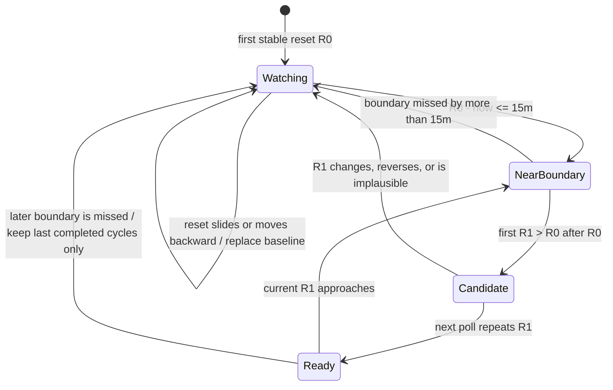

# Provider-wide quota pace plan

## 文件目的

這份計畫把 pace 的修正單位從「Codex Weekly 特例」改成「每一張 provider recurring quota card」。Codex、Claude、Grok、Antigravity 與 Copilot 的額度 window 都必須先取得可信的 account scope、stable window key、reset 與 duration，才能進入同一套 Linear／Historical 計算；缺少 duration 或歷史時必須顯示可理解的學習狀態，不得永久或無聲地退回 Linear。

[`codex-historical-pace-v2.md`](codex-historical-pace-v2.md) 保留為已落地的 Codex Weekly evaluator 基礎與 migration 證據，但不再代表 provider-wide outcome。這份新計畫取代它作為後續實作與驗收的 active design。

> **核心結果：** pace duration 屬於 quota window，不屬於 provider 特例。任何已顯示、具有 recurring percentage quota 語意的 card，都必須走同一個 duration lifecycle；無法證明 duration 時，UI 必須明示原因，而不是顯示看似真實的 pace。

## 目錄

- [目標與非目標](#目標與非目標)
- [目前缺口](#目前缺口)
- [Card eligibility contract](#card-eligibility-contract)
- [Account and window identity](#account-and-window-identity)
- [Duration contract](#duration-contract)
- [Pace state and wire contract](#pace-state-and-wire-contract)
- [Generic historical evaluator](#generic-historical-evaluator)
- [Storage and migration](#storage-and-migration)
- [Provider adapter matrix](#provider-adapter-matrix)
- [執行階段](#執行階段)
- [驗收條件](#驗收條件)
- [交付與驗證](#交付與驗證)
- [風險、相依與停止條件](#風險相依與停止條件)
- [授權邊界](#授權邊界)

---

## 目標與非目標

### Objective

完成後，Mac app 的 Historical 設定會套用到所有 eligible provider quota cards，而不是只在 Codex Weekly 有 backend result。每張 card 的 pace 由同一組 Rust-owned inputs 驅動：`providerId + accountScope + windowKey + reset + duration + usedPercent`。Swift 只負責 decode、模式選擇與呈現，不得自行猜 duration 或重算 Historical ETA／will-last／risk。

### Scope

| 類別 | 本計畫包含 | 本計畫不包含 |
|---|---|---|
| Providers | Codex、Claude、Grok、Antigravity、Copilot 的所有 recurring percentage windows | 新增 provider 或重新設計 provider authentication |
| Duration | Provider-reported、frozen contract、observed rollover 三種可信來源 | 從 display label、剩餘百分比或模糊 calendar 假設 duration |
| History | Generic cycle-normalized store、sampling、confidence、evaluation 與 Codex v2 import | 從 local token／cost history 回填 subscription quota |
| Account scope | Authoritative ID 優先、安全 credential-lineage fallback、切換帳號隔離 | 把 raw email、access token 或 token hash寫入 history |
| UX | 明確 learning／available／unavailable 狀態、所有 eligible cards 的 pace 文案與顏色 | History management UI 或手動編輯 history |
| Cross-language | Rust JSON、C contract comment、Swift decoder／presentation、Windows handoff fixture | 未經另行授權修改 TokenBar-Windows |
| Integration | 可審查的 Mac 實作與完整本機驗證計畫 | Push、PR、merge、tag、appcast 或 Homebrew release |

`OpenCode` 只提供 Copilot authentication，不是獨立 quota provider。Antigravity local IDE與 remote OAuth都是同一 provider，但 current auth evidence不能安全證明兩條 route屬於同一 account；因此兩邊都支援 pace，卻保持 account-scope隔離，直到 authenticated provider ID能證明同一 owner。安全 fragmentation優先於跨帳號污染。

## 目前缺口

現在的 nested `historicalPace` 只有 Codex refresh 會填入，而且 enrichment 只選 `Weekly`。其他 provider mapper 都把 `historicalPace` 初始化成 `nil`；Swift Historical mode 遇到 `nil` 便直接使用 Linear，因此 UI 看似支援 Historical，實際上 Claude、Grok、Antigravity 與 Copilot 永遠不會學到個人曲線。

| Surface | 現況 | 必須修正成 |
|---|---|---|
| Duration | Codex／Claude／Grok 部分 window 有 `windowMinutes`；Antigravity／Copilot 沒有 | 每張 eligible card 有可信 duration 或明確 `learningDuration` |
| Identity | Codex 有 account ID／email；其他 provider 不一致 | 每個 sample 都有不跨帳號混用的 opaque account scope |
| Window key | 多數 mapper 只有易變的 display label | Provider adapter 提供 stable semantic key，label 只供 UI |
| History | Store 與 cadence 固定為 Codex Weekly | 依 cycle duration 正規化、保留與判斷 confidence |
| Wire state | `historicalPace == nil` 同時表示 learning、unsupported、legacy 與 error | Required `paceStatus` 區分每個狀態 |
| Presentation | Historical 缺資料時 silent Linear fallback | 只有 `learningHistory` 可暫用 Linear，且文案必須明示 |

## Card eligibility contract

Rust provider adapter 必須先把每個 emitted window 分類，分類結果是 wire fixture 的一部分，不得由 Swift 依 label 猜測。

| Classification | Definition | Required behavior |
|---|---|---|
| `recurringQuota` | 有 bounded `0...100` utilization、下一次 reset，且 reset 後 quota 重新開始 | 必須進入 duration、sampling 與 Historical lifecycle |
| `recurringQuotaMissingReset` | 百分比看似 recurring，但 provider payload 沒有 reset | 顯示 `unavailable(missingReset)`；不能假設月初 |
| `nonRecurringCap` | Spend／credit cap 沒有可證明的 recurring reset | 不計算 pace，顯示 cap 語意；不得偽裝成 quota pace |
| `invalid` | 非 finite、越界、expired reset 或 contradictory bounds | 不 record；保留 last good card，或依既有 provider error contract 顯示錯誤 |

Claude `extra_usage` 目前只有 monthly cap 與 utilization，沒有 reset timestamp。官方說明確認它是 [monthly spending cap](https://support.claude.com/en/articles/12429409-manage-usage-credits-for-paid-claude-plans)，但沒有承諾 calendar boundary；因此本版本把它鎖定為 `recurringQuotaMissingReset`，不以「Monthly」文字推導 duration。這是唯一允許不顯示 pace 的正常 emitted percentage card，而且原因必須可見、可測，不得被歸類為「其他 provider 尚未支援」。若未來 payload 增加 reset，adapter 依 schema version 升級為 `recurringQuota`。

## Account and window identity

History series 使用 `SeriesKey { providerId, accountScope, windowKey }`。Duration 不進入 key：每個 cycle 保存自己的 duration，讓 28／29／30／31 天的同一 monthly quota 能在 phase-normalized curve 中比較。若 provider 真正改變 quota 語意，adapter 必須 bump `windowKey` version，而不是靠 duration 偶然切開 history。

### Account scope resolver

Security review 已把 Mac protocol 鎖定如下。Implementation 不得自行換成 token hash、path／slot-only identity或額外 provider endpoint；這個 trust-boundary stage 只能交給 `security-executor`。

| Priority | Evidence | `accountScope` | Failure behavior |
|---|---|---|---|
| 1 | 從同一 authenticated response或實際發出 request 的 credential chain取得的 immutable ID／email | Domain-separated HMAC of provider、kind與 normalized identifier | Evidence 改變即建立新 series；不以另一份 unrelated local state補標 |
| 2 | Credential marker lineage | HMAC of provider與 random 128-bit lineage ID | Unseen external replacement建立新 lineage；已知 app refresh明確 transfer |
| 3 | No trusted evidence | None | `unavailable(accountScope)`；不得讀寫 provider history |

Antigravity local IDE 的 email 來自 authenticated `GetUserStatus`，可走 authoritative route。Remote OAuth quota 使用 Google credential，但目前 email 來自另一份 `google_accounts.active` state，兩者未綁定；remote 必須走 credential lineage，且該 local email不得再用來標示或 scope remote quota。Local／remote history 只有在未來同一 authenticated response證明相同 provider ID，或有明確 trusted binding 時才能 merge；目前安全地分開學習。

| Current provider route | Frozen account evidence |
|---|---|
| Codex | 成功 usage response 前實際送出的 `ChatGPT-Account-Id`，缺少時使用 lineage；ID-token email 只供 presentation |
| Claude | Current payload沒有 bound owner ID；所有 login／setup-token paths使用 lineage |
| Grok | Current billing response沒有 owner ID；`auth.x.ai` entry的 email只供 presentation，history使用 lineage |
| Antigravity local IDE | Authenticated `GetUserStatus` email；缺席時 fail closed |
| Antigravity remote OAuth | Google credential lineage；忽略 unbound active-email state |
| Copilot | OpenCode GitHub credential lineage；本 Plan不新增 `/user` request |

#### Installation key and HMAC

| Item | Frozen behavior |
|---|---|
| Key generation | `SecRandomCopyBytes` 產生 32 bytes；concurrent first creation採 add-if-absent，loser重新讀取 winner |
| Key storage | Non-synchronizing generic-password Keychain item；service `com.nyanako.tokenbar.account-scope.v1`、account `installation-key` |
| API boundary | 直接使用 Security.framework；不得把 key或 metadata傳給 `security -w`／process argv |
| HMAC | HMAC-SHA256，完整 32-byte output以 unpadded base64url保存；不得截短到 128 bits以下 |
| Authoritative scope | `HMAC(K, encode("scope-id-v1", provider, kind, normalizedIdentifier))` |
| Credential fingerprint | `HMAC(K, encode("credential-v1", provider, rawCredentialMarker))` |
| Slot digest | `HMAC(K, encode("slot-v1", provider, semanticSource, canonicalLocation))` |
| Lineage scope | 先用 `SecRandomCopyBytes` 產生 128-bit random lineage ID，再算 `HMAC(K, encode("scope-lineage-v1", provider, lineageId))` |
| Metadata MAC key | `HMAC(K, encode("metadata-key-v1"))`；只用於 authenticated metadata envelope |

`encode` 對每個 byte field 依序寫入 unsigned 32-bit big-endian length，再寫 exact bytes；domain 也是第一個 length-prefixed field。Text fields 先轉 UTF-8；credential marker 與 random lineage 保留 raw bytes。這個 encoding 套用到所有 HMAC 與 known vectors，不使用分隔字串或無長度 concatenation。

Raw identifier 與 credential marker 只在記憶體短暫存在。Email normalization 是 trim 加 ASCII lowercase；opaque provider ID 只 trim，保留 byte case。History 只保存最後的 `accountScope`；low-entropy email 不能在缺少 installation key 時離線猜回。

#### Credential markers and secure metadata

Credential marker 固定依下表選擇；同 provider不得由 worker另選較方便但會旋轉的欄位。

| Provider／route | Marker |
|---|---|
| Codex | Refresh token，缺少時 access token |
| Claude full login | Refresh token |
| Claude env／shell／raw setup-token | Access／setup token |
| Grok | Exact `auth.x.ai` entry的 refresh token |
| Antigravity remote | Google refresh token；若未來 provider回傳 replacement，走 refresh transfer |
| Antigravity local IDE | Authenticated provider ID／email；兩者皆無就 fail closed |
| Copilot | OpenCode `github-copilot.refresh`，缺少時 `access` |

Application Support 的 `quota-account-scope-v1.json` 使用 authenticated envelope：

```text
schemaVersion = 1
payloadBytesBase64
payloadMac

payload.bindings[] = {
  provider,
  slotDigest,
  credentialFingerprint,
  randomLineageId
}
payload.currentFingerprintBySlot
```

Metadata 不保存 raw token、email、account ID、path、display label或 plain SHA-256。Fingerprint binding immutable；相同 provider credential出現在另一個 source可重用 lineage；同 slot出現未知 fingerprint會建立新 lineage。Any conflicting existing binding fails closed，不自動 merge。

Metadata 的 load → MAC verify → mutate → atomic save 使用獨立 process mutex 與 `fs2` exclusive lock；temp file mode `0600`，write／`sync_all`／atomic rename 後 sync parent directory。不得同時持有 metadata lock 與 v3 history lock；network 與 Keychain call 不得在 metadata／v3 lock 內執行。Provider refresh lock 是唯一可跨 network request 持有的 file lock。順序固定為：先讀 Keychain key，refresh 若需要則完成下列 refresh transaction，完成並釋放 metadata transaction，最後才取得 v3 lock 寫 history。

#### Refresh transaction and recovery

App-controlled refresh 的 cross-process lock 固定為 Application Support 的 `quota-auth-refresh-<provider>.lock`，以 owner-only mode 開啟。Lock ordering 只能是 refresh lock → metadata lock；不得在持有 metadata／v3 lock 時反向取得 refresh lock。流程固定依序：

1. 先從 Keychain 讀 installation key，再取得 provider refresh process／file lock。
2. 取得 refresh lock 後重新載入 exact current auth record並計算 `F_old`。
3. 持有 refresh lock 執行既有 refresh request，從回傳 credential 計算 `F_new`；此時不持有 metadata／v3 lock。
4. 在 metadata transaction 內確認 `F_old` lineage 無 conflict，並把 `F_old`、`F_new` 綁到同一 lineage；persist 後立即釋放 metadata lock。
5. 仍持有 refresh lock 時 persist provider credentials，完成後釋放 refresh lock。
6. Quota fetch 成功後，才以已持久化 scope 寫 v3 history。

Crash before metadata save不會以 new credential寫 history；crash between metadata and credential save時 old／new fingerprints都能回到同 lineage；credential save後 crash則下一次仍可 resolve。Metadata write失敗可以讓 auth refresh繼續，但本 poll pace必須是 `unavailable(accountScope)`，不得寫 history。

| Failure／restore | Required result |
|---|---|
| Keychain denied／locked 或 existing item 長度不是 32 bytes | Typed unavailable；不得 replace key、quarantine metadata 或讀寫 history |
| Key item not found，且沒有 metadata／v3 artifacts | Add-if-absent 建立 key；concurrent loser 重讀 winner；可在同一 poll 建立 metadata |
| Key item not found，但 metadata 或 v3 已存在 | 若 metadata 存在，先 byte-preserving rename 到 unique `.orphaned-<seconds>[.<n>].json`；成功後才 add-if-absent 建立 key；v3 原位保留為 orphaned scopes；該 poll unavailable，下一 poll 建立 fresh metadata |
| Metadata syntax／schema／MAC invalid | 使用 existing valid key 先 byte-preserving rename 到 unique `.corrupt-<seconds>[.<n>].json`；該 poll unavailable；下一 poll 建立 fresh metadata |
| Any quarantine failure | 不建立／replace key，不建立／overwrite metadata，不讀寫 v3 |
| Metadata lock／save failure 或 binding conflict | Typed unavailable；保留最後有效 metadata 與 history |
| Normal app reinstall | Keychain 與 Application Support 仍在時恢復同 scopes |
| Consistent full restore | Key、metadata、v3 三者一致才恢復 |
| Explicit full purge | 必須一起刪除 Keychain key、metadata、v3 與 legacy v2；本 Plan 不新增 purge UI，也不宣稱 APFS secure erase |

Retained v2 仍含 legacy raw Codex account key，因此分類為 legacy-sensitive rollback data；「沒有 raw identifier」只適用新 metadata與 v3。這份 Plan保留 v2 bytes／mtime／path，不隱瞞或假稱已清除；v2 retirement必須是 rollback window結束後的獨立明確決策。

Security fixtures 必須覆蓋 HMAC known vectors／domain separation、different-installation unlinkability、各 credential source、refresh每一步 crash injection、same-slot replacement、two-process create／transfer conflict、Keychain／MAC／lock／quarantine failures、Antigravity stale active-email mismatch，以及 metadata／v3 byte scan不含 fixture raw values或其 plain SHA-256。

### Stable window keys

`windowKey` 來自 provider schema 的 field、period type、quota class 或 model ID。Display label 可以 localized 或改名，不得成為 history identity。Antigravity mapper 必須保留 model ID；若同一 model 有多個 bucket，先依現有 binding-limit 規則選出 card，再用 model ID 建立唯一 series。

## Duration contract

每個 eligible card 都走相同 resolver，但 resolver 只接受三種有證據的來源，優先序固定為 `provider` → `contract` → `observed`。前一種 route 缺少必要欄位時，只要仍有可信 future reset 就可進入下一種；沒有 reset 則直接 `unavailable(missingReset)`。

| `durationSource` | Source | Examples | Trust rule |
|---|---|---|---|
| `provider` | 同一 payload 的 cycle start／end 或 explicit duration | Codex `limit_window_seconds`；Grok period start／end | Bounds finite、end later than start、current reset matches end |
| `contract` | Provider schema field 或已驗證 calendar rule 的 frozen semantic duration | Claude 5h／7d schema aliases；Copilot first-of-month reset | 用 schema key，不用 display label；fixture 鎖定 aliases 與 calendar edge |
| `observed` | TokenBar 實際看到相鄰 reset rollover | Antigravity model；Grok缺少 period start 的 fallback；非標準 Copilot reset | 只有通過下列 rollover state machine 才可使用 |

### Observed rollover state machine



Accepted observed duration is exactly `R1 - R0`, where the app saw the stable old reset within 15 minutes before expiry, saw the new reset within 15 minutes after expiry, and confirmed that new reset on the next poll. The existing 5-minute background poll and 1-minute visible-window poll make this reachable; sleep or app downtime may miss the boundary, in which case the card remains `learningDuration` for the new cycle.

| Edge case | Required transition |
|---|---|
| Duplicate reset | No-op; never manufactures a boundary |
| Sliding reset | Invalidate candidate and watch the newest stable reset |
| Backward reset | Invalidate current duration; preserve completed history but do not sample current cycle |
| Missed one or more cycles | Do not divide reset delta or guess cycle count; restart watching |
| Monthly 28–31 days | Accept each exact adjacent delta as that cycle's duration; never replace it with a 30-day average |
| Boundary seen but new reset not stable | Stay learning; no current-cycle samples |

Raw readings collected before duration becomes ready are not retroactively turned into curve samples. Once `R1 - R0` is accepted, `R0` is the exact start of the current cycle and sampling begins from that boundary.

### Durable rollover state

Observed state is not a second file. It lives inside the same v3 `SeriesState` as samples and is mutated under the same process mutex、inter-process lock與 atomic save。The persisted union is:

| State | Required fields | Restart behavior |
|---|---|---|
| `watching` | `resetAt`、`firstSeenAt`、`lastSeenAt`、`consecutiveCount` | Continue counting the same normalized reset；two consecutive polls make it stable |
| `candidate` | `oldResetAt`、`oldSeenAt`、`newResetAt`、`firstNewSeenAt` | Same `newResetAt` on the next poll becomes ready；any other reset replaces baseline |
| `ready` | `cycleStartedAt`、`resetAt`、`durationSeconds`、`confirmedAt`、`lastSeenAt` | Current cycle may sample immediately；later near-boundary observation can create the next candidate |

`SeriesState` is keyed by the full `providerId + accountScope + windowKey` and also persists optional `activeResetAt` plus `lastActivityAt`。`activeResetAt` is updated only from a valid provider／contract card reset，or from `ready.resetAt` after observed confirmation。`lastActivityAt` is the maximum accepted sample timestamp or rollover-observation timestamp；it never advances merely because the store was loaded。All timestamps are Unix seconds；durations must be positive and at most 400 days；`consecutiveCount` is capped at 2。`nearBoundary` is derived from `lastSeenAt` and is not separately serialized。A duplicate observation only advances `lastSeenAt`／stability；a missing card does not mutate state。

When a candidate confirms, state transition and the first duration-ready sample are one v3 transaction。A crash before rename leaves the old candidate；a crash after rename leaves ready state plus the sample。Corrupt v3 follows the store quarantine rule and restarts observed learning；a new account scope naturally gets separate state，while old scope state remains isolated until retention removes it。

Copilot has one immediate contract route：when `quota_reset_date` is exactly UTC midnight on day 1，duration is the difference between that reset and the previous UTC calendar-month boundary。This matches the provider's documented [first-of-month reset](https://docs.github.com/en/copilot/reference/copilot-billing/request-based-billing-legacy/copilot-requests) and naturally produces 28／29／30／31-day cycles。Any non-first-of-month reset must use the observed state machine；it must not be rounded to 30 days。

## Pace state and wire contract

`UsageWindow` 新增 required `cardId` 與 required nested `paceStatus`。`cardId` 只負責 provider 內的 presentation row identity；`windowKey` 才能識別可學習的 history series。Positive `durationSeconds` 是新 pace 唯一精確 duration；`windowMinutes` 保留 legacy compatibility，由 `durationSeconds / 60` 整數除法導出，Swift v3 calculation 不得再讀它。現有 `historicalPace` 仍是 Rust evaluator 的 coherent result。Swift decoder 對舊 payload 缺少 `paceStatus` 的情況建立 internal `legacyMissing`，不得把它與 learning 混為一談。

| `paceStatus.state` | `durationSeconds` | `historicalPace` | Historical mode presentation |
|---|---:|---:|---|
| `learningDuration` | `nil` | `nil` | `Learning reset duration`；不顯示假 pace 或 ETA |
| `learningHistory` | required positive | `nil` | 明示 `Learning history · Linear estimate`，暫用 Linear |
| `available` | required positive | required | 使用 Rust historical expected／ETA／will-last／risk |
| `unavailable` | optional | `nil` | 顯示 typed reason，例如 `missingReset`、`nonRecurring`、`accountScope`、`storeCapacity` |

`paceStatus` 至少包含 `state`、optional `windowKey`、`durationSeconds`、`durationSource`、`completeCycles` 與 optional `reason`。`windowKey` 只有 `unavailable(windowIdentity)` 可為 `null`，其他 state 必須 non-empty。`durationSource` 在 `learningDuration` 可為 `observed`，在 `unavailable` 可缺席。Rust serialization tests 必須鎖定下列不變量：

```text
available       <=> durationSeconds > 0 && historicalPace != nil
learningHistory  => durationSeconds > 0 && historicalPace == nil
learningDuration => durationSeconds == nil && historicalPace == nil
unavailable      => historicalPace == nil
windowKey == nil <=> unavailable(windowIdentity)
```

`cardId` 必須在同一 provider snapshot 內唯一且不讀 display label。Identified cards 使用 `cardId = windowKey`；無 semantic history key 時，adapter 使用 structural presentation ID：Codex main slots 為 `row.main.<slot>.v1`，anonymous additional limit 為 `row.additional.unknown.<slot>.v1`（同 slot 只 emit provider-order 第一筆），unknown Grok period 為 `row.billing.unknown.v1`，Antigravity CLI missing-model rows 為 `row.cli.config.<originalSourceIndex>.v1`。Swift row key 固定為 `providerId + ":" + cardId`；同 snapshot 若仍 collision，後一筆 fail closed 不 render，不得 suffix display label。Localization 或 duplicate labels 不再影響 row identity。

Linear setting 也使用同一個 exact `durationSeconds`。Historical setting 只有在 `learningHistory` 可以暫時使用 Linear，而且 UI 必須明示；`learningDuration`、`unavailable`、`legacyMissing` 都不能 silent fallback。Settings 文案要從「weekly curve」改成「learns each quota window's usage pattern」。

黃色 ahead／deficit 狀態只有在 `available` 時能宣稱是 historical comparison；`learningHistory` 的 Linear estimate 必須以不同文案標示，避免把測試用 reverse 或硬編文字誤認為真實 historical result。

## Generic historical evaluator

Codex v2 的 coherent Rust result、current-actual shift、capped-demand extension 與 expected／ETA／will-last／risk ownership 保留，但 sampling、coverage、retention 與 recency 改為 cycle-aware。

### Sample and cycle model

每筆 sample 保存 `sampledAt`、`resetAt`、`durationSeconds`、`durationSource` 與 bounded `usedPercent`。對該 cycle 的 phase 定義為：

```text
u = clamp(1 - (resetAt - sampledAt) / durationSeconds, 0, 1)
```

| Rule | Frozen behavior |
|---|---|
| Reset normalization | Quantum `q = clamp(duration / 100, 60s, 300s)`；同一 provider reset 的小 jitter 收斂，但 observed rollover 的原始 boundary 另行保留 |
| Phase buckets | 每 cycle 48 格；`phaseBucket = min(floor(u * 48), 47)`；reset 改變、進入新 phase bucket，或 usage 改變至少 1 percentage point 才接受 |
| Sample cap | 每 cycle 最多 48 筆；同 series／normalized reset／phase bucket dedupe |
| Valid sample | Finite、`0 < usedPercent <= 100`、positive duration、sample 位於 cycle bounds；zero reading 可供當下 Linear 顯示但不持久化 |
| Complete cycle | 至少 6 個 distinct phase buckets，起點／終點 coverage 成立，且最大 phase gap 不超過 `0.30` |

Coverage boundary 使用 `b = min(0.10, 24h / duration)`；complete cycle 必須滿足 `uMin <= b` 與 `uMax >= 1 - b`。最大 gap 在排序後的 `[0, distinct observed phases..., 1]` 上計算。這讓 5h、7d 與 monthly window 都用相同比例規則，又不要求 monthly app 在 reset 後數分鐘內一定在線。

### Retention and confidence

`nominalDuration` 是同 series 已完成 cycles 的 duration median，只用於 retention／recency，不覆蓋 current cycle 的 exact duration，也不進入 series key。奇數筆取中間值；偶數筆取兩個中間值的 arithmetic mean；尚無 complete cycle 時使用 current accepted exact duration（observed route 即 `ready.durationSeconds`）。

| Decision | Formula |
|---|---|
| Retained completed cycles | `R = clamp(max(8, ceil(28d / nominalDuration)), 8, 128)`；time horizon `H = clamp(max(56d, R * nominalDuration), 56d, 400d)` |
| Per-series sample cap | 最多 `R` 個 completed cycles，加一個 current incomplete cycle；每 cycle 最多 48 samples |
| Recency basis | `ageSeconds = max(0, currentResetAt - historicalResetAt)`；`ageCycles = ageSeconds / nominalDuration`；`tauCycles = clamp(max(3, 7d / nominalDuration), 3, 64)`；`weight = exp(-ageCycles / tauCycles)` |
| Effective samples | `nEff = sum(weight)^2 / sum(weight^2)` |
| Observation span | `latest historical resetAt - earliest historical cycleStartedAt`；只計 complete historical cycles，不包含 current partial cycle |
| Historical expected gate | 至少 3 complete cycles、`nEff >= 2.5`、observation span `>= max(2 * nominalDuration, 24h)` |
| Historical risk gate | 至少 5 complete cycles、`nEff >= 4`、observation span `>= max(4 * nominalDuration, 7d)` |

Retention 在每次 locked v3 transaction 完成 duration transition／record 後、atomic save 前執行，並以該 transaction 的 `now` 決定所有 boundary。每個 series 先依 normalized reset分組，規則固定為：

| Group or state | Deterministic retention |
|---|---|
| Completed cycle | 同時滿足「依 `resetAt` 最新的 `R` 個」以及 `resetAt >= now - H` 才保留；其餘整 cycle刪除 |
| Current incomplete cycle | 只保留一組：其 reset必須等於 persisted `activeResetAt`；observed route 還必須等於 `ready.resetAt`。最多 48 samples |
| Other incomplete groups | 立即整組刪除，包括 expired、superseded、future fragment與 repeated partial-reset churn |
| `watching`／`candidate`／`ready` | Tracked old reset超過 boundary 15 minutes仍未完成合法 adjacent transition即清除；candidate也必須在 `oldResetAt + 15m` 前由 next poll確認。下一個 reading從 fresh `watching` 開始 |
| Rollover-only series | 沒有 samples／completed cycles且 `lastActivityAt < now - 56d` 時刪除；空 series立即刪除 |

Persisted `activeResetAt` 由最近一次 provider／contract route驗證成功的 normalized reset更新；observed route只有 ready後才可設定，因此 learning-duration readings不會留下 incomplete sample group。它在其他 provider transaction中仍能識別該 series的唯一 current group，但一旦早於 `now - 15m` 就先清除，舊 partial也不再受 current-cycle保護。Cleanup 不把 expired partial cycle升格為 completed cycle，也不從 reset delta猜漏掉幾個 cycles。

Store 另有兩個全域 hard bounds：最多 512 個 series、65,536 個 samples。Pruning 先套用 invalid／incomplete／stale state與 per-series規則；sample仍超額時，按 `(resetAt, providerId, accountScope, windowKey)` 升冪整批刪除全域最舊 completed cycles，直到回到上限。Current incomplete cycle不是這個全域 sample eviction的候選。

新增 series將超過 512 時，先移除 inactive series；排序固定為 `(lastActivityAt, providerId, accountScope, windowKey)` 升冪。Active 定義為本次 provider snapshot有 emit，或仍持有 future／15-minute grace內的唯一 current incomplete reset或 rollover reset；目前 active series不得被 eviction。若同一 transaction 的 active candidates仍超過剩餘容量，既有 active series優先，new candidates依完整 `SeriesKey`升冪依序 admission；其餘 cards回傳 `unavailable(storeCapacity)`，且不得 mutate v3。若只剩 current incomplete samples仍無法降到 65,536，也拒絕本次 offending sample並保留 transaction 前的最後有效 store；不得為了寫入而 eviction current active data。

Retention fixtures 必須覆蓋 repeated partial-reset churn、sliding／backward reset、stale rollover-only state、abandoned account scopes、28–31-day horizon、short-cycle `R = 128`、global sample eviction tie ordering、active-series protection與 hard-cap overflow。

每個 complete cycle 先依自己的 duration 映射到 `u`，再重建為 169-point monotonic curve。Monthly cycle 長度改變不會造成 series fragmentation；evaluator 仍以 current exact duration 把 phase crossing 轉回 ETA seconds。3–4 個可信 cycles 可以產生 expected／ETA，risk 仍為 `nil`；達 risk gate 後才公開 probability。

Expected 與 risk arithmetic 保留 Codex v2 行為，但把 week weights 換成上表的 cycle-aware weights。令 `u_i = i / 168`，`i = 0...168`，並固定：

```text
lambda = clamp((nEff - 2) / 6, 0, 1)
historical_i = recencyWeightedMedian(completedCycleCurve_i, weight)
linear_i = 100 * u_i
expected_i = clamp(lambda * historical_i + (1 - lambda) * linear_i, 0, 100)
```

169 個 `expected_i` 算完後再由左到右做 cumulative maximum，不能把 Linear baseline 當成上限。若 `totalWeight` 非 finite 或 `<= 0`，不產生 historical result，card 保持 `learningHistory`。

Risk／ETA 對每條 completed-cycle curve 依序套用以下 frozen order：若 curve 在最後一格前第一次到達 100%，從 cap point 起以 `slope = valueAtCap / uAtCap` 延伸未截斷 demand；在 current phase 算 `shift = actual - curve(uNow)`，且 shifted curve 在 crossing search 前不得 clamp。`shiftedEnd >= 100` 的 cycle 把自己的 weight 加到 `weightedRunOutMass`，並以線性 interpolation 找出第一個 `>= 100` 的 crossing candidate。接著固定：

```text
smoothed = clamp((weightedRunOutMass + 0.5) / (totalWeight + 1), 0, 1)
willLastToReset = smoothed < 0.5
```

只有通過上表 exact Historical risk gate 時，`runOutProbability = Some(smoothed)`；通過 expected gate但未通過 risk gate時為 `nil`。一旦已有 historical result且 current actual `>= 100`，一律覆蓋為 `runOutProbability = Some(1)`、`willLastToReset = false`、`etaSeconds = Some(0)`。其他情況若 `willLastToReset == false` 卻沒有 crossing candidate，必須改回 `true`，不能輸出 `false + nil`。ETA 是各 candidate 的 `(crossingU - uNow) * currentDurationSeconds`，clamp 到 non-negative 後用相同 weighted-median tie rule彙總。

Weighted median 沿用 v2 的 deterministic tie rule：依 value 升冪排序，累積 weight 第一次 `>= totalWeight / 2` 就取該值，因此 exact half 選 lower value；total weight 為零時同樣排序並取 index `len / 2`。Expected grid 與 ETA candidates 都使用此規則。

## Storage and migration

Generic store 使用 `quota-pace-history-v3.json`，schema version 固定為 `3`。Top level 是排序後的 `series[]`；每個 `SeriesState` 保存 `providerId`、opaque `accountScope`、`windowKey`、optional `activeResetAt`、`lastActivityAt`、optional rollover state與 `samples[]`。Sample 固定包含 `resetAt`、`durationSeconds`、`durationSource`、`usedPercent`、`sampledAt` 與 `origin`（`liveV3` 或 `importedV2`）。v1 永不讀取；既有 `codex-weekly-history-v2.json` 是唯一 migration input，且 bytes、mtime 與 pathname 必須保持不變。

| Concern | Required behavior |
|---|---|
| Serialization | Account scope先在獨立 metadata transaction resolve並釋放其 lock；接著 process mutex加 `fs2::FileExt::lock_exclusive` 鎖住 app-data `quota-pace-v3.lock`，包住 load → import → duration transition → record → atomic save → evaluate；所有 error path 都釋放 lock |
| Atomic save | 重用現有 same-directory unique temp、flush／sync與 `tokscale_core::fs_atomic::replace_file`；失敗保留最後一份有效 v3；Unix file／lock mode 限制為 owner-only |
| v2 import eligibility | 只在 successful Codex usage fetch 內執行；只接受 schema `2`、`windowMinutes == 10_080`、valid reset／sample bounds／`0 < usedPercent <= 100`，且 raw `accountKey` matches the accepted request account ID；其他 record skip，不修改 v2 |
| Current-account match | 只有本次成功 request 實際送出的 `ChatGPT-Account-Id` 可做 trimmed byte-exact match；ID-token email 不作 import binding；不得從 legacy string shape 猜 ID／email，也不得批次匯入未登入帳號 |
| v2 conversion | `providerId = codex`、current resolved opaque `accountScope`、`windowKey = main.weekly.v1`、`durationSeconds = windowMinutes * 60`、`activeResetAt = null`、`lastActivityAt = max(imported sampledAt)`；reset保留 v2既有 nearest-300s normalization |
| Canonical sample key | `(providerId, accountScope, windowKey, normalizedResetAt, phaseBucket)`，其中 phase bucket 使用 v3 的 48-bucket formula |
| Collision precedence | 同 key 時 `liveV3` 永遠勝過 `importedV2`；同 origin 取較晚 `sampledAt`；timestamp也相同時取較高 finite `usedPercent`；最後以完整 serialized tuple升冪作 deterministic tie-break |
| Idempotency | 每次啟動可重新 merge v2；canonical key dedupe 是 correctness rule，整檔 SHA-256 digest 只作 skip optimization，不作「已完成」marker |
| Existing v3 | Merge 新的合法 v2 samples，不清空其他 provider／account series |
| Corrupt v2 | Leave untouched、skip import、保留既有 v3；不得寫「已完成」marker |
| Corrupt v3 | 依 v2 既有 quarantine contract 保留原始 bytes；quarantine 成功後才能重建，失敗則本次完全不寫 |
| Interrupted migration | 正式 v3 只能是 migration 前或完整 migration 後版本，不得出現 partial JSON |
| Concurrent first run | 第二個 process 取得同一 `fs2` lock 後重新讀正式 v3；account scope已在先前獨立 metadata transaction持久化，merge不得 lost update或建立 duplicate lineage |
| Rollback app adds v2 samples | 新版下次啟動重新 merge；v2 仍然不被改寫 |

Import 不會為 v2 raw key 自行建立 scope。它只使用成功 request 已接受並持久化的 account-ID scope；因此 v2 中的其他 accounts 與 email-keyed records 保持未匯入。這會安全地捨棄部分 legacy continuity，但不會把 stale email history 掛到另一個帳號。

Migration fixtures 必須包含 empty／existing／corrupt v3、valid／corrupt v2、accepted current-ID match、email-only skip、multiple legacy accounts only-current-ID-imported、same-bucket collisions、rollback 新增 v2 sample、save interruption 與 two-process first run。每個 fixture 都逐 byte／mtime 驗證 v2 未變，並鎖定 sorted v3 JSON。V3 history 與新 metadata 不得保存 raw provider identifiers、credential material、display labels 或 UI copy；fixture 同時明示 retained v2 仍是 legacy-sensitive。

## Provider adapter matrix

### Codex and Claude mappings

| Provider source field | Display card | Stable `windowKey` | Duration route |
|---|---|---|---|
| Codex recognized 18,000-second main window | Session | `main.session.v1` | Provider explicit seconds |
| Codex recognized 604,800-second main window | Weekly | `main.weekly.v1` | Provider explicit seconds |
| Codex additional limit `primary_window`／`secondary_window` | Existing cleaned label | `additional.<sourceDigest>.<slot>.v1` | Provider explicit seconds |
| Claude JSON `five_hour`／5h header | Session | `session.v1` | Contract 300 minutes |
| Claude JSON `seven_day`／7d header | Weekly | `weekly.v1` | Contract 10,080 minutes |
| Claude `seven_day_oauth_apps` | OAuth Apps | `oauth_apps.weekly.v1` | Contract 10,080 minutes |
| Claude `seven_day_sonnet` | Sonnet | `sonnet.weekly.v1` | Contract 10,080 minutes |
| Claude `seven_day_opus` | Opus | `opus.weekly.v1` | Contract 10,080 minutes |
| Claude design aliases | Designs | `design.weekly.v1` | Contract 10,080 minutes |
| Claude routines aliases | Daily Routines | `routines.weekly.v1` | Contract 10,080 minutes |
| Claude `extra_usage` | Extra usage | `extra_usage.v1` | `unavailable(missingReset)` |

Codex main mapping retains the current role normalization：18,000 seconds always maps Session and 604,800 seconds always maps Weekly，regardless of primary／secondary order。An unrecognized main duration may still render，但 its pace is `unavailable(windowIdentity)` until a semantic key fixture is added。

For Codex additional limits，`sourceDigest` is lowercase hex SHA-256 of trimmed `metered_feature` when present，otherwise trimmed `limit_name`；`slot` is `primary` or `secondary` before selection。Both identity fields missing means typed `unavailable(windowIdentity)`，not the shared `Codex extra limit` label。Digesting avoids persisting provider display text；different raw identities safely fragment rather than collide。

Claude design aliases are frozen in current first-match order：`seven_day_design`、`seven_day_claude_design`、`claude_design`、`design`、`seven_day_omelette`、`omelette`、`omelette_promotional`。Routines aliases are `seven_day_routines`、`seven_day_claude_routines`、`claude_routines`、`routines`、`routine`、`seven_day_cowork`、`cowork`。Every alias in each group maps to the one semantic key shown above；alias source and display label never enter history。

### Grok, Antigravity, and Copilot mappings

| Provider source field | Display card | Stable `windowKey` | Duration route |
|---|---|---|---|
| Grok `period_type` containing `WEEKLY` | Weekly | `billing.weekly.v1` | Period start／end；observed fallback when only end exists |
| Grok `period_type` containing `MONTHLY` | Monthly | `billing.monthly.v1` | Period start／end；observed fallback when only end exists |
| Antigravity CLI `modelOrAlias.model` | Provider label or model ID | `model.<exactModelId>.v1` | Observed |
| Antigravity OAuth `models` object key | Provider display name or object key | `model.<exactModelId>.v1` | Observed |
| Antigravity quota bucket `modelId` | Model ID | `model.<exactModelId>.v1` | Observed |
| Copilot `quota_snapshots.premium_interactions` | Premium | `premium_interactions.v1` | Calendar-month contract；observed fallback |
| Copilot `quota_snapshots.chat` | Chat | `chat.v1` | Calendar-month contract；observed fallback |

Unknown Grok period type must not default to Weekly；it renders `unavailable(windowIdentity)`。For Antigravity，`exactModelId` is Unicode-trimmed and otherwise byte-exact。CLI、OAuth object與 bucket values merge only when those exact IDs match；there is no label heuristic。CLI config lacking `modelOrAlias.model` may still display its label but is `unavailable(windowIdentity)`。When duplicate rows share an exact model ID in one payload，choose the lowest remaining fraction；ties choose the earliest future reset，then source order，so the binding card is deterministic。

Copilot Premium／Chat share reset and account scope but never share window history。A zero-entitlement placeholder remains non-card and therefore has no pace state。No new GitHub identity endpoint is part of this Plan；absence of user ID goes through the frozen lineage protocol。

Stage 0 no longer discovers mappings。It turns every row and every reject rule above into old-fail/new-pass fixtures；a newly observed provider field outside this matrix is a stop condition requiring a Plan revision，not an implementation-time naming choice。

## 執行階段

以下階段只有在本 Plan 經核准後才能開始。主 session 擁有整體 contract、integration 與 diff review；各寫入階段採 exclusive file ownership，不讓兩個 worker 同時修改 `agent_usage.rs` 或 wire models。

| Stage | Exclusive ownership and primary files | Work | Exit gate |
|---|---|---|---|
| 0. Freeze capability fixtures | Main session；provider modules與 dedicated fixtures | 把 frozen source-field matrix、aliases、unknown-key rejects與 current silent-fallback behavior變成 old-fail fixtures | Matrix每一列與 reject rule都有 case ID；本階段不再做 product discovery |
| 1. Secure account scope | `security-executor`；new account-scope module與 provider auth hooks | 實作 Keychain installation key、HMAC、authenticated metadata、lineage transfer與 fail-closed recovery | Approved security protocol逐項有 fixture；Antigravity stale email不能 scope／label remote quota |
| 2. V3 shell and duration lifecycle | `executor`；new duration／v3 store modules、provider-neutral `UsageWindow` internals | 建立 locked atomic `SeriesState` store，實作 provider／contract／observed resolver與 durable rollover state | Restart／corruption／account-isolation加5h／7d／monthly／missed-boundary fixtures綠燈 |
| 3. Generic history and migration | `executor`；v3 store／evaluator modules與 legacy `agent_history.rs` reader | 加 cycle-aware sampling／retention／confidence、current-account-only v2 import與 coherent evaluator | Exact migration collision matrix與5h／7d／monthly evaluator fixtures綠燈；v1／v2 unchanged proofs成立 |
| 4. Provider adapters | `executor`；`agent_usage.rs`、Antigravity／Copilot／Grok modules | 為每個 card 注入 account scope、stable key、duration與 v3 enrichment | Provider matrix逐列有 serialized fixture；Codex 不再是特殊 enrichment entry point |
| 5. Wire and Mac UX | `executor`；`ctb.h`、Swift models、`UsagePace`、settings／quota card views | 加 `paceStatus`、移除 silent fallback、更新 learning／available文案與顏色 | Rust JSON 可由 Swift decode；yellow ahead 僅由真實 evaluator fixture 驅動 |
| 6. Cross-port handoff | Main session；CrossCheckHarness、canonical docs、fixture artifact | 跑完整 baseline、列出 intended wire delta、準備 Windows DTO／state-machine handoff | 非 pace cases 零回歸；Windows 尚未 port 時明確標為 pending，不改 Windows repo |
| 7. Integrated verification | Main session，加 fresh `verifier` | 執行 full gates、人工 local UX與 adversarial edge cases | Verifier 回傳 `CONFIRMED`；任何 `REFUTED` 回到 owning stage |

### Change budget

| Boundary | Budget |
|---|---|
| Runtime modules | 最多新增 account scope、duration、generic history 三個 focused Rust modules；超出時先重審 ownership |
| Provider network calls | 零新增；若未來要取 stable ID，先停止並另列 latency／privacy／failure plan |
| Dependencies | `hmac = 0.12`（new lock entry）；direct `sha2 = 0.10`、`base64 = 0.22`、`fs2 = 0.4`與 target-macOS `security-framework = 3.7`；除 HMAC package外其餘版本已在 lockfile |
| Swift surface | 只改 quota model、pace calculation、settings copy與 quota card presentation，不擴大 dashboard architecture |
| Vendor | 零修改；這是 app-owned quota flow，不做 tokscale sync |
| Cross-repo | TokenBar-Windows 零寫入；只產生 handoff與 fixtures |

## 驗收條件

### Provider and duration acceptance

| Case | Required result |
|---|---|
| Codex every recurring window | Positive provider duration 的 card 全部有 pace lifecycle，不再只選 Weekly |
| Claude every 5h／7d schema field | 依 field key 得到 300／10,080 minutes；JSON與 header aliases 不分裂 history |
| Grok exact period | Weekly與 variable monthly 使用實際 start／end，不 hardcode 7／30 days |
| Antigravity every identified model | Exact model ID series；相鄰 rollover 後 duration ready，未觀察前明示 learning；缺 ID card typed unavailable |
| Copilot Premium／Chat | 各自 stable key，共用 account scope；first-of-month calendar duration立即可用，其他 reset走 observed lifecycle |
| Missing reset | 不產生 pace／sample；顯示 typed reason，不用 label 猜 duration |
| Provider alias | Claude schema aliases與 exact Antigravity model IDs依 frozen mapping收斂；Antigravity local／remote account scope在未證明同 owner前刻意分開 |

### Identity, history, and migration acceptance

| Case | Required result |
|---|---|
| Credential refresh | Same account history continues across app-controlled rotation；每個 transaction crash point有 fail-closed proof |
| Account switch | Same auth slot切換帳號後不可讀到前一個 account series |
| No safe identity | Fail closed with visible status；history 不使用 provider-only default key |
| Antigravity identity binding | Remote OAuth不得使用 unbound `google_accounts.active` email；local／remote未證明同 owner前不 merge |
| Duration variance | 28–31 day cycles保留各自 duration，phase curve可共同評估 |
| Short cycles | 5h history可在 bounded retention與 observation-span gate後達到 expected／risk confidence |
| Partial cycle | 少於 6 phase buckets、缺起點／終點或 gap 過大時不算 complete |
| Bounded store | Repeated partial resets與 abandoned accounts會依 deterministic retention移除；series／sample hard caps與 tie ordering有 fixtures，capacity failure不破壞 last valid v3 |
| V2 migration | 只匯入本次成功 request 接受的 Codex account-ID records；其他 ID records 等待各自登入，email-keyed records 保持 legacy-only；v2 bytes／mtime／path 不變 |
| Corruption／concurrency | 保留 evidence、無 partial file、無 lost update、multiple accounts不互相覆蓋 |

### Wire and UX acceptance

| Case | Required result |
|---|---|
| Historical available | Card 使用 Rust historical expected、ETA、will-last與risk；ahead狀態可呈現真正黃色 |
| Learning duration | 顯示 `Learning reset duration`，不顯示 deficit、projected empty或 lasts |
| Learning history | 明示 Linear estimate；不得看起來像已啟用 Historical |
| Unavailable／legacy payload | 顯示 typed unavailable／update state，不 silent Linear |
| Linear setting | 所有 duration-ready cards 使用相同 exact `paceStatus.durationSeconds`；`windowMinutes`只做 legacy decode |
| Cross-language | Rust fixture、Swift decoder與 C contract 對 optional／required fields完全一致 |
| Settings copy | 不再宣稱只學 weekly curve，也不宣稱尚未 ready 的 provider 已有 history |

## 交付與驗證

每個 provider 先用 hermetic fixture 證明 duration／identity／rollover，再跑 generic evaluator。Live provider refresh 只作 smoke；因本機剛好沒有遇到 rollover而看不到變化，不能取代 observed-duration tests。

| Evidence | Minimum proof |
|---|---|
| Old-fail/new-pass | 既有 Claude／Grok／Antigravity／Copilot mapper serializes `historicalPace: null`；新 fixture進入對應 lifecycle |
| Duration truth | Provider bounds／contract field／adjacent rollover三條 route各有 positive與reject cases |
| Generic evaluator | 5h、7d、weekly、28–31d monthly phase-invariance與 confidence fixtures |
| Migration | V2 sentinel bytes／mtime、idempotent merge、corrupt inputs、interruption與 two-process contention |
| Security | Raw identifiers／credential material不出現在新 metadata、v3、logs、errors或 serialized fixtures；retained v2的 legacy-sensitive status另行斷言 |
| Presentation | UI-free text／color tests加 local popover驗收；yellow historical state由 injected backend result產生，不硬改 display text |
| Cross-port | 完整 baseline、nested `paceStatus` fixture與 Windows semantic delta；不偽造 Windows PASS |

Runtime 實作完成後從 repository root 執行：

```bash
cargo fmt --all -- --check
cargo test
cargo clippy --workspace --all-targets
make build
swift run TokenBar --selftest
swift run TokenBar --smoke
swift run TokenBar --open-popover
```

Canonical docs 每個 checkpoint 執行：

```bash
python3 scripts/check_knowledge.py --self-test
python3 -m py_compile scripts/check_knowledge.py
python3 scripts/check_knowledge.py
make check-docs
git diff --check
```

Local UX 驗收必須實際切換 Linear／Historical，覆蓋至少一張 `learningDuration`、一張 `learningHistory` 與一張 injected `available` card。Injected fixture 必須標示為 fixture；真實 provider card 只有在 store 達 confidence gate後才可作為 live historical proof。

## 風險、相依與停止條件

| Risk or dependency | Impact | Mitigation／stop condition |
|---|---|---|
| Provider 沒有 stable account ID | History 可能混帳號或碎裂 | 使用 secure lineage；若 security review 無法證明隔離，停止該 adapter，不得降級 default key |
| Reset-only provider長時間未跨 boundary | Card 暫時沒有 pace | 顯示 learning；不以 median或 calendar猜測 |
| Claude Extra usage沒有 reset | 無法計算 elapsed phase | 已鎖定 typed unavailable；未來只有 provider payload提供 reset並更新 Plan後才能啟用 |
| Provider schema alias不穩定 | History可能分裂或串錯 | Stable field／model／period fixtures；無 stable key時停止 migration |
| Short-cycle sample量增大 | Store膨脹、I/O增加 | 48 buckets、`R`／`H` retention、512-series與65,536-sample hard caps；overflow typed unavailable且保留 last valid store |
| Cross-language state drift | Swift再次 silent fallback | Required `paceStatus` invariants與 Rust／Swift shared fixtures |
| V2 import破壞既有學習 | Codex使用者重新等待或 evidence遺失 | V2 read-only、idempotent merge、atomic v3與 byte／mtime assertions |
| 新 identity endpoint | 新 privacy／latency／failure surface | 預設不新增；若必要，Stage 0停止並先更新 Plan與 security review |
| Windows尚未同步 | Downstream DTO與呈現不一致 | Mac可完成但 parity標為 pending；另行授權跨 repo port後才能宣稱全平台完成 |

任何一張 eligible card 沒有 stable key、safe account scope 或可信 duration path 時，implementation 必須停在該 provider 的 Stage 0／1／2 gate，回來更新這份 Plan；不得以 label、token hash、30-day constant或 silent Linear 來「完成」matrix。

## 授權邊界

核准這份 Plan 只授權在隔離 worktree 依 Stage 0–7 實作與驗證 Mac repository。它不授權 commit、push、PR、merge、tag、release，也不授權寫入 TokenBar-Windows。每一個 integration 動作仍依 [`../workflow.md`](../workflow.md) 取得獨立明確指令。
