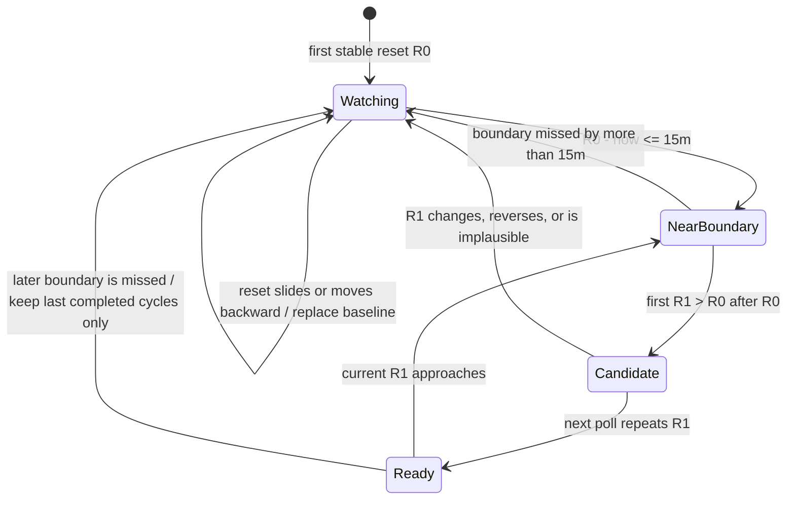

# Provider-wide quota pace plan

## 文件目的

這份計畫把 pace 的修正單位從「Codex Weekly 特例」改成「每一張 provider recurring quota card」。Codex、Claude、Grok、Antigravity 與 Copilot 的額度 window 都必須先取得可信的 account scope、stable window key、reset 與 duration，才能進入同一套 Linear／Historical 計算；缺少 duration 或歷史時必須顯示可理解的學習狀態，不得永久或無聲地退回 Linear。

[`codex-historical-pace-v2.md`](codex-historical-pace-v2.md) 保留為已退役的 Codex Weekly historical evaluator 設計與 schema-2 migration 歷史記錄；現行 v3 runtime 與 read-only importer 的 source of truth 是 `agent_quota_history.rs`。這份新計畫取代它作為 provider-wide outcome 的 active design。

> **核心結果：** pace duration 屬於 quota window，不屬於 provider 特例。任何已顯示、具有 recurring percentage quota 語意的 card，都必須走同一個 duration lifecycle；無法證明 duration 時，UI 必須明示原因，而不是顯示看似真實的 pace。
>
> **Implementation checkpoint（2026-07-27）：** Mac Stages 0–7已完成secure account scope、duration lifecycle、generic v3 history、五個provider adapters、typed Swift lifecycle／selection／presentation、serializer-locked cross-language fixture、monitored live smoke與deterministic popover UX；最終post-GUI fresh verifier回傳 `CONFIRMED`。M19-B1又在Native PR #102與Windows PR #7完成exact shared-core handoff、Windows production DTO／state machine／selection／presentation、119-case Swift／C# cross-check、hosted x64 runtime以及separate real ARM64 runtime gate。Windows port／parity因此完成；C ABI、ledger、cache format與provider network surface均未擴張。

## 目錄

- [目標與非目標](#目標與非目標)
- [目前缺口](#目前缺口)
- [Card eligibility contract](#card-eligibility-contract)
- [Account and window identity](#account-and-window-identity)
- [Duration contract](#duration-contract)
- [Pace state and wire contract](#pace-state-and-wire-contract)
- [Generic historical evaluator](#generic-historical-evaluator)
- [Storage and migration](#storage-and-migration)
- [Provider adapter matrix](#provider-adapter-matrix)
- [執行階段](#執行階段)
- [驗收條件](#驗收條件)
- [交付與驗證](#交付與驗證)
- [風險、相依與停止條件](#風險相依與停止條件)
- [授權邊界](#授權邊界)

---

## 目標與非目標

### Objective

完成後，Mac app 的 Historical 設定會套用到所有 eligible provider quota cards，而不是只在 Codex Weekly 有 backend result。每張 card 的 pace 由同一組 Rust-owned inputs 驅動：`providerId + accountScope + windowKey + reset + duration + usedPercent`。Swift 只負責 decode、模式選擇與呈現，不得自行猜 duration 或重算 Historical ETA／will-last／risk。

### Scope

| 類別 | 本計畫包含 | 本計畫不包含 |
|---|---|---|
| Providers | Codex、Claude、Grok、Antigravity、Copilot 的所有 recurring percentage windows | 新增 provider 或重新設計 provider authentication |
| Duration | Provider-reported、frozen contract、observed rollover 三種可信來源 | 從 display label、剩餘百分比或模糊 calendar 假設 duration |
| History | Generic cycle-normalized store、sampling、confidence、evaluation 與 Codex v2 import | 從 local token／cost history 回填 subscription quota |
| Account scope | Authoritative ID 優先、安全 credential-lineage fallback、切換帳號隔離 | 把 raw email、access token 或 token hash寫入 history |
| UX | 明確 learning／available／unavailable 狀態、所有 eligible cards 的 pace 文案與顏色 | History management UI 或手動編輯 history |
| Cross-language | Rust JSON、C contract comment、Swift decoder／presentation、Windows handoff fixture | 未經另行授權修改 TokenBar-Windows |
| Integration | 可審查的 Mac 實作與完整本機驗證計畫 | Push、PR、merge、tag、appcast 或 Homebrew release |

`OpenCode` 只提供 Copilot authentication，不是獨立 quota provider。Antigravity local IDE與 remote OAuth都是同一 provider，但 current auth evidence不能安全證明兩條 route屬於同一 account；因此兩邊都支援 pace，卻保持 account-scope隔離，直到 authenticated provider ID能證明同一 owner。安全 fragmentation優先於跨帳號污染。

## 目前缺口

現在的 nested `historicalPace` 只有 Codex refresh 會填入，而且 enrichment 只選 `Weekly`。其他 provider mapper 都把 `historicalPace` 初始化成 `nil`；Swift Historical mode 遇到 `nil` 便直接使用 Linear，因此 UI 看似支援 Historical，實際上 Claude、Grok、Antigravity 與 Copilot 永遠不會學到個人曲線。

| Surface | 現況 | 必須修正成 |
|---|---|---|
| Duration | Codex／Claude／Grok 部分 window 有 `windowMinutes`；Antigravity／Copilot 沒有 | 每張 eligible card 有可信 duration 或明確 `learningDuration` |
| Identity | Codex 有 account ID／email；其他 provider 不一致 | 每個 sample 都有不跨帳號混用的 opaque account scope |
| Window key | 多數 mapper 只有易變的 display label | Provider adapter 提供 stable semantic key，label 只供 UI |
| History | Store 與 cadence 固定為 Codex Weekly | 依 cycle duration 正規化、保留與判斷 confidence |
| Wire state | `historicalPace == nil` 同時表示 learning、unsupported、legacy 與 error | Required `paceStatus` 區分每個狀態 |
| Presentation | Historical 缺資料時 silent Linear fallback | 只有 `learningHistory` 可暫用 Linear，且文案必須明示 |

## Card eligibility contract

Rust provider adapter 必須先把每個 emitted window 分類，分類結果是 wire fixture 的一部分，不得由 Swift 依 label 猜測。

| Classification | Definition | Required behavior |
|---|---|---|
| `recurringQuota` | 有 bounded `0...100` utilization、下一次 reset，且 reset 後 quota 重新開始 | 必須進入 duration、sampling 與 Historical lifecycle |
| `recurringQuotaMissingReset` | 百分比看似 recurring，但 provider payload 沒有 reset | 顯示 `unavailable(missingReset)`；不能假設月初 |
| `nonRecurringCap` | Spend／credit cap 沒有可證明的 recurring reset | 不計算 pace，顯示 cap 語意；不得偽裝成 quota pace |
| `invalid` | 非 finite、越界、expired reset 或 contradictory bounds | 不 record；保留 last good card，或依既有 provider error contract 顯示錯誤 |

Claude `extra_usage` 目前只有 monthly cap 與 utilization，沒有 reset timestamp。官方說明確認它是 [monthly spending cap](https://support.claude.com/en/articles/12429409-manage-usage-credits-for-paid-claude-plans)，但沒有承諾 calendar boundary；因此本版本把它鎖定為 `recurringQuotaMissingReset`，不以「Monthly」文字推導 duration。這是唯一允許不顯示 pace 的正常 emitted percentage card，而且原因必須可見、可測，不得被歸類為「其他 provider 尚未支援」。若未來 payload 增加 reset，adapter 依 schema version 升級為 `recurringQuota`。

## Account and window identity

History series 使用 `SeriesKey { providerId, accountScope, windowKey }`。Duration 不進入 key：每個 cycle 保存自己的 duration，讓 28／29／30／31 天的同一 monthly quota 能在 phase-normalized curve 中比較。若 provider 真正改變 quota 語意，adapter 必須 bump `windowKey` version，而不是靠 duration 偶然切開 history。

### Account scope resolver

Security review 與 2026-07-17 live prompt 後的修訂已把 Mac protocol 鎖定如下。Implementation 不得自行換成 token hash、path／slot-only identity、account-scope Keychain或額外 provider endpoint；這個 trust-boundary stage只能交給 `security-executor`。

| Priority | Evidence | `accountScope` | Failure behavior |
|---|---|---|---|
| 1 | 從同一 authenticated response或實際發出 request 的 credential chain取得的 immutable ID／email | Domain-separated HMAC of provider、kind與 normalized identifier | Evidence 改變即建立新 series；不以另一份 unrelated local state補標 |
| 2 | Credential marker lineage | HMAC of provider與 random 128-bit lineage ID | Unseen external replacement建立新 lineage；已知 app refresh明確 transfer |
| 3 | No trusted evidence | None | `unavailable(accountScope)`；不得讀寫 provider history |

### History identity 與 account scope 是兩個不同的身分（2026-08-07）

上面那張表定義的是 **`accountScope`**，它服務三個消費者，而其中兩個對「碎裂」的要求與第三個相反：

| 消費者 | 存活時間 | credential 輪替時碎裂的後果 |
|---|---|---|
| `ProviderCacheBinding`（本體就是 `AccountScope`） | 一次 refresh | **正確**——碎裂即丟棄快取，這正是拒絕端出其他帳號快照的機制 |
| Claude plan 標籤快取 | 1 小時 | **正確**——同上 |
| Quota-pace history 的 `SeriesKey` | 數週 | **摧毀模型**——這是 issue #183 |

因此 durable history 另有一個身分 **`HistoryScope`**，由 `resolve_history_scope` 產生，與 `accountScope` 是**不可互轉的獨立型別**（傳錯不會編譯）。解析規則只有兩級：

| Priority | Evidence | `HistoryScope` |
|---|---|---|
| 1 | 與上表 priority 1 相同的 authoritative identifier | 沿用同一個 domain-separated HMAC |
| 2 | 無 authoritative evidence | `HMAC(K, "scope-history-v1" ‖ provider)`——per-installation、per-provider 常數，不讀 metadata |

**Priority 2 不會因 evidence 不足而失敗**，只會因 installation key 或 storage 失敗。但這不會放寬 fail-closed：`agent_usage.rs` 保留原本那道以 `accountScope` 為判準的 early return，它才是「身分未驗證就不寫入永久歷史」的唯一守門員（`parse_user_status` 會回傳 `accountScope` 為 `Err(NoTrustedEvidence)` 但 windows 非空的快照）。

> **產品決策（2026-08-07，owner 拍板）：** pace 曲線模型的是「這個人如何在一個 window 內消耗額度」，那是操作者的性質，不是帳單歸屬的屬性。**分得出來就分，分不出來就不要硬分。**
>
> 接受的後果：在沒有 authoritative ID 的 provider 上，同一台機器的兩個帳號共用一條 pace series。影響 Claude 全部路線、Grok、Copilot、Antigravity remote，以及 `ChatGPT-Account-Id` 缺席時的 Codex。
>
> 一併接受的模型代價：series 存的是 `usedPercent` 對 phase，同一個人在不同規模的方案上斜率不同，合併會讓曲線失真。判斷是「失真的模型遠勝於永遠學不起來的模型」。**刻意不把 plan tier 放進 `windowKey`**，那會重新引入碎片化。
>
> **一次性的歷史歸零，也是接受的代價。** 換 key 就是換 series，所以帶著這個改動出貨的那一版，上述每個 provider 的既有歷史都會被拋下、卡片回到 `learningHistory`，短 window 要重新累積 6 個 bucket、長 window 要 3 個完整 cycle。曾經評估過一次性 re-key 或合併舊 series 來避開這件事，實作並驗證後**被否決**：合併會把來源的 `active_reset_at` 交給目標，而 `apply_observed_duration` 在未學到 duration 的分支上遇到不同的 reset 就把它設成 `None`，救回來的 cycle 隨即失去 `retain_series` 的 active-group 豁免而整批被刪——實測同一份 store 同一次 poll，合併 3→0、不合併 3→3。付一次歸零的代價，比背一套會刪掉自己要救的資料的機制便宜。發版說明必須提到這一次重來。
>
> 被拋下的 series 不需要清理：`retain_store` 會掃過**每一條** series（不只正在寫入的那些），樣本逐一老化出 horizon 後整條被丟棄。

下列三條規則約束的是 **`accountScope`**，不是 history identity——history identity 走的就是上表 priority 2 的 provider-only 常數，那是記錄在案的決策而非默默放寬：§風險表的「不得降級 default key」列、§停止條件的「不得以 label、token hash、30-day constant或 silent Linear 來『完成』matrix」，以及 §Account scope resolver 開頭的「不得自行換成 token hash、path／slot-only identity」。（以內容引用而非行號：本節的插入曾讓既有的行號引用整體位移。）

Antigravity local IDE 的 email 來自 authenticated `GetUserStatus`，可走 authoritative route。Remote OAuth quota 使用 Google credential，但目前 email 來自另一份 `google_accounts.active` state，兩者未綁定；remote 必須走 credential lineage，且該 local email不得再用來標示或 scope remote quota。Local／remote history 只有在未來同一 authenticated response證明相同 provider ID，或有明確 trusted binding 時才能 merge；目前安全地分開學習。

| Current provider route | Frozen account evidence |
|---|---|
| Codex | 成功 usage response 前實際送出的 `ChatGPT-Account-Id`，缺少時使用 lineage；ID-token email 只供 presentation |
| Claude | Current payload沒有 bound owner ID；主 config directory 的所有 login／setup-token paths 仍使用 lineage。**例外(2026-08-23)**:以 `CLAUDE_CONFIG_DIR` 隔離的額外帳號走 authoritative route,identifier 為該目錄的絕對路徑。該路徑不是「與憑證無關的本機狀態」——它**選擇**憑證,因為讀取的 Keychain service 就是 `Claude Code-credentials-<sha256(path)[..8]>`。此綁定**僅在 Keychain 那條路徑成立**:`fetch_claude_inner` 另有四條來源(env token、login-shell harvest、`TOKENBAR_*`、主目錄檔案、固定 service),皆非由目錄選出,故額外帳號的憑證若來自其中任一,**不得寫入 durable history**(fail closed,卡片仍顯示)。主目錄的推導一個位元都沒有改變 |
| Grok | Current billing response沒有 owner ID；`auth.x.ai` entry的 email只供 presentation，history使用 lineage |
| Antigravity local IDE | Authenticated `GetUserStatus` email；缺席時 fail closed |
| Antigravity remote OAuth | Google credential lineage；忽略 unbound active-email state |
| Copilot | OpenCode GitHub credential lineage；本 Plan不新增 `/user` request |

#### Installation key and HMAC

| Item | Frozen behavior |
|---|---|
| Key generation | `SecRandomCopyBytes` 產生 32 bytes；concurrent first creation在 account-scope process mutex與 `fs2` file lock內完成，所有 caller重新讀取並驗證同一 persisted winner |
| Key storage | Application Support 的 `quota-account-scope-installation-key-v1.bin`；exact 32-byte binary、directory mode `0700`、file mode `0600`、write／`sync_all`／atomic replace後 sync parent directory |
| API boundary | Account-scope不使用 Keychain、`security` CLI或process argv；既有開發用 `com.nyanako.tokenbar.account-scope.v1` item只忽略，不讀取、刪除、更新或遷移 |
| HMAC | HMAC-SHA256，完整 32-byte output以 unpadded base64url保存；不得截短到 128 bits以下 |
| Authoritative scope | `HMAC(K, encode("scope-id-v1", provider, kind, normalizedIdentifier))` |
| Credential fingerprint | `HMAC(K, encode("credential-v1", provider, rawCredentialMarker))` |
| Slot digest | `HMAC(K, encode("slot-v1", provider, semanticSource, canonicalLocation))` |
| Lineage scope | 先用 `SecRandomCopyBytes` 產生 128-bit random lineage ID，再算 `HMAC(K, encode("scope-lineage-v1", provider, lineageId))` |
| Metadata MAC key | `HMAC(K, encode("metadata-key-v1"))`；只用於 authenticated metadata envelope |

`encode` 對每個 byte field 依序寫入 unsigned 32-bit big-endian length，再寫 exact bytes；domain 也是第一個 length-prefixed field。Text fields 先轉 UTF-8；credential marker 與 random lineage 保留 raw bytes。這個 encoding 套用到所有 HMAC 與 known vectors，不使用分隔字串或無長度 concatenation。

Raw identifier 與 credential marker只在記憶體短暫存在。Email normalization是 trim加 ASCII lowercase；opaque provider ID只 trim，保留 byte case。History只保存最後的 `accountScope`；單獨取得metadata／history而未取得installation-key file時，不能對low-entropy email做離線猜測。`0600`／`0700`邊界保護其他本機使用者；已能以相同UID任意讀取Application Support的惡意程式不在此權限模型內。

#### Credential markers and secure metadata

Credential marker 固定依下表選擇；同 provider不得由 worker另選較方便但會旋轉的欄位。

| Provider／route | Marker |
|---|---|
| Codex | Refresh token，缺少時 access token |
| Claude full login | Refresh token |
| Claude env／shell／raw setup-token | Access／setup token |
| Grok | Exact `auth.x.ai` entry的 refresh token |
| Antigravity remote | Google refresh token；若未來 provider回傳 replacement，走 refresh transfer |
| Antigravity local IDE | Authenticated provider ID／email；兩者皆無就 fail closed |
| Copilot | OpenCode `github-copilot.refresh`，缺少時 `access` |

Application Support 的 `quota-account-scope-v1.json` 使用 authenticated envelope：

```text
schemaVersion = 1
payloadBytesBase64
payloadMac

payload.bindings[] = {
  provider,
  slotDigest,
  credentialFingerprint,
  randomLineageId
}
payload.currentFingerprintBySlot
```

Metadata 不保存 raw token、email、account ID、path、display label或 plain SHA-256。Fingerprint binding immutable；相同 provider credential出現在另一個 source可重用 lineage；同 slot出現未知 fingerprint會建立新 lineage。Any conflicting existing binding fails closed，不自動 merge。

Installation-key 的 read／first-create／key-loss recovery與metadata的 load → MAC verify → mutate → atomic save共用 account-scope process mutex與 `fs2` exclusive lock；temp file mode `0600`，write／`sync_all`／atomic replace後 sync parent directory。每次scope resolution都從persisted key file重讀，不使用process cache。不得同時持有account-scope lock與v3 history lock；network不得在account-scope／v3 lock內執行。Provider refresh lock是唯一可跨network request持有的file lock。順序固定為：先完成installation-key transaction並釋放account-scope lock；refresh若需要則依下列refresh lock → metadata lock順序完成lineage transfer；最後才取得v3 lock寫history。

#### Refresh transaction and recovery

App-controlled refresh 的 cross-process lock 固定為 Application Support 的 `quota-auth-refresh-<provider>.lock`，以 owner-only mode 開啟。Lock ordering 只能是 refresh lock → metadata lock；不得在持有 metadata／v3 lock 時反向取得 refresh lock。Claude／Grok target-bound transaction 固定依序：

1. 先在account-scope lock內讀取或recover installation-key file並釋放該lock，再取得provider refresh process／file lock；key error保留為typed unavailable，但不得阻止既有credential refresh本身。
2. 取得 refresh lock 後重新載入 exact current auth target A，發出 `RefreshCheckpoint::Reloaded`，計算 `F_old`並resolve A scope／binding。
3. 持有 refresh lock 執行既有 refresh request，發出 `RefreshCheckpoint::NetworkReturned`，驗證response並計算 `F_new`；此時不持有 metadata／v3 lock。
4. 在lineage transfer前重新讀取並preflight exact durable target。Missing、changed、malformed或無法可靠驗證皆terminal；不得進入metadata transfer或quota continuation。
5. Preflight成功後，在 metadata transaction 內確認 `F_old` lineage無conflict，把 `F_old`、`F_new`綁到同一lineage，persist後立即釋放metadata lock，再發出 `RefreshCheckpoint::MetadataHandled`。
6. 仍持有 refresh lock 時執行typed save：第二次重新讀取／比較exact target，從current root merge以保留siblings，compare成功後才嘗試encode／stage／write。Save closure回傳後一律發出 `RefreshCheckpoint::CredentialsPersisted`，再依typed result分支；這個checkpoint名稱不保證write成功。
7. 只有success或genuine persistence fail-soft result可進入required quota continuation；success帶reusable binding，persistence failure帶fresh credential與transferred scope但`cache_binding=None`。Quota fetch成功且scope可信後，才寫v3 history。

| Refresh result | Metadata／checkpoint state | Continuation policy |
|---|---|---|
| Preflight target-invalid | 相對已預建立A lineage的metadata baseline byte-identical；只有`Reloaded`、`NetworkReturned` | Terminal；不save、不usage |
| Post-preflight target-invalid | Transfer已完成；save-attempt checkpoints包含`MetadataHandled`、`CredentialsPersisted`；external durable target不覆寫；new marker可留下inert A-lineage mapping | Terminal；不usage、不cache |
| Genuine persistence failure | 第二次exact compare成功且transfer已完成；writer／encode persistence stage失敗；不rollback metadata | Fresh-but-uncacheable；exactly one required continuation；不提供reusable cache binding |
| Success | Current siblings合併保存；persisted `F_new`重新resolve成binding | 繼續既有quota flow並可寫history |

Claude File pinning以exact `claudeAiOauth` object為target；pure Keychain decision同時驗證captured account、current account與captured-account exact item，real write仍固定更新captured account。Mid-refresh mcpOAuth-only、`claudeAiOauth:null`與explicit logout都是`TargetMissing`，不套用top-level setup-token fallback。Grok只重讀captured `auth.x.ai::<client_id>` exact entry，foreign entries不作fallback並在成功merge時保留。Codex與Antigravity維持各自既有ordering／failure policy，不由本流程改寫。

Compare-to-write期間仍可能有same-user external writer介入；filesystem atomic replace與Keychain `security -U`都不是CAS，credential store與lineage metadata也不是cross-resource atomic transaction。Crash after lineage transfer but before credential success可留下old／new fingerprints同lineage；該mapping在target-invalid時是inert，不授權usage。Metadata write失敗不得被當作target persistence failure，本poll pace維持`unavailable(accountScope)`且不得寫history。

| Failure／restore | Required result |
|---|---|
| Existing key無法讀取、不是real regular file、mode不是exact `0600`、inode在驗證期間被替換，或長度不是exact 32 bytes | Typed unavailable；不得replace key、quarantine metadata或讀寫history |
| Key file不存在，且沒有metadata／v3 artifacts | 在account-scope lock內建立owner-only key並atomic replace；重新讀取persisted winner後可在同一poll建立metadata |
| Key file不存在，但canonical metadata、既有`.orphaned-*` metadata evidence或v3已存在 | 若canonical metadata存在，先byte-preserving rename到unique `.orphaned-<seconds>[.<n>].json`；既有orphaned evidence只作保守存在性判定，不讀取、覆寫或刪除；成功後才建立key；v3原位保留為orphaned scopes；建立並重讀winner後，first poll回`unavailable(accountScope)`，下一poll建立fresh metadata |
| Metadata syntax／schema／MAC invalid | 使用existing valid key先byte-preserving rename到unique `.corrupt-<seconds>[.<n>].json`；該poll unavailable；下一poll建立fresh metadata |
| Any quarantine failure | 不建立或replace key，不建立／overwrite metadata，不讀寫v3；保留原始或已rollback的證據 |
| Key atomic-write failure | Replace前不得留下partial key或temp；replace後的parent-directory sync failure可留下exact `0600` winner，但本poll仍typed unavailable，下一次resolution重新讀取並驗證該winner；不得讀寫v3 |
| Account-scope lock／metadata save failure或binding conflict | Typed unavailable；保留最後有效metadata與history |
| Normal app reinstall | Application Support仍在時恢復同installation key、metadata與scopes；若Application Support被移除則視為新installation |
| Consistent full restore | Installation key、metadata、v3三者一致才恢復 |
| Explicit full purge | 必須一起刪除installation-key file、metadata、v3與legacy v2；本Plan不新增purge UI，也不宣稱APFS secure erase |

Retained v2 仍含 legacy raw Codex account key，因此分類為 legacy-sensitive migration data；「沒有 raw identifier」只適用新 metadata與 v3。這份 Plan保留 v2 bytes／mtime／path，不隱瞞或假稱已清除；v2 writer／evaluator 已退役，但 schema-2 檔案仍由 `agent_quota_history.rs` 的 importer 作 read-only migration input。

Security fixtures必須覆蓋HMAC known vectors／domain separation、different-installation unlinkability、各credential source、refresh每一步crash injection、Claude File／pure Keychain／Grok exact-entry的preflight與post-preflight四種target classification、genuine persistence fail-soft、required continuation count／binding／checkpoint／sibling preservation、same-slot replacement、two-process create／transfer conflict、key exact-length／mode／symlink／non-regular／inode-replacement防護、key-loss orphan recovery、MAC／lock／atomic-write／quarantine failures、Antigravity stale active-email mismatch，以及metadata／v3 byte scan不含fixture raw values或其plain SHA-256。

現行release是ad-hoc signed，因此restrictive Keychain ACL沒有跨rebuild／update的stable code identity。未來只有在release chain採用穩定Developer ID signing後，才可另立migration plan評估升級回Keychain；migration必須匯入並驗證與現有file完全相同的32 bytes，成功前file維持source of truth，絕不能生成新key造成`accountScope`與history斷代。舊開發用Keychain item不屬於migration input。

### Stable window keys

`windowKey` 來自 provider schema 的 field、period type、quota class 或 model ID。Display label 可以 localized 或改名，不得成為 history identity。Antigravity mapper 必須保留 model ID；若同一 model 有多個 bucket，先依現有 binding-limit 規則選出 card，再用 model ID 建立唯一 series。

## Duration contract

每個 eligible card 都走相同 resolver，但 resolver 只接受三種有證據的來源，優先序固定為 `provider` → `contract` → `observed`。前一種 route 缺少必要欄位時，只要仍有可信 future reset 就可進入下一種；沒有 reset 則直接 `unavailable(missingReset)`。

| `durationSource` | Source | Examples | Trust rule |
|---|---|---|---|
| `provider` | 同一 payload 的 cycle start／end 或 explicit duration | Codex `limit_window_seconds`；Grok period start／end | Bounds finite、end later than start、current reset matches end |
| `contract` | Provider schema field 或已驗證 calendar rule 的 frozen semantic duration | Claude 5h／7d schema aliases；Copilot first-of-month reset | 用 schema key，不用 display label；fixture 鎖定 aliases 與 calendar edge |
| `observed` | TokenBar 實際看到相鄰 reset rollover | Antigravity model；Grok缺少 period start 的 fallback；非標準 Copilot reset | 只有通過下列 rollover state machine 才可使用 |

### Observed rollover state machine


```mermaid
stateDiagram-v2
    [*] --> Watching: first stable reset R0
    Watching --> NearBoundary: R0 - now <= 15m
    Watching --> Watching: duplicate R0
    Watching --> Watching: reset slides or moves backward / replace baseline
    NearBoundary --> Candidate: first R1 > R0 after R0
    NearBoundary --> Watching: boundary missed by more than 15m
    Candidate --> Ready: next poll repeats R1
    Candidate --> Watching: R1 changes, reverses, or is implausible
    Ready --> NearBoundary: current R1 approaches
    Ready --> Watching: later boundary is missed / keep last completed cycles only
```

Accepted observed duration is exactly `R1 - R0`, where the app saw the stable old reset within 15 minutes before expiry, saw the new reset within 15 minutes after expiry, and confirmed that new reset on the next poll. The existing 5-minute background poll and 1-minute visible-window poll make this reachable; sleep or app downtime may miss the boundary, in which case the card remains `learningDuration` for the new cycle.

| Edge case | Required transition |
|---|---|
| Duplicate reset | No-op; never manufactures a boundary |
| Sliding reset | Invalidate candidate and watch the newest stable reset |
| Backward reset | Invalidate current duration; preserve completed history but do not sample current cycle |
| Missed one or more cycles | Do not divide reset delta or guess cycle count; restart watching |
| Monthly 28–31 days | Accept each exact adjacent delta as that cycle's duration; never replace it with a 30-day average |
| Boundary seen but new reset not stable | Stay learning; no current-cycle samples |

Raw readings collected before duration becomes ready are not retroactively turned into curve samples. Once `R1 - R0` is accepted, `R0` is the exact start of the current cycle and sampling begins from that boundary.

### Durable rollover state

Observed state is not a second file. It lives inside the same v3 `SeriesState` as samples and is mutated under the same process mutex、inter-process lock與 atomic save。The persisted union is:

| State | Required fields | Restart behavior |
|---|---|---|
| `watching` | `resetAt`、`firstSeenAt`、`lastSeenAt`、`consecutiveCount` | Continue counting the same normalized reset；two consecutive polls make it stable |
| `candidate` | `oldResetAt`、`oldSeenAt`、`newResetAt`、`firstNewSeenAt` | Same `newResetAt` on the next poll becomes ready；any other reset replaces baseline |
| `ready` | `cycleStartedAt`、`resetAt`、`durationSeconds`、`confirmedAt`、`lastSeenAt` | Current cycle may sample immediately；later near-boundary observation can create the next candidate |

`SeriesState` is keyed by the full `providerId + accountScope + windowKey` and also persists optional `activeResetAt` plus `lastActivityAt`。`activeResetAt` is updated only from a valid provider／contract card reset，or from `ready.resetAt` after observed confirmation。`lastActivityAt` is the maximum accepted sample timestamp or rollover-observation timestamp；it never advances merely because the store was loaded。All timestamps are Unix seconds；durations must be positive and at most 400 days；`consecutiveCount` is capped at 2。`nearBoundary` is derived from `lastSeenAt` and is not separately serialized。A duplicate observation only advances `lastSeenAt`／stability；a missing card does not mutate state。

When a candidate confirms, state transition and the first duration-ready sample are one v3 transaction。A crash before rename leaves the old candidate；a crash after rename leaves ready state plus the sample。Corrupt v3 follows the store quarantine rule and restarts observed learning；a new account scope naturally gets separate state，while old scope state remains isolated until retention removes it。

Copilot has one immediate contract route：when `quota_reset_date` is exactly UTC midnight on day 1，duration is the difference between that reset and the previous UTC calendar-month boundary。This matches the provider's documented [first-of-month reset](https://docs.github.com/en/copilot/reference/copilot-billing/request-based-billing-legacy/copilot-requests) and naturally produces 28／29／30／31-day cycles。Any non-first-of-month reset must use the observed state machine；it must not be rounded to 30 days。

## Pace state and wire contract

`UsageWindow` 新增 required `cardId` 與 required nested `paceStatus`。`cardId` 只負責 provider 內的 presentation row identity；`windowKey` 才能識別可學習的 history series。Positive `durationSeconds` 是新 pace 唯一精確 duration；`windowMinutes` 保留 legacy compatibility，由 `durationSeconds / 60` 整數除法導出，Swift v3 calculation 不得再讀它。現有 `historicalPace` 仍是 Rust evaluator 的 coherent result。Swift decoder 對舊 payload 缺少 `paceStatus` 的情況建立 internal `legacyMissing`，不得把它與 learning 混為一談。

| `paceStatus.state` | `durationSeconds` | `historicalPace` | Historical mode presentation |
|---|---:|---:|---|
| `learningDuration` | `nil` | `nil` | `Learning reset duration`；不顯示假 pace 或 ETA |
| `learningHistory` | required positive | `nil` | 明示 `Learning history · Linear estimate`，暫用 Linear |
| `available` | required positive | required | 使用 Rust historical expected／ETA／will-last／risk |
| `unavailable` | optional | `nil` | 顯示 typed reason，例如 `missingReset`、`nonRecurring`、`accountScope`、`storeCapacity` |

`paceStatus` 至少包含 `state`、optional `windowKey`、`durationSeconds`、`durationSource`、`completeCycles` 與 optional `reason`。`windowKey` 只有 `unavailable(windowIdentity)` 可為 `null`，其他 state 必須 non-empty。`durationSource` 在 `learningDuration` 可為 `observed`，在 `unavailable` 可缺席。Rust serialization tests 必須鎖定下列不變量：

```text
available       <=> durationSeconds > 0 && historicalPace != nil
learningHistory  => durationSeconds > 0 && historicalPace == nil
learningDuration => durationSeconds == nil && historicalPace == nil
unavailable      => historicalPace == nil
windowKey == nil <=> unavailable(windowIdentity)
```

`cardId` 必須在同一 provider snapshot 內唯一且不讀 display label。Identified cards 使用 `cardId = windowKey`；無 semantic history key 時，adapter 使用 structural presentation ID：Codex main slots 為 `row.main.<slot>.v1`，anonymous additional limit 為 `row.additional.unknown.<slot>.v1`（同 slot 只 emit provider-order 第一筆），unknown Grok period 為 `row.billing.unknown.v1`，Antigravity CLI missing-model rows 為 `row.cli.config.<originalSourceIndex>.v1`。Swift row key 固定為 `providerId + ":" + cardId`；同 snapshot 若仍 collision，後一筆 fail closed 不 render，不得 suffix display label。Localization 或 duplicate labels 不再影響 row identity。

Linear setting 也使用同一個 exact `durationSeconds`。Historical setting 只有在 `learningHistory` 可以暫時使用 Linear，而且 UI 必須明示；`learningDuration`、`unavailable`、`legacyMissing` 都不能 silent fallback。Settings 文案要從「weekly curve」改成「learns each quota window's usage pattern」。

「這是 historical comparison」的宣稱只有在 `available` 時成立，而且**只由文案承擔**：`learningHistory` 的 Linear estimate 必須以不同文案標示，避免把測試用 reverse 或硬編文字誤認為真實 historical result。

橘色 ahead／deficit 標記本身不承擔這個宣稱——只要 actual 越過 expected 線就上色，Historical 與 Linear 同色。理由是 `available` 由每次 refresh 重跑的 out-of-sample fit gate 決定（`evaluate_partial_projection` 有六個 `return None` 分支：bucket 數、phase span、fit quality、slope、crossing 範圍），同一張 card 會在 `available` 與 `learningHistory` 之間來回；把顏色綁在 basis 上，使用者看到的是預測「一下子就不見了」，而底層 deficit 一直存在。

## Generic historical evaluator

Codex v2 的 coherent Rust result、current-actual shift、capped-demand extension 與 expected／ETA／will-last／risk ownership 保留，但 sampling、coverage、retention 與 recency 改為 cycle-aware。

### Sample and cycle model

每筆 sample 保存 `sampledAt`、`resetAt`、`durationSeconds`、`durationSource` 與 bounded `usedPercent`。對該 cycle 的 phase 定義為：

```text
u = clamp(1 - (resetAt - sampledAt) / durationSeconds, 0, 1)
```

| Rule | Frozen behavior |
|---|---|
| Reset normalization | Quantum `q = clamp(duration / 100, 60s, 300s)`；同一 provider reset 的小 jitter 收斂，但 observed rollover 的原始 boundary 另行保留 |
| Phase buckets | 每 cycle 48 格；`phaseBucket = min(floor(u * 48), 47)`；reset 改變、進入新 phase bucket，或 usage 改變至少 1 percentage point 才接受 |
| Sample cap | 每 cycle 最多 48 筆；同 series／normalized reset／phase bucket dedupe |
| Valid sample | Finite、`0 < usedPercent <= 100`、positive duration、sample 位於 cycle bounds；zero reading 可供當下 Linear 顯示但不持久化 |
| Retention-complete group | 至少 6 個 distinct phase buckets，起點／終點 coverage 成立，且最大 phase gap 不超過 `0.30` |
| Fit-eligible completed cycle | 先符合 retention completeness，且所有 validated samples的 `durationSeconds` exact相同 |

Coverage boundary 使用 `b = min(0.10, 24h / duration)`；retention-complete group 必須滿足 `uMin <= b` 與 `uMax >= 1 - b`。最大 gap 在排序後的 `[0, distinct observed phases..., 1]` 上計算。這讓 5h、7d 與 monthly window 都用相同比例規則，又不要求 monthly app 在 reset 後數分鐘內一定在線。Mixed-duration group仍受同一 retention bounds管理，但不進fit。

### Retention and confidence

`nominalDuration` 是同 series retention-complete groups 的 duration median，只用於 retention／recency，不覆蓋 current cycle 的 exact duration，也不進入 series key。奇數筆取中間值；偶數筆取兩個中間值的 arithmetic mean；尚無 retention-complete group 時使用 current accepted exact duration（observed route 即 `ready.durationSeconds`）。

Retention completeness 與 fit eligibility 是兩個不同判斷。`retention_cycle_descriptor` 只檢查 sample validity、normalized reset、6 個以上 buckets、起終點 coverage與最大 phase gap；符合者占用既有 historical slot。`cycle_profile` 才額外要求該 group 的所有 validated samples具有 exact相同 `durationSeconds`。Mixed-duration group會在原位、bounded保留，但不計 `completeCycles`、不建 curve，也不進任何 fit fold。

| Decision | Formula |
|---|---|
| Retained completed groups | `R = clamp(max(8, ceil(28d / nominalDuration)), 8, 128)`；time horizon `H = clamp(max(56d, R * nominalDuration), 56d, 400d)` |
| Per-series sample cap | 最多 `R` 個 retention-complete groups，加一個 active incomplete group；每 group 最多 48 samples |
| Recency basis | `ageSeconds = max(0, currentResetAt - historicalResetAt)`；`ageCycles = ageSeconds / nominalDuration`；`tauCycles = clamp(max(3, 7d / nominalDuration), 3, 64)`；`weight = exp(-ageCycles / tauCycles)` |
| Effective samples | `nEff = sum(weight)^2 / sum(weight^2)`；只保留作 actual `< 100` 的 completed risk confidence，不再作 expected availability hard gate |
| Expected quality gate | Completed history的 out-of-sample `fitRmse <= 6 pp + EPSILON`；沒有合格 completed history時，可由 active current group的 walk-forward `fitRmse <= 6 pp + EPSILON`通過 |
| Historical risk gate | 至少 5 個 fit-eligible completed cycles、`nEff >= 4`、observation span `>= max(4 * nominalDuration, 7d)`，且 final-quarter holdout quality通過 |

Retention 在每次 locked v3 transaction 完成 duration transition／record 後、atomic save 前執行，並以該 transaction 的 `now` 決定所有 boundary。每個 series 先依 normalized reset分組，規則固定為：

| Group or state | Deterministic retention |
|---|---|
| Retention-complete group | 同時滿足「依 `resetAt` 最新的 `R` 個」以及 `resetAt >= now - H` 才保留；mixed-duration group也占同一 slot，超額時依相同順序整組刪除 |
| Current incomplete group | 只保留一組：每筆 sample必須通過 validity，且以自己的 persisted duration正規化後符合 persisted `activeResetAt`。最多 48 samples |
| Other incomplete groups | 立即整組刪除，包括 expired、superseded、future fragment與 repeated partial-reset churn；`activeResetAt`缺失時不猜最近或sample最多的group |
| `watching`／`candidate`／`ready` | Tracked old reset超過 boundary 15 minutes仍未完成合法 adjacent transition即清除；candidate也必須在 `oldResetAt + 15m` 前由 next poll確認。下一個 reading從 fresh `watching` 開始 |
| Rollover-only series | 沒有 samples／retention-complete groups且 `lastActivityAt < now - 56d` 時刪除；空 series立即刪除 |

Persisted `activeResetAt` 由最近一次 provider／contract route驗證成功的 normalized reset更新；observed route只有 ready後才可設定，因此 learning-duration readings不會留下 incomplete sample group。每次取得 accepted current duration後、寫入新 sample前，Rust會刪除同一 active incomplete group中 duration不相容的舊 evidence；completed groups不受影響。Evaluator只接受 normalized active reset、normalized current reset與每筆 exact current duration三者一致的 current samples，任何矛盾都 fail closed並重新學習。

Store 另有兩個全域 hard bounds：最多 512 個 series、65,536 個 samples。Pruning 先套用 invalid／incomplete／stale state與 per-series規則；sample仍超額時，按 `(resetAt, providerId, accountScope, windowKey)` 升冪整批刪除全域最舊 retention-complete groups，直到回到上限。Current incomplete group不是這個全域 sample eviction的候選。

新增 series將超過 512 時，先移除 inactive series；排序固定為 `(lastActivityAt, providerId, accountScope, windowKey)` 升冪。Active 定義為本次 provider snapshot有 emit，或仍持有 future／15-minute grace內的唯一 current incomplete reset或 rollover reset；目前 active series不得被 eviction。若同一 transaction 的 active candidates仍超過剩餘容量，既有 active series優先，new candidates依完整 `SeriesKey`升冪依序 admission；其餘 cards回傳 `unavailable(storeCapacity)`，且不得 mutate v3。若只剩 current incomplete samples仍無法降到 65,536，也拒絕本次 offending sample並保留 transaction 前的最後有效 store；不得為了寫入而 eviction current active data。

Retention fixtures 必須覆蓋 repeated partial-reset churn、sliding／backward reset、stale rollover-only state、abandoned account scopes、mixed-duration bounded retention、28–31-day horizon、short-cycle `R = 128`、global sample eviction tie ordering、active-series protection與 hard-cap overflow。

### Quality-based availability

每個 fit-eligible completed cycle先依自己的唯一 duration映射到 `u`，再重建為169-point monotonic curve。Availability不再使用固定 complete-cycle數量、`nEff`或observation span作 expected hard gate，而是使用真正 holdout：

- LOBO每次移除一個完整 phase bucket，只以其他 raw samples重建 curve，再對held-out bucket預測。每個cycle先算 bucket等權 MSE。
- 只有一個cycle時，`fitRmse = loboRmse`。兩個以上cycles另做LOCO：排除一個cycle，以其他cycles的recency-weighted median curve預測該cycle；`fitRmse = max(loboRmse, locoRmse)`。
- 跨cycle aggregate固定為 `sqrt(sum(weight * cycleMse) / sum(weight))`。空training、非finite、non-positive weight或 `fitRmse > 6 pp + EPSILON`一律fail closed。
- Completed blend使用 `fitQuality = clamp(1 - fitRmse / 12, 0, 1)`、`evidenceShare = totalWeight / (totalWeight + 1)`與 `lambda = fitQuality * evidenceShare`。一個近期、完美cycle的historical contribution不超過50%。

若沒有合格completed projection，exact active current group可獨立通過。它至少需要6個distinct phase buckets、phase span `>= 0.10`，並以phase排序做walk-forward validation：前三個buckets是initial prefix，每個後續bucket只能使用更早evidence fit through-origin slope `usedPercent ≈ beta * phase`。至少3個held-out predictions且RMSE通過相同6 pp gate後，才以全部current samples重算final `beta`。

Partial blend固定為：

```text
fitQuality = clamp(1 - fitRmse / 12, 0, 1)
lambda = 0.5 * fitQuality
trendDemand(u) = max(0, beta * u)
linearDemand(u) = 100 * u
baseDemand(u) = lambda * trendDemand(u) + (1 - lambda) * linearDemand(u)
```

`expectedUsedPercent`取current phase的unshifted `baseDemand`；ETA與will-last則先算 `shift = actualUsedPercent - baseDemand(uNow)`，再從shifted demand找crossing。這讓wire可以合法回傳 `available + completeCycles: 0 + historicalPace`，其語意是validated current-window learned projection，不是跨cycle穩定性聲明。Partial actual `< 100`時不公開模型型risk。

### Projection and risk

Completed expected curve把通過quality gate的historical curve與 `linear_i = 100 * u_i`依上述 `lambda`混合，169點完成後再由左到右做cumulative maximum。若 `totalWeight`非finite或 `<= 0`，不產生completed result並嘗試current partial path。

Risk／ETA 對每條completed curve沿用current-actual shift與uncapped demand extension。`weightedRunOutMass`仍以recency weight彙總，並以 `smoothed = clamp((weightedRunOutMass + 0.5) / (totalWeight + 1), 0, 1)`決定 `willLastToReset = smoothed < 0.5`。Actual `< 100`時，只有risk gate成立且每個cycle在 `phase >= 0.75 - EPSILON`的LOBO與LOCO各至少有3個held-out residuals、tail aggregate也通過6 pp gate，才公開 `runOutProbability = Some(smoothed)`；evidence不足只隱藏risk，不會撤銷已通過的expected／ETA。

一旦quality gate已產生historical result且current actual `>= 100`，這是已發生的觀測事實：不論completed或partial path都固定 `runOutProbability = Some(1)`、`willLastToReset = false`、`etaSeconds = Some(0)`，不受5-cycle、`nEff`、span或tail-confidence限制。其他情況若 `willLastToReset == false`卻沒有合法crossing，整個candidate fail closed；不得輸出 `false + nil`。

Weighted median沿用v2的deterministic tie rule：依value升冪排序，累積weight第一次 `>= totalWeight / 2`就取該值，因此exact half選lower value；total weight為零時同樣排序並取index `len / 2`。Expected grid、LOCO curve與ETA candidates都使用此規則。

單一production calculation只定位exact `SeriesKey`一次，且只讀target series。最多讀取128個retention-complete historical groups加1個active partial group，共 `129 * 48 = 6,192` samples；partial最多45次walk-forward fits，completed最多6,144個LOBO folds與128個LOCO folds。不得對其他series建profile、curve或fold，也不得persist fit cache。

## Storage and migration

Generic store 使用 `quota-pace-history-v3.json`，schema version 現為 `4`。檔名裡的 `v3` 是 store family、在 store 建立時就固定，與 schema counter 是兩個不同的號碼；升級是就地惰性的，磁碟上的檔案會維持 `"schemaVersion": 3` 直到下一次本來就要寫檔的交易。Top level 是排序後的 `series[]`；每個 `SeriesState` 保存 `providerId`、opaque `accountScope`（承載的是 `HistoryScope` 而非 `AccountScope`，欄位名為相容既有記錄而保留）、`windowKey`、optional `activeResetAt`、`lastActivityAt`、optional rollover state與 `samples[]`。Sample 固定包含 `resetAt`、`durationSeconds`、`durationSource`、`usedPercent`、`sampledAt` 與 `origin`（`liveV3` 或 `importedV2`），schema 4 另加 optional `plan`——目前恆為 `None` 且不做 backfill，也不得進入 canonical sample key。v1 永不讀取；既有 `codex-weekly-history-v2.json` 是唯一 migration input，且 bytes、mtime 與 pathname 必須保持不變。

| Concern | Required behavior |
|---|---|
| Serialization | Account scope先在獨立 metadata transaction resolve並釋放其 lock；接著 process mutex加 `fs2::FileExt::lock_exclusive` 鎖住 app-data `quota-pace-v3.lock`，包住 load → import → duration transition → record → atomic save → evaluate；所有 error path 都釋放 lock |
| Atomic save | 重用現有 same-directory unique temp、flush／sync與 `tokscale_core::fs_atomic::replace_file`；失敗保留最後一份有效 v3；Unix file／lock mode 限制為 owner-only |
| v2 import eligibility | 只在 successful Codex usage fetch 內執行；只接受 schema `2`、`windowMinutes == 10_080`、valid reset／sample bounds／`0 < usedPercent <= 100`，且 raw `accountKey` matches the accepted request account ID；其他 record skip，不修改 v2 |
| Current-account match | 只有本次成功 request 實際送出的 `ChatGPT-Account-Id` 可做 trimmed byte-exact match；ID-token email 不作 import binding；不得從 legacy string shape 猜 ID／email，也不得批次匯入未登入帳號 |
| v2 conversion | `providerId = codex`、current resolved opaque `accountScope`、`windowKey = main.weekly.v1`、`durationSeconds = windowMinutes * 60`、`activeResetAt = null`、`lastActivityAt = max(imported sampledAt)`；reset保留 v2既有 nearest-300s normalization |
| Canonical sample key | `(providerId, accountScope, windowKey, normalizedResetAt, phaseBucket)`，其中 phase bucket 使用 v3 的 48-bucket formula |
| Collision precedence | 同 key 時 `liveV3` 永遠勝過 `importedV2`；同 origin 取較晚 `sampledAt`；timestamp也相同時取較高 finite `usedPercent`；最後以完整 serialized tuple升冪作 deterministic tie-break |
| Idempotency | 每次啟動可重新 merge v2；canonical key dedupe 是 correctness rule，整檔 SHA-256 digest 只作 skip optimization，不作「已完成」marker |
| Existing v3 | Merge 新的合法 v2 samples，不清空其他 provider／account series |
| Corrupt v2 | Leave untouched、skip import、保留既有 v3；不得寫「已完成」marker |
| Corrupt v3 | 依 v2 既有 quarantine contract 保留原始 bytes；quarantine 成功後才能重建，失敗則本次完全不寫 |
| Interrupted migration | 正式 v3 只能是 migration 前或完整 migration 後版本，不得出現 partial JSON |
| Concurrent first run | 第二個 process 取得同一 `fs2` lock 後重新讀正式 v3；account scope已在先前獨立 metadata transaction持久化，merge不得 lost update或建立 duplicate lineage |
| Rollback app adds v2 samples | 新版下次啟動重新 merge；v2 仍然不被改寫 |

Import 不會為 v2 raw key 自行建立 scope。它只使用成功 request 已接受並持久化的 account-ID scope；因此 v2 中的其他 accounts 與 email-keyed records 保持未匯入。這會安全地捨棄部分 legacy continuity，但不會把 stale email history 掛到另一個帳號。

Migration fixtures 必須包含 empty／existing／corrupt v3、valid／corrupt v2、accepted current-ID match、email-only skip、multiple legacy accounts only-current-ID-imported、same-bucket collisions、rollback 新增 v2 sample、save interruption 與 two-process first run。每個 fixture 都逐 byte／mtime 驗證 v2 未變，並鎖定 sorted v3 JSON。V3 history 與新 metadata 不得保存 raw provider identifiers、credential material、display labels 或 UI copy；fixture 同時明示 retained v2 仍是 legacy-sensitive。

## Clock disagreement is repaired, not quarantined（2026-08-09，issue #144）

一個結構完整的 store 曾因為單一 series 的 `lastActivityAt` 超前讀取交易 48 秒而被整份隔離重建，585 筆樣本消失。根因不是 provider 資料也不是 stale caller——**寫入端一律是本機時鐘，但兩個寫入點都是單調的**：`update_seen` 的 `previous.max(now)` 與 `series.last_activity_at.max(now)`。因此**單次向前的時鐘偏移（NTP step、睡眠喚醒）會被永久鎖住**，時鐘回正後該值不會衰減，之後每次讀取的 ceiling 都低於它。`max()` 本身正確（防時間戳倒退），保留不動。

`validate_store` 本來就是純結構檢查、`validate_store_at` 才加上唯一那條時間檢查——分離早已存在，是呼叫端把兩者塌成同一個隔離決定。現行契約：

| Failure class | Disposition |
|---|---|
| Deserialize 或結構失敗 | 隔離、重建空 store（不變） |
| 某 series 自己的 `sample.sampled_at` 超前 ceiling | **只**丟該 series，兄弟不受影響 |
| Rollover 的**活動**時間戳超前 | rollover 設為 `None`，樣本全留 |
| `lastActivityAt` 超前 ceiling | 夾取 |

四條規則各自都曾寫錯過一次，錯法相同——**把本模組四種語意不同的時間量拿兩種來比**：

| 規則 | 錯了會怎樣 |
|---|---|
| 偵測門檻一律 `upperBound`，**只有夾取目標**是 `observationNow` | 夾到 ceiling 會讓 series 高於交易主體的時鐘，`is_stale_observation` 拒絕每一筆觀測、不存檔、每次載入重複——保住歷史卻永久停止記錄，比隔離更糟 |
| Rollover 偵測**只看活動時間戳** | `resetAt` 等是未來邊界（`validate_observed_state` 要求 `lastSeenAt < resetAt`），納入會在每次載入丟掉每個健康 rollover、duration 學習停擺。`Candidate` 沒有 `lastSeenAt`，其活動時間戳是 `firstNewSeenAt` |
| Floor 包含存活的 rollover，不只樣本 | 落在 `(observationNow, upperBound]` 的 rollover 活動時間戳會存活，只算樣本的 floor 會夾到它底下、違反 `activity_valid`，最後讓**整筆交易**對所有 provider 失敗 |
| 夾取以 `lastActivityAt > upperBound` 為閘 | 無閘會改低較新寫入者已提交的時間戳。多 series 時（實際回報的形狀）A 超前觸發修復、兄弟 B 落在健康帶被改低＝lost update |

修復是記憶體內的，**不隔離、不改名、不寫第二個檔**，由既有的 save-if-changed 路徑持久化。它對任何今日可正常載入的 store 必為 no-op：`activity_valid` 已強制 `sampled_at <= lastActivityAt <= upperBound`，所以丟棄條件不可滿足、per-series 閘也全數跳過。**刻意不設有界門檻常數**——夾取在任何幅度下都合理，門檻只會在兩個等價修復之間做無法論證的選擇；真正需要看幅度的只有「樣本證據在未來」，那由分類處理。

## Provider adapter matrix

### Codex and Claude mappings

| Provider source field | Display card | Stable `windowKey` | Duration route |
|---|---|---|---|
| Codex recognized 18,000-second main window | Session | `main.session.v1` | Provider explicit seconds |
| Codex recognized 604,800-second main window | Weekly | `main.weekly.v1` | Provider explicit seconds |
| Codex additional limit `primary_window`／`secondary_window` | Existing cleaned label | `additional.<sourceDigest>.<slot>.v1` | Provider explicit seconds |
| Claude JSON `five_hour`／5h header | Session | `session.v1` | Contract 300 minutes |
| Claude JSON `seven_day`／7d header | Weekly | `weekly.v1` | Contract 10,080 minutes |
| Claude `seven_day_oauth_apps` | OAuth Apps | `oauth_apps.weekly.v1` | Contract 10,080 minutes |
| Claude `seven_day_sonnet` | Sonnet | `sonnet.weekly.v1` | Contract 10,080 minutes |
| Claude `seven_day_opus` | Opus | `opus.weekly.v1` | Contract 10,080 minutes |
| Claude design aliases | Designs | `design.weekly.v1` | Contract 10,080 minutes |
| Claude routines aliases | Daily Routines | `routines.weekly.v1` | Contract 10,080 minutes |
| Claude `limits[]` model-scoped weekly（已知 flat 前身） | 沿用該 flat lane 的 card | 沿用該 flat lane 的 key | Contract 10,080 minutes |
| Claude `limits[]` model-scoped weekly（其他） | `<model> only` | `weekly_scoped.<modelSlug>.v1` | Contract 10,080 minutes |
| Claude `extra_usage` | Extra usage | `extra_usage.v1` | `unavailable(missingReset)` |

Codex main mapping retains the current role normalization：18,000 seconds always maps Session and 604,800 seconds always maps Weekly，regardless of primary／secondary order。An unrecognized main duration may still render，但 its pace is `unavailable(windowIdentity)` until a semantic key fixture is added。

For Codex additional limits，`sourceDigest` is lowercase hex SHA-256 of trimmed `metered_feature` when present，otherwise trimmed `limit_name`；`slot` is `primary` or `secondary` before selection。Both identity fields missing means typed `unavailable(windowIdentity)`，not the shared `Codex extra limit` label。Digesting avoids persisting provider display text；different raw identities safely fragment rather than collide。

Claude design aliases are frozen in current first-match order：`seven_day_design`、`seven_day_claude_design`、`claude_design`、`design`、`seven_day_omelette`、`omelette`、`omelette_promotional`。Routines aliases are `seven_day_routines`、`seven_day_claude_routines`、`claude_routines`、`routines`、`routine`、`seven_day_cowork`、`cowork`。Every alias in each group maps to the one semantic key shown above；alias source and display label never enter history。

#### Claude `limits[]` model-scoped weekly windows

Anthropic 的 `oauth/usage` 除了上述 flat 欄位，另有一個 `limits[]` 陣列承載 model-scoped weekly 額度。促銷型模型（2026-08 起的 Fable 5）**只**出現在這裡，沒有對應 flat 欄位；長期而言 Opus／Sonnet 等既有 lane 也可能遷入此處。Flat 欄位是 `Option`，缺席不會報錯，因此不解析 `limits[]` 的話這類 window 會靜默消失。

Eligibility：一筆 entry 必須同時滿足 `group == "weekly"`、`kind == "weekly_scoped"`、`percent` 為有限值且落在 `0..=100`（與 flat 欄位的 `utilization` 同尺度、同為 used percent）、`scope.model.display_name` 去空白後非空，且 scope 不是 account-wide。Account-wide 的排除同時比對 model id slug 與 display-name slug 的 `all-models`／`-all-models` 後綴。陣列以 element-wise 解析，單一 entry 格式錯誤只丟棄該 entry，不影響同陣列的其他 entry。

`is_active` **不解析也不過濾**。2026-08-04 實際 payload 中，真正生效的 Fable window 回報 `is_active: false`；[steipete/codexbar](https://github.com/steipete/codexbar) 與 [stablyai/orca](https://github.com/stablyai/orca)（其 issue #8979）各自獨立踩過同一顆雷。以該欄位過濾會隱藏實際生效的額度。

Identity 來源是 `scope.model.display_name` 的 slug，**不使用 `scope.model.id`**。這是本 lane 對「stable schema key 優先於 display 文字」通則的一項 documented exception，理由是 schema 目前沒有提供可用的 stable id：實際 payload 的 `scope.model.id` 為 `null`，而欄位本身存在。若採 id 優先，Anthropic 日後填入該欄位就會在 label 完全不變的情況下搬移 `cardId` 與 `windowKey`，使 Swift 的 `clientId|cardId` 精確比對失效、既有 history series 中斷。與 Codex additional limits 的 `sourceDigest` 不同的是，那裡 digest 的目的是避免持久化 `metered_feature`／`limit_name` 這類可能夾帶使用者或組織資訊的任意 provider 文字；Claude 這裡的來源是封閉集合中的模型名稱，不含使用者資料，因此保留明文 slug 以維持 history 與診斷的可讀性。Display name 改名仍會搬移 identity，但那一次搬移對使用者是可見的，因為 card label 同時改變。

Flat lane 已擁有的模型不另立 identity。`sonnet`、`opus`、`designs`、`daily-routines` 四個 model slug 凍結對應到既有的 `sonnet.weekly.v1`、`opus.weekly.v1`、`design.weekly.v1`、`routines.weekly.v1` 與其原 label；當 Anthropic 移除 flat 欄位而同一額度改由 `limits[]` 提供時，card 與 history 原地延續。反向的重複則由 flat-window 去重擋下：scoped entry 的 display-name slug 若命中本次已產生的 window label，直接跳過，因此 flat 欄位仍存在時它保有優先權。該去重集合由實際產生的 window 推導，不是硬編碼模型清單，才不會隨 flat 欄位增減而漂移。

Scoped window 一律使用 contract 10,080 minutes；`resets_at` 可能為 `null`（實際 Fable entry 即如此），此時 window 照常產生，只是沒有 reset 時間。

### Grok, Antigravity, and Copilot mappings

| Provider source field | Display card | Stable `windowKey` | Duration route |
|---|---|---|---|
| Grok `period_type` containing `WEEKLY` | Weekly | `billing.weekly.v1` | Period start／end；observed fallback when only end exists |
| Grok `period_type` containing `MONTHLY` | Monthly | `billing.monthly.v1` | Period start／end；observed fallback when only end exists |
| Antigravity CLI `modelOrAlias.model` | Provider label or model ID | `model.<exactModelId>.v1` | Observed |
| Antigravity OAuth `models` object key | Provider display name or object key | `model.<exactModelId>.v1` | Observed |
| Antigravity quota bucket `modelId` | Model ID | `model.<exactModelId>.v1` | Observed |
| Copilot `quota_snapshots.premium_interactions` | Premium | `premium_interactions.v1` | Calendar-month contract；observed fallback |
| Copilot `quota_snapshots.chat` | Chat | `chat.v1` | Calendar-month contract；observed fallback |

Unknown Grok period type must not default to Weekly；it renders `unavailable(windowIdentity)`。For Antigravity，`exactModelId` is Unicode-trimmed and otherwise byte-exact。CLI、OAuth object與 bucket values merge only when those exact IDs match；there is no label heuristic。CLI config lacking `modelOrAlias.model` may still display its label but is `unavailable(windowIdentity)`。When duplicate rows share an exact model ID in one payload，choose the lowest remaining fraction；ties choose the earliest future reset，then source order，so the binding card is deterministic。

Copilot Premium／Chat share reset and account scope but never share window history。A zero-entitlement placeholder remains non-card and therefore has no pace state。No new GitHub identity endpoint is part of this Plan；absence of user ID goes through the frozen lineage protocol。

Stage 0 no longer discovers mappings。It turns every row and every reject rule above into old-fail/new-pass fixtures；a newly observed provider field outside this matrix is a stop condition requiring a Plan revision，not an implementation-time naming choice。

## 執行階段

以下階段只有在本 Plan 經核准後才能開始。主 session 擁有整體 contract、integration 與 diff review；各寫入階段採 exclusive file ownership，不讓兩個 worker 同時修改 `agent_usage.rs` 或 wire models。

| Stage | Exclusive ownership and primary files | Work | Exit gate |
|---|---|---|---|
| 0. Freeze capability fixtures | Main session；provider modules與 dedicated fixtures | 把 frozen source-field matrix、aliases、unknown-key rejects與 current silent-fallback behavior變成 old-fail fixtures | Matrix每一列與 reject rule都有 case ID；本階段不再做 product discovery |
| 1. Secure account scope | `security-executor`；new account-scope module與provider auth hooks | 實作owner-only installation-key file、HMAC、authenticated metadata、lineage transfer與fail-closed recovery | Approved security protocol逐項有fixture；storage path／permission attacks fail closed；Antigravity stale email不能scope／label remote quota |
| 2. V3 shell and duration lifecycle | `executor`；new duration／v3 store modules、provider-neutral `UsageWindow` internals | 建立 locked atomic `SeriesState` store，實作 provider／contract／observed resolver與 durable rollover state | Restart／corruption／account-isolation加5h／7d／monthly／missed-boundary fixtures綠燈 |
| 3. Generic history and migration | `executor`；v3 store／evaluator與 `agent_quota_history.rs` 內的 schema-2 read-only importer | 加 cycle-aware sampling／retention／confidence、current-account-only v2 import與 coherent evaluator | Exact migration collision matrix與5h／7d／monthly evaluator fixtures綠燈；v1／v2 unchanged proofs成立 |
| 4. Provider adapters | `executor`；`agent_usage.rs`、Antigravity／Copilot／Grok modules | 為每個 card 注入 account scope、stable key、duration與 v3 enrichment | Provider matrix逐列有 serialized fixture；Codex 不再是特殊 enrichment entry point |
| 5. Wire and Mac UX | `executor`；`ctb.h`、Swift models、`UsagePace`、settings／quota card views | 加 `paceStatus`、移除 silent fallback、更新 learning／available文案與顏色 | Rust JSON 可由 Swift decode；yellow ahead 僅由真實 evaluator fixture 驅動 |
| 6. Cross-port handoff | Main session；CrossCheckHarness、canonical docs、fixture artifact | 跑完整 baseline、列出 wire delta、完成 Windows DTO／state-machine handoff | 119-case Swift／C# cross-check 零 material difference；real ARM64 provider-v3 run 產生 exact 12 cases |
| 7. Integrated verification | Main session，加 fresh `verifier` | 執行 full gates、人工 local UX與 adversarial edge cases | Verifier 回傳 `CONFIRMED`；任何 `REFUTED` 回到 owning stage |

### Stage 6 checkpoint and completed Windows handoff

Mac-owned [`provider-quota-pace-v3.json`](../../../Fixtures/CrossCheck/provider-quota-pace-v3.json) 由 Rust production serializer test 鎖定，再由 Swift production `AgentUsagePayload`／`UsageWindow` decoder、`UsagePace` 與 `QuotaResolver` 執行。Fixture 包含 7 張 lifecycle windows 與 12 個 projection／selection／legacy／malformed cases；所有資料皆為 `.invalid` synthetic identifiers，不含 credential、account ID、email 或本機 path。

| Surface | Windows port requirement |
|---|---|
| DTO | `UsageWindow` 加 required v3 `cardId`／`paceStatus` 與 optional coherent `historicalPace`；整個 `paceStatus` key 缺失才是 internal legacy，present-null／unknown／矛盾資料必須 decode failure |
| Duration | Pace 只讀 positive `durationSeconds`；`windowMinutes` 只是 `durationSeconds / 60` compatibility output，不能恢復 legacy Linear fallback |
| Mode policy | Historical 只在 `available` 使用 backend result；`learningHistory` 才可明示 Linear estimate；`learningDuration`／`unavailable`／legacy 無 pace；Off 一律無 marker |
| Selection | Persisted identity 改為 `clientId|cardId`；舊 label 只有唯一 match 才遷移；well-formed unmatched／ambiguous explicit selection 保留並 resolve `nil`，讓 transient partial payload 使用該來源 last-good，而非靜默切到 Auto；只有 malformed／empty selection 回 Auto；duplicate card ID 保留第一張並 fail closed |
| Presentation | Deficit／yellow gate 必須同時是 Historical basis、`available` 與 deficit stage；Linear 或 learning estimate 不得偽裝成 learned Historical |
| Cross-check | Windows harness讀同一份v3 fixture並與Mac actual output對拍；M19-B1完成DTO、state machine、selection與presentation後，119-case full cross-check為零material difference，real ARM64 provider-v3 run也產生exact 12 cases |

`crosscheck-harness` 的 no-selector legacy run 可完整產生42 pace＋74 format cases；原本28個legacy pace cases的intended mismatch來自v3 strict decoder、typed lifecycle與no-silent-fallback contract。M19-B1 Windows port以production decoder與同一份serializer-locked fixture收斂這些差異，status為 **port/parity complete**。GitHub ARM64 cross-package只證明交叉建置；另外執行的real ARM64 gate才是runtime evidence。

### Change budget

| Boundary | Budget |
|---|---|
| Runtime modules | 最多新增 account scope、duration、generic history 三個 focused Rust modules；超出時先重審 ownership |
| Provider network calls | 零新增；若未來要取 stable ID，先停止並另列 latency／privacy／failure plan |
| Dependencies | `hmac = 0.12`（new lock entry）；direct `sha2 = 0.10`、`base64 = 0.22`、`fs2 = 0.4`與 target-macOS `security-framework = 3.7`；除 HMAC package外其餘版本已在 lockfile |
| Swift surface | 只改 quota model、pace calculation、settings copy與 quota card presentation，不擴大 dashboard architecture |
| Vendor | 零修改；這是 app-owned quota flow，不做 tokscale sync |
| Cross-repo | TokenBar-Windows 零寫入；只產生 handoff與 fixtures |

## 驗收條件

### Provider and duration acceptance

| Case | Required result |
|---|---|
| Codex every recurring window | Positive provider duration 的 card 全部有 pace lifecycle，不再只選 Weekly |
| Claude every 5h／7d schema field | 依 field key 得到 300／10,080 minutes；JSON與 header aliases 不分裂 history |
| Grok exact period | Weekly與 variable monthly 使用實際 start／end，不 hardcode 7／30 days |
| Antigravity every identified model | Exact model ID series；相鄰 rollover 後 duration ready，未觀察前明示 learning；缺 ID card typed unavailable |
| Copilot Premium／Chat | 各自 stable key，共用 account scope；first-of-month calendar duration立即可用，其他 reset走 observed lifecycle |
| Missing reset | 不產生 pace／sample；顯示 typed reason，不用 label 猜 duration |
| Provider alias | Claude schema aliases與 exact Antigravity model IDs依 frozen mapping收斂；Antigravity local／remote account scope在未證明同 owner前刻意分開 |

### Identity, history, and migration acceptance

| Case | Required result |
|---|---|
| Credential refresh | Same account history continues across app-controlled rotation；每個 transaction crash point有 fail-closed proof |
| Account switch | **History**：在沒有 authoritative ID 的 provider 上，同一 installation 的帳號切換依設計**共用**同一條 series（見 History identity 一節的產品決策）。**非-history 屬性必須維持隔離**，並以兩個面證明：`ProviderCacheBinding` 仍隨 credential 改變而改變，Claude plan 標籤快取仍拒絕服務另一個 scope。有 authoritative ID 的路線（Codex、Antigravity local IDE）仍然分開 |
| No safe identity | `accountScope` 仍 fail closed with visible status。History identity 走 provider-only 常數是記錄在案的決策；缺少 `accountScope` 時仍不寫入 history |
| Antigravity identity binding | Remote OAuth不得使用 unbound `google_accounts.active` email；local／remote未證明同 owner前不 merge |
| Duration variance | 28–31 day cycles保留各自 duration，phase curve可共同評估 |
| Short cycles | 5h history可在 bounded retention與 observation-span gate後達到 expected／risk confidence |
| Partial cycle | 少於 6 phase buckets、缺起點／終點或 gap 過大時不算 complete |
| Bounded store | Repeated partial resets與 abandoned accounts會依 deterministic retention移除；series／sample hard caps與 tie ordering有 fixtures，capacity failure不破壞 last valid v3 |
| V2 migration | 只匯入本次成功 request 接受的 Codex account-ID records；其他 ID records 等待各自登入，email-keyed records 保持 legacy-only；v2 bytes／mtime／path 不變 |
| Corruption／concurrency | 保留 evidence、無 partial file、無 lost update、multiple accounts不互相覆蓋 |

### Wire and UX acceptance

| Case | Required result |
|---|---|
| Historical available | Card 使用 Rust historical expected、ETA、will-last與risk；ahead狀態上橘色（與 Linear 的 deficit 同色） |
| Learning duration | 顯示 `Learning reset duration`，不顯示 deficit、projected empty或 lasts |
| Learning history | 明示 Linear estimate；不得看起來像已啟用 Historical |
| Unavailable／legacy payload | 顯示 typed unavailable／update state，不 silent Linear |
| Linear setting | 所有 duration-ready cards 使用相同 exact `paceStatus.durationSeconds`；`windowMinutes`只做 legacy decode |
| Cross-language | Rust fixture、Swift decoder與 C contract 對 optional／required fields完全一致 |
| Settings copy | 不再宣稱只學 weekly curve，也不宣稱尚未 ready 的 provider 已有 history |

## 交付與驗證

每個 provider 先用 hermetic fixture 證明 duration／identity／rollover，再跑 generic evaluator。Live provider refresh 只作 smoke；因本機剛好沒有遇到 rollover而看不到變化，不能取代 observed-duration tests。

| Evidence | Minimum proof |
|---|---|
| Old-fail/new-pass | 既有 Claude／Grok／Antigravity／Copilot mapper serializes `historicalPace: null`；新 fixture進入對應 lifecycle |
| Duration truth | Provider bounds／contract field／adjacent rollover三條 route各有 positive與reject cases |
| Generic evaluator | 5h、7d、weekly、28–31d monthly phase-invariance與 confidence fixtures |
| Migration | V2 sentinel bytes／mtime、idempotent merge、corrupt inputs、interruption與 two-process contention |
| Security | Raw identifiers／credential material不出現在新 metadata、v3、logs、errors或 serialized fixtures；retained v2的 legacy-sensitive status另行斷言 |
| Presentation | UI-free text／color tests加 local popover驗收；yellow historical state由 injected backend result產生，不硬改 display text |
| Cross-port | 完整 baseline、nested `paceStatus` fixture與 Windows semantic delta；不偽造 Windows PASS |

Runtime 實作完成後從 repository root 執行：

```bash
cargo fmt --all -- --check
cargo test
cargo clippy --workspace --all-targets
make build
swift run TokenBar --selftest
swift run TokenBar --smoke
swift run TokenBar --open-popover
```

Canonical docs 每個 checkpoint 執行：

```bash
python3 scripts/check_knowledge.py --self-test
python3 -m py_compile scripts/check_knowledge.py
python3 scripts/check_knowledge.py
make check-docs
git diff --check
```

Local UX 驗收必須實際切換 Linear／Historical，覆蓋至少一張 `learningDuration`、一張 `learningHistory` 與一張 injected `available` card。Injected fixture 必須標示為 fixture；真實 provider card 只有在 store 達 confidence gate後才可作為 live historical proof。

## 風險、相依與停止條件

| Risk or dependency | Impact | Mitigation／stop condition |
|---|---|---|
| Provider 沒有 stable account ID | History 可能混帳號或碎裂 | 使用 secure lineage；若 security review 無法證明隔離，停止該 adapter，不得降級 default key |
| Reset-only provider長時間未跨 boundary | Card 暫時沒有 pace | 顯示 learning；不以 median或 calendar猜測 |
| Claude Extra usage沒有 reset | 無法計算 elapsed phase | 已鎖定 typed unavailable；未來只有 provider payload提供 reset並更新 Plan後才能啟用 |
| Provider schema alias不穩定 | History可能分裂或串錯 | Stable field／model／period fixtures；無 stable key時停止 migration |
| Short-cycle sample量增大 | Store膨脹、I/O增加 | 48 buckets、`R`／`H` retention、512-series與65,536-sample hard caps；overflow typed unavailable且保留 last valid store |
| Cross-language state drift | Swift再次 silent fallback | Required `paceStatus` invariants與 Rust／Swift shared fixtures |
| V2 import破壞既有學習 | Codex使用者重新等待或 evidence遺失 | V2 read-only、idempotent merge、atomic v3與 byte／mtime assertions |
| 新 identity endpoint | 新 privacy／latency／failure surface | 預設不新增；若必要，Stage 0停止並先更新 Plan與 security review |
| Consumer pin／ABI drift | Shared source或app-owned DTO／呈現再次分歧 | 兩邊維持同一 reviewed engine pin；app-owned delta 重新跑完整 Swift／C# cross-check，兩個 consumer gates 完成前不得宣稱全平台 parity |

任何一張 eligible card 沒有 stable key、safe account scope 或可信 duration path 時，implementation 必須停在該 provider 的 Stage 0／1／2 gate，回來更新這份 Plan；不得以 label、token hash、30-day constant或 silent Linear 來「完成」matrix。

## 授權邊界

核准這份 Plan 只授權在隔離 worktree 依 Stage 0–7 實作與驗證 Mac repository。它不授權 commit、push、PR、merge、tag、release，也不授權寫入 TokenBar-Windows。每一個 integration 動作仍依 [`../workflow.md`](../workflow.md) 取得獨立明確指令。
