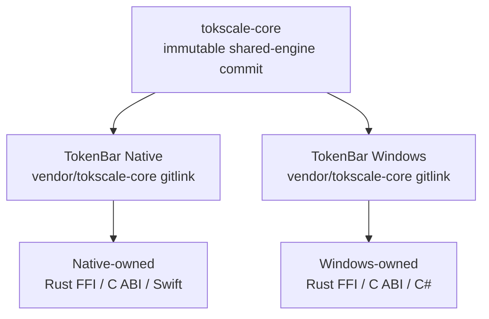
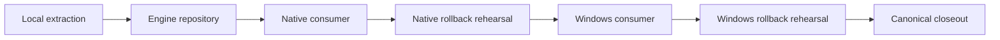

# Shared Rust engine extraction plan

> **Historical completion record：** CORE-R0 through CORE-X1D completed on
> 2026-07-29. Current shared-engine work follows
> [`vendor-tokscale.md`](../vendor-tokscale.md); this plan preserves the
> extraction decisions, gates, and rollback evidence rather than authorizing a
> new migration.

## 目錄

- [文件目的](#文件目的)
- [Final state](#final-state)
- [Objective and scope](#objective-and-scope)
- [Architecture decision](#architecture-decision)
- [Ownership boundary](#ownership-boundary)
- [Execution record](#execution-record)
- [Acceptance evidence](#acceptance-evidence)
- [Rollback contract](#rollback-contract)
- [Delivery and authorization](#delivery-and-authorization)
- [Closeout boundary](#closeout-boundary)

---

## 文件目的

這份文件記錄如何把 Native 與 Windows 共用的 Rust parser、scanner、
cache、pricing 與 aggregation core 從 duplicated vendor tree 抽成公開的
中立 repository `tokscale-core`，再讓兩個 app 以同一路徑的 Git
submodule pin 同一個 immutable commit。執行期間的本機路徑、credential
處理與 unpublished scan material 不屬於公開紀錄。

## Final state

| Repository | Closeout checkpoint | Shared-engine state |
|---|---|---|
| [`Nanako0129/tokscale-core`](https://github.com/Nanako0129/tokscale-core) | `b31e39425859393504a2d56cb5af7c93e6461c7d` | Shared source、tests、standalone lock／CI 與 authoritative `UPSTREAM.md` ledger |
| [`Nanako0129/TokenBar`](https://github.com/Nanako0129/TokenBar) | `704426e8df9acfb8e82fe4bf3b7ed3e5adbc2fea` | Gitlink `vendor/tokscale-core` pins `b31e39425859393504a2d56cb5af7c93e6461c7d` |
| [`Nanako0129/TokenBar-Windows`](https://github.com/Nanako0129/TokenBar-Windows) | `26492a5b615fed9378034e7bb56bc5aeccf5d368` | Gitlink `vendor/tokscale-core` pins `b31e39425859393504a2d56cb5af7c93e6461c7d` |

At closeout, the two consumer default branches used the same public submodule
URL and exact gitlink. Their application-owned FFI、C header、Swift／C# bridge、
root lock and packaging surfaces remain outside the engine repository.

## Objective and scope

| Outcome | Completed state |
|---|---|
| Single ownership | Shared Rust source、history、standalone CI 與 exact upstream／local-patch ledger have one owner：`tokscale-core` |
| Exact consumer pin | Native and Windows default branches point to the same reviewed engine commit |
| Stable app boundary | Rust FFI、C ABI、Swift／C# wrappers and app fixtures remain consumer-owned |
| No semantic migration | Extraction did not change the C ABI、payload、parser、cache schema or runtime behavior |
| Recoverable rollout | Both consumer migrations passed disposable post-merge revert rehearsals |

> **Non-goals：** The extraction did not move `tb_core_ffi`, redesign the C
> ABI, release either app, add an installer, rename the projects, or clean
> unrelated vendor code.

## Architecture decision



| Option | Decision | Reason |
|---|---|---|
| Same-path Git submodule | Selected | Immutable pin、independent history and minimal Cargo／FFI path change |
| Cargo Git dependency | Rejected for extraction | Would also rewrite workspace layout and remove checked-out engine tests from existing app gates |
| Manual copy | Rejected | Preserves duplicated sources of truth |
| Git subtree | Rejected | Makes each consumer carry duplicated engine history and update ownership |

History extraction used `git filter-repo --subdirectory-filter
vendor/tokscale-core` against a frozen Native source commit. Publication was
gated on a frozen reachable-object closure, full-history scans, standalone
locked builds, and an anonymous post-publication clone.

## Ownership boundary

| Surface | Owner after extraction |
|---|---|
| Shared parser、scanner、cache、pricing、aggregation and tests | `tokscale-core` |
| Standalone `Cargo.lock` and macOS／Windows engine CI | `tokscale-core` |
| Exact upstream baseline、selection and local-patch ledger | `tokscale-core/UPSTREAM.md` |
| Native gitlink、root lock、Rust FFI、C header、Swift and bundle wiring | TokenBar |
| Windows gitlink、root lock、Rust FFI、C header、C# and packaging wiring | TokenBar-Windows |

Consumer documents record only repository provenance and reviewed pins.
Shared-engine changes land and pass review in `tokscale-core` before either
consumer advances its gitlink.

## Execution record

| Phase | Result |
|---|---|
| CORE-R0 rebaseline | Issue #107 and Windows cfg hygiene landed; Native source was frozen at `729dc3adf21cc31e16ef0b8b742f0244197d7058`, Windows at `68e2541c5e9adb14a47433f8b25e26b0be84d1fc`, and both shared trees were exact |
| CORE-T0 tool provenance | `git-filter-repo 2.47.0`, `gitleaks 8.30.1`, supporting scanners and their configurations were fixed before history rewrite |
| CORE-X0 local extraction | Filtered base `5bc3d4092bfae987df30dd0df20ed575663cc40e` reproduced source tree `3b27354b617649cba2880fbca3ecaddee4326e7c`; standalone lock、macOS／Windows gates、closure scans and fresh security verification passed |
| CORE-X1H engine repository | [Engine PR #1](https://github.com/Nanako0129/tokscale-core/pull/1) completed hardening and publication at `b31e39425859393504a2d56cb5af7c93e6461c7d`; Codex review、dual-platform CI、anonymous closure equality and fresh verification passed |
| CORE-X1N Native consumer | [Native PR #114](https://github.com/Nanako0129/TokenBar/pull/114) rebase-merged the same-path submodule at main `704426e8df9acfb8e82fe4bf3b7ed3e5adbc2fea`; root lock、runtime gates、review、CI、fresh verification and rollback rehearsal passed |
| CORE-X1W Windows consumer | [Windows PR #12](https://github.com/Nanako0129/TokenBar-Windows/pull/12) rebase-merged the same pin at main `26492a5b615fed9378034e7bb56bc5aeccf5d368`; root lock、x64／ARM64 CI、Swift cross-check、native ARM64 FFI smoke、review、fresh verification and rollback rehearsal passed |
| CORE-X1D closeout | Default-branch pins、ledger ownership、retired manual-copy paths and canonical knowledge were audited and recorded |

## Acceptance evidence

| ID | Final evidence |
|---|---|
| AC-1 | Frozen Native subtree and filtered engine source tree both equal `3b27354b617649cba2880fbca3ecaddee4326e7c` |
| AC-2 | Frozen reachable history passed secret、private-path、large-blob、license and attribution scans before and after public publication |
| AC-3 | Engine passed standalone locked build、tests and strict Clippy on macOS and Windows |
| AC-4 | Native and Windows default-branch gitlinks both equal reviewed engine commit `b31e39425859393504a2d56cb5af7c93e6461c7d` |
| AC-5 | Rust-consuming CI and release paths use recursive checkout |
| AC-6 | Native app gates、Windows x64／ARM64 packaging and separately authorized native ARM64 runtime smoke passed |
| AC-7 | Anonymous public clone reproduced the scanned engine refs and reachable-object closure |
| AC-8 | Native and Windows root `Cargo.lock` files remained byte-identical to their CORE-R0 snapshots |
| AC-9 | Consumer diffs preserved C ABI、payload、parser、cache and provider semantics |
| AC-10 | Fresh recursive checkout instructions reproduce the reviewed engine pin and locked builds |
| AC-11 | Both consumer migrations restored exact pre-migration trees and locks in disposable revert rehearsals |

The same engine pin proves shared-source equality. It does not replace
cross-language verification for consumer-owned FFI、Swift and C# changes.

## Rollback contract

No rollback branch、commit、push or PR was created. The rehearsals prove the
recovery path without changing a default branch.

| Consumer | Rehearsal result |
|---|---|
| Native | Reverting `704426e8df9acfb8e82fe4bf3b7ed3e5adbc2fea` then `d114da442f94c6f3b56e408e97f9d2e49daaafae` restored superproject tree `4fdcb184c9417541d549bd6dd4e366bf9e9ecbbc`, shared tree `3b27354b617649cba2880fbca3ecaddee4326e7c`, and root-lock SHA-256 `b43f13855caa0eef9dd964282703b2af2aa130f23a0e53dbbfe2e2149f76baa2` |
| Windows | Deinitializing the submodule, then reverting `26492a5b615fed9378034e7bb56bc5aeccf5d368` and `5a1ae9a5c4994198face5bbbcf7f0e463adb6ab5`, restored tree `2ea2ad5af4b1d1ef6ddda88db03b753d1720f3f8` and root-lock SHA-256 `11cc213417e3dc5e4f440eb317dbd9764f87f4277a909a3de14a0d5ea9a3ad94` |

The Native rehearsal used a fresh non-recursive clone. The Windows rehearsal
proved that an initialized checkout must first deinitialize the exact
submodule path:

```bash
git submodule deinit --force -- vendor/tokscale-core
git revert --no-commit 26492a5b615fed9378034e7bb56bc5aeccf5d368
git revert --no-commit 5a1ae9a5c4994198face5bbbcf7f0e463adb6ab5
```

Directly reverting the initialized Windows checkout is invalid because the
submodule files would be overwritten while Git restores the former tracked
directory.

## Delivery and authorization



Each phase had a separate scope gate. Source-edit approval did not authorize
push、PR、merge、tag or release；current-head Codex `+1`、green CI and fresh
verification were readiness evidence rather than integration authority.

## Closeout boundary

The former manual-copy process and consumer-local exact ledger are retired.
The engine `UPSTREAM.md` is the sole precise shared-source ledger；Native
[`vendor/README.md`](../../../vendor/README.md) and Windows `vendor/ENGINE.md`
record consumer pins and ownership only.

Syrtis rename、FFI extraction、consumer release and new shared-engine behavior
remain separate work. Completing this historical plan does not authorize any
of them.
