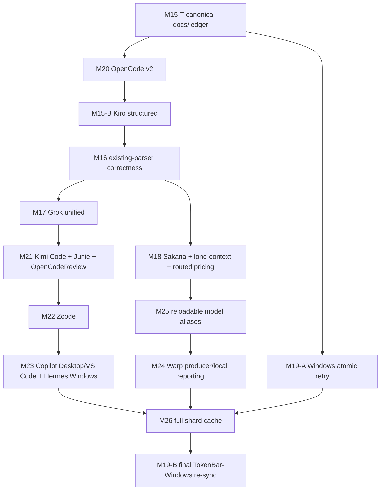
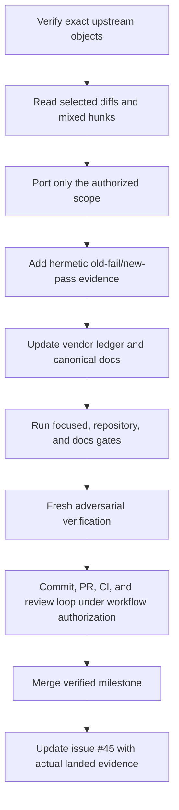

# Rolling tokscale alignment plan

## 文件目的

TokenBar follows upstream `tokscale` as a rolling source and selects bounded milestones without replacing the locally adapted vendor tree wholesale. This document records the approved product scope, dependency graph, cache schedule, and delivery protocol; the exact 111-row commit classification stays exclusively in [`vendor/README.md`](../../../vendor/README.md).

## 目錄

- [Current audit checkpoint](#current-audit-checkpoint)
- [Product decision](#product-decision)
- [Fastest dependency graph](#fastest-dependency-graph)
- [Milestone queue](#milestone-queue)
- [Ownership and integration](#ownership-and-integration)
- [Cache schedule](#cache-schedule)
- [Milestone protocol](#milestone-protocol)
- [Tracking surfaces](#tracking-surfaces)
- [Required evidence and stop conditions](#required-evidence-and-stop-conditions)

---

## Current audit checkpoint

| Surface | Current value |
|---|---|
| TokenBar main baseline | [`11ae1bed`](https://github.com/Nanako0129/TokenBar/commit/11ae1bed8c38df81f197d74c11be4d24fac78a9a), the rebase-merge result of Windows atomic replacement M19-A PR #68 |
| tokscale target | [`366ce643`](https://github.com/junhoyeo/tokscale/commit/366ce64395594abf111e0409581d91016561b25a), OpenCode v2 PR #920 merge |
| Audited set | 111 `crates/tokscale-core` commits from `0c820a5d..366ce643` |
| M17 implementation classification | `ALREADY_VENDORED 67`, `TAKE 20`, `ADAPT_FOR_STREAMING 0`, `DEFER 10`, `SKIP 13`, `SUPERSEDED 1` |
| Cache | TokenBar main and the M17 implementation checkpoint use monolithic schema 31 |

The audited range and all referenced trees are readable from a clean upstream clone. The six categories are duplicate-free and have no symmetric difference from the 111-hash range. M20 moved `366ce643`; M15-B moved `405ded4a` and `315549b4`; M16 moved `6899ea03`, `b59979c5`, `9155018c`, and `18cd13cc` to `ALREADY_VENDORED`, moved mixed `34cfbb50` to `DEFER`, and left mixed `b64d861e` as one `TAKE` row after its Jcode hunk. M19-A moved `a87f0ab6` from `TAKE` to `ALREADY_VENDORED` after taking only its Windows atomic-replacement hunk; public issue #45 now records merged M19-A at `67/20/0/10/13/1`. M17 takes non-main `ed798642`, so its implementation does not change those audited counts. Mixed upstream commits remain one ledger row even when TokenBar takes selected hunks in several milestones. This includes `cd07bf78`: M26 takes its generic cache format-2 and related-file metadata hunks, while its Devin parser/discovery hunks remain deferred. Three non-main commits and one pre-anchor Warp commit are semantic sources only and do not enter the 111-row ledger.

## Product decision

The following capabilities are selected for this alignment cycle:

| Group | Selected scope |
|---|---|
| Existing parser correctness | OpenCode v2, Kiro structured sessions, Codex/Claude/Copilot/Jcode/provider/Antigravity corrections, and Grok unified-log precedence |
| New local sources | Kimi Code, Junie, OpenCodeReview, Zcode, Copilot Desktop, Copilot VS Code `chatSessions`, Hermes Windows discovery, and Warp producer/local reporting |
| Money correctness | Sakana/Fugu pricing, verified request-level long-context pricing, and the complete routed-pricing precedence pipeline |
| Runtime configuration | Reloadable configurable model aliases that affect grouping only, not raw model identity, pricing, or persistence |
| Cache architecture | Full identity-aware source-message shard cache after every selected parser/source milestone lands |
| Windows parity | Atomic replacement retry first, then one final downstream re-sync after the shard-cache barrier |

The following product features remain deliberately deferred: Command Code, CodeBuddy/WorkBuddy, Devin CLI/Desktop, and 9Router. Sakana subscription billing-console scraping remains skipped; selecting Fugu model pricing does not select the subscription usage provider.

## Fastest dependency graph

The shared-parser critical path through M16 and the independent M19-A filesystem checkpoint are merged. M17 is the active source-lane integration, while M18's disjoint money/settings patch is prepared for the next integration lock. M19-A's bounded Windows replacement behavior remains an M26 dependency. M26 is the final Native architecture barrier and M19-B runs exactly once after it.

## Milestone queue

| Milestone | Dependency | Outcome | Cache decision |
|---|---|---|---|
| M15-T | M15-A merged | Merged as PR #64 and published the complete 111-row classification, selected scope, DAG, and transition rules | Schema 29 |
| M20 | M15-T merged | Merged as PR #65 at `1bc2fa76`: parse OpenCode v2 `session_message` data while preserving v1/JSON semantics, distinct embedded IDs, persisted primary/alias keys for overlaps without a v1 embedded id, same-ID SQLite rows whose timestamp/token identity is incompatible across every lane, and exact-deferred-first JSON authority replacement scoped by message id plus creation timestamp | Schema 29 → 30 |
| M15-B | M20 merged | Merged as PR #66 at `f5773ea0`: add Kiro `sess_*` structured sessions; reuse one related-file helper across specialized fingerprinting, both active cache lanes, latest mtime, and sibling-aware pruning; preserve M15-A coexistence and existing CLI/SQLite model fallback | Kept schema 30 |
| M16 | M15-B merged | Merged as PR #67 at `aebbc371`: land Codex, Claude, Copilot, Jcode, provider, and Antigravity correctness; leave only the 9Router feature of mixed `34cfbb50` deferred and keep `b64d861e` in `TAKE` for later selected clients | Schema 30 → 31 |
| M17 | M16 | Active implementation checkpoint: discover only the exact top-level unified log beside the primary and every configured Grok sessions root, canonical-dedup overlapping files, cache raw unified/legacy sources independently, deduplicate exact replays without collapsing distinct same-base token records, refresh cached derived dates before streaming filters, preserve loop-one message counts through live trace and unambiguous legacy model/workspace attribution, reprice selected materialized and streaming rows after model carry-over, retain the required authority cohort during modified-after pruning, and select unified-covered sessions exactly once across materialized, shipping streaming, count, and report lanes; a topology-sensitive FFI graph/live-tail token restores legacy fallback when a non-max unified source disappears | Keep schema 31 |
| M21 | M17 | Add Kimi Code, Junie, and OpenCodeReview with append-only client IDs | Keep schema 31 |
| M22 | M21 | Add Zcode legacy and v2 with one normalization/dedup authority | Keep schema 31 |
| M23 | M22 | Add Copilot Desktop/VS Code sources and Hermes Windows fallback discovery | Keep schema 31 |
| M18 | M16 | Add Fugu rates, verified whole-request long-context tiers, and the complete routed-pricing precedence pipeline | Keep schema 31 |
| M25 | M18 | Add reloadable grouping aliases and one process-wide usage-data invalidation seam | Keep schema 31 |
| M24 | M25 | Add explicit-credential Warp fetching/local reporting through the shared invalidation seam; no automatic credential harvesting | Keep schema 31 |
| M19-A | M15-T | Merged as PR #68 at `11ae1bed`: retry only Windows atomic-replacement errors 5/32 for at most five attempts with exact bounded backoff; preserve non-Windows rename and exclude TUI signal behavior | Keep schema 31 |
| M26 | M23 + M24 + M19-A | Activate 256 identity-aware cache shards across every materialized, streaming, count, and report lane, including `cd07bf78` generic related-file path/existence metadata while excluding Devin behavior | Active shard format 2; leave legacy schema-31 monolith untouched |
| M19-B | M26 merged | Reconcile Windows-only residuals and perform one final Rust/header/registry re-sync with parity gates | Sync shard format 2 and legacy schema-31 provenance |

Every runtime merge applies the deterministic ledger delta recorded in [`vendor/README.md`](../../../vendor/README.md), regenerates all six hash sets, and rechecks duplicates plus both symmetric-difference directions. The expected terminal counts are `85/0/0/12/13/1`, total 111, but actual previous-ledger state remains authoritative when lanes merge in a different ready order.

## Ownership and integration

At most four writing worktrees run concurrently, including the integration owner. Ownership is exclusive rather than file-by-file negotiated during implementation:

| Owner | Scope |
|---|---|
| Integration owner | Client registry, scanner/session registration, core report/cache integration, FFI/Swift boundary, vendor ledger, and canonical docs |
| Parser lane A | Shared session utilities plus Kiro, Codex, Claude, Jcode, Grok, Kimi, Junie, and OpenCodeReview parser files |
| Parser lane B | OpenCode, Zcode, and Copilot parser files |
| Specialist lane | Provider/pricing, model-alias module, atomic filesystem helper, or the security-sensitive Warp network/storage unit |

Prepared parser/specialist patches must not carry shared registry, scanner, cache, FFI, Swift, or documentation files into integration. Shared core, pricing, FFI/Swift, and docs/ledger surfaces each have one merge lock. If a parent milestone changes a shared contract, dependent prepared work stops, rebases, and reruns affected gates before integration.

## Cache schedule

| Checkpoint | Active cache contract |
|---|---|
| Baseline / M15-T | Monolithic schema 29 |
| M20 | Monolithic schema 30, rejecting same-fingerprint hybrid-DB entries that cached only non-empty v1 output before v2 rows were understood |
| M15-B | Schema 30 unchanged; sibling-aware identity handles new structured sources |
| M16 | Monolithic schema 31, rebuilding all changed existing-parser outputs once |
| M17, M18, M21, M22, M23, M24, M25, and M19-A | Schema 31 unchanged |
| M26 | `source-message-cache-v2/<client>/<00..ff>.bin`, format 2; legacy schema-31 monolith is not read, changed, deleted, or migrated |
| M19-B | Windows consumer matches format 2 and the preserved legacy schema-31 boundary |

Any newly discovered serialized-output change outside this schedule is a stop condition, not permission to invent another schema bump inside a prepared branch.

## Milestone protocol

A milestone is complete only after its implementation and mandatory docs share one PR, the applicable verifier confirms the integrated result, review threads and CI are clean, the PR merges, and issue #45 records the actual PR/SHA, ledger delta, cache/schema decision, fixtures, and next-ready dependencies. Tagging and release remain separate decisions.

## Tracking surfaces

| Surface | Responsibility |
|---|---|
| [`vendor/README.md`](../../../vendor/README.md) | Exact 111-row classification, selected/mixed commit accounting, transition matrix, cache provenance, and local patch ledger |
| [Issue #45](https://github.com/Nanako0129/TokenBar/issues/45) | Designated public ledger; current through merged M19-A at `67/20/0/10/13/1`; M17 keeps those counts because its source is non-main |
| Private Project #1 | Executable milestone cards only; no duplicate commit-by-commit ledger and no parser-preparation branches |
| This plan | Product decisions, dependency graph, ownership, cache schedule, and milestone completion contract |
| [`current-state.md`](../current-state.md) | Concise current queue and maintenance handoff |

Project writes require their own preflight and authorization. Issue #45 must not claim a milestone landed until its merge is observable.

## Required evidence and stop conditions

| Area | Required evidence |
|---|---|
| Inventory integrity | Exact 111-hash range; each hash in one category; duplicate set and both symmetric differences empty |
| Fidelity | Exact upstream diff, selected hunks, excluded hunks, and preserved TokenBar streaming/cache/report seams |
| Correctness | Hermetic old-fail/new-pass fixture plus a non-triggering preservation case |
| Cache | Explicit schema decision and same-fingerprint warm-cache evidence when output changes |
| Sibling sources | Fingerprint, active materialized/streaming lanes, latest-mtime probe, and sibling-aware pruning |
| Report parity | Materialized, shipping streaming, count, and affected report surfaces agree |
| Boundary | Rust → C ABI → Swift contract verified whenever registry, option, payload, or invalidation state crosses it |
| Delivery | Full diff review, repository/docs gates, fresh verifier, clean PR review/CI, and post-merge issue bookkeeping |

Stop immediately if the ledger no longer equals the audited range, a worker crosses exclusive ownership, a mixed commit contains unclassified scope, a parser/output change needs an unplanned schema bump, sibling-only invalidation fails, dedup authority diverges between lanes, Warp can leak or cross accounts, a stacked child has not rebased after a parent contract change, or Windows residual classification is mixed/conflicting.
