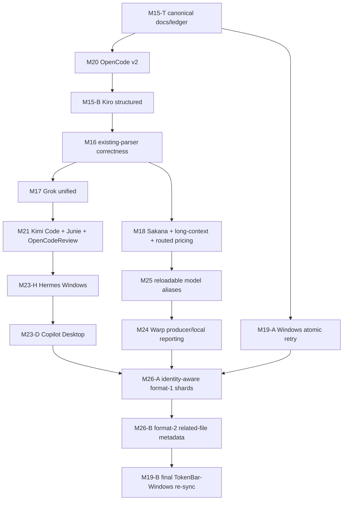
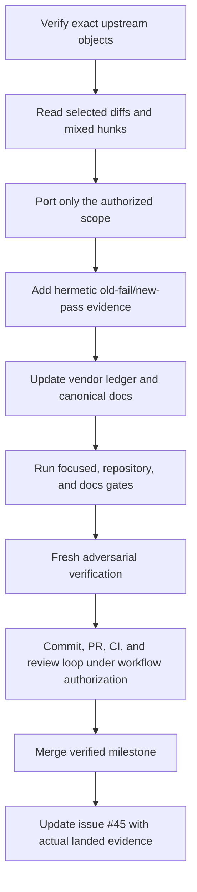

# Rolling tokscale alignment plan

## 文件目的

TokenBar follows upstream `tokscale` as a rolling source and selects bounded milestones without replacing the locally adapted vendor tree wholesale. This document records the approved product scope, dependency graph, cache schedule, and delivery protocol; the exact 111-row commit classification stays exclusively in [`vendor/README.md`](../../../vendor/README.md).

## 目錄

- [Current audit checkpoint](#current-audit-checkpoint)
- [Product decision](#product-decision)
- [Fastest dependency graph](#fastest-dependency-graph)
- [Milestone queue](#milestone-queue)
- [Ownership and integration](#ownership-and-integration)
- [Cache schedule](#cache-schedule)
- [Milestone protocol](#milestone-protocol)
- [Tracking surfaces](#tracking-surfaces)
- [Required evidence and stop conditions](#required-evidence-and-stop-conditions)

---

## Current audit checkpoint

| Surface | Current value |
|---|---|
| TokenBar execution baseline | [`f99d9274`](https://github.com/Nanako0129/TokenBar/commit/f99d9274fcfdfc8fc228e21e52808584f822385f), including merged M23-H PR #82 and M23-D PR #83 |
| tokscale target | [`366ce643`](https://github.com/junhoyeo/tokscale/commit/366ce64395594abf111e0409581d91016561b25a), 111 commits |
| Fidelity stops | M22 PR #72 and PR #74 are closed unmerged; M23-H + M23-D replaced PR #74 in merged PRs #82 + #83, while M23-V remains deferred |
| 111-row classification | `ALREADY_VENDORED 78`, `TAKE 3`, `ADAPT_FOR_STREAMING 0`, `DEFER 16`, `SKIP 13`, `SUPERSEDED 1` |
| Cache | Active monolithic schema is **32** after Grok `turn_completed.usage`; M23-D adds a new independently fingerprinted source and does not bump it |

The audited range and all referenced trees are readable from a clean upstream clone. The six categories are duplicate-free and have no symmetric difference from the 111-hash range. Through M25 the classification was `75/7/0/15/13/1`. M23-H moved `c1aef5e9` to `ALREADY_VENDORED`, while the PR #74 fidelity decision moved VS Code `074619f7` to `DEFER`, producing `76/5/0/16/13/1`. Merged M23-D moved Copilot Desktop rows `f6f7eced + 0b454e60` to `ALREADY_VENDORED`, producing `78/3/0/16/13/1`. Three non-main commits and one pre-anchor Warp commit are semantic sources only and do not enter the 111-row ledger.

### Merged milestone drift audit

| Milestone | Audit result | Decision |
|---|---|---|
| M20 | Production drift `2.76x` upstream; parser port is close to upstream, with most extra code in the necessary TokenBar OpenCode cross-store/streaming authority seam | Adaptation is intentional; follow upstream identity narrowly, do not roll back |
| M15-B | Production drift `0.76–0.86x` upstream | Faithful |
| M16 | Overall parser additions about `1.06x` upstream; Copilot is `+800%` locally from duplicate-span merge hardening, while other surfaces are near or below upstream | Local hardening is bounded |
| M17 | Production churn `4.26x`, mainly TokenBar lanes/cache/FFI and multiple hardening rounds | Grandfathered/freeze; track upstream #849, reconsider if future work becomes systematic |
| M18 | Production churn `2.78x`, mainly TokenBar pricing precedence and safety policy | High adaptation; do not wholesale upstream |
| M21 | Production `1.056x`, parser net `99.8%`; integration adds `+39` net lines for necessary TokenBar seams | Faithful |
| M19-A | Local production net `44` versus upstream `23` (`~1.91x`), explained by the injected retry test seam | Runtime behavior remains faithful |
| M22 | Production drift about `2.1–2.5x` upstream and total drift about `3.1–3.5x`, with 15 review-driven fixes and about 520 lines of custom cross-store matching | Failed the fidelity threshold; PR #72 closed unmerged and Zcode moved to `DEFER` |
| M23 / PR #74 | Copilot production reached about `3.1x` upstream across 18 commits and 14 review rounds, while ObjectMutationLog replay, bare-model classification, Desktop agent attribution, and cost-only handling still had confirmed defects | Split: rebuild Hermes and Desktop as serial bounded milestones; move VS Code `074619f7` to `DEFER`; preserve #74 as evidence and close it only after replacements merge |

Churn ratio is a volume signal, not a fidelity percentage. The fidelity rule remains the stop condition for future ports.

## Product decision

The following capabilities are selected for this alignment cycle:

| Group | Selected scope |
|---|---|
| Existing parser correctness | OpenCode v2, Kiro structured sessions, Codex/Claude/Copilot/Jcode/provider/Antigravity corrections, and Grok unified-log precedence |
| New local sources | Kimi Code, Junie, OpenCodeReview, Copilot Desktop, Hermes Windows discovery, and Warp producer/local reporting |
| Money correctness | Sakana/Fugu pricing, verified request-level long-context pricing, and the complete routed-pricing precedence pipeline |
| Runtime configuration | Reloadable configurable model aliases that affect grouping only, not raw model identity, pricing, or persistence |
| Cache architecture | Full identity-aware source-message shard cache after every selected parser/source milestone lands |
| Windows parity | Atomic replacement retry first, then one final downstream re-sync after the shard-cache barrier |

The following product features remain deliberately deferred: Zcode legacy/v2, Copilot VS Code `chatSessions`, Command Code, CodeBuddy/WorkBuddy, Devin CLI/Desktop, and 9Router. Zcode was selected originally, but PR #72 demonstrated that safe adoption required systemic repair and downstream invention beyond the upstream scope. VS Code was likewise selected originally, but PR #74 exposed unresolved upstream ObjectMutationLog replay semantics and expanding local authority heuristics; reassess only after upstream or a reproducible format contract converges. Sakana subscription billing-console scraping remains skipped; selecting Fugu model pricing does not select the subscription usage provider.

## Fastest dependency graph

The shared-parser critical path through M17, the money-correctness M18 checkpoint, the independent M19-A filesystem checkpoint, M21, M25, M23-H, and M23-D are merged. M22 is closed unmerged and deferred. M23-V is deferred and does not block M26. M24 can attach to M25's shared invalidation seam. M26-A waits for M24 and M19-A to activate upstream-faithful format-1 shards; M26-B then ports the generic `cd07bf78` format-2 path/existence metadata before M19-B runs exactly once. No release occurs between the two cache PRs.

## Milestone queue

| Milestone | Dependency | Outcome | Cache decision |
|---|---|---|---|
| M15-T | M15-A merged | Merged as PR #64 and published the complete 111-row classification, selected scope, DAG, and transition rules | Schema 29 |
| M20 | M15-T merged | Merged as PR #65 at `1bc2fa76`: parse OpenCode v2 `session_message` data while preserving v1/JSON semantics, distinct embedded IDs, persisted primary/alias keys for overlaps without a v1 embedded id, same-ID SQLite rows whose timestamp/token identity is incompatible across every lane, and exact-deferred-first JSON authority replacement scoped by message id plus creation timestamp | Schema 29 → 30 |
| M15-B | M20 merged | Merged as PR #66 at `f5773ea0`: add Kiro `sess_*` structured sessions; reuse one related-file helper across specialized fingerprinting, both active cache lanes, latest mtime, and sibling-aware pruning; preserve M15-A coexistence and existing CLI/SQLite model fallback | Kept schema 30 |
| M16 | M15-B merged | Merged as PR #67 at `aebbc371`: land Codex, Claude, Copilot, Jcode, provider, and Antigravity correctness; leave only the 9Router feature of mixed `34cfbb50` deferred and keep `b64d861e` in `TAKE` for later selected clients | Schema 30 → 31 |
| M17 | M16 | Merged as PR #69 at `d4ff968b`: select exact top-level Grok unified logs once over covered legacy sessions across materialized, shipping streaming, count, graph/time, and report lanes; retain legacy-only fallback, model/workspace carry-over, process/model authority, token/message semantics, topology-sensitive invalidation, and post-selector pricing | Kept schema 31 |
| M21 | M17 | Merged as PR #71 at `471a7f239f0270b4ebfaed04894335c506d588d3`: add Kimi Code beside legacy Kimi through structural parser selection and `KIMI_CODE_HOME`; append Junie/OpenCodeReview as client IDs 31/32; preserve Junie provider-reported cost, prompt ownership, duration anchors, OpenCodeReview workspace metadata, and materialized/streaming/count/report parity | Keep schema 31 |
| M22 | M21 | PR #72 closed unmerged; DEFER until upstream converges because its Zcode cross-store/parser/schema/provider/scanner scope exceeded the fidelity threshold | Keep schema 31; no rollback because it never merged |
| M23-H | M21 | Merged as PR #82 at `1a8ee0c6`: add only Hermes Windows `%LOCALAPPDATA%/hermes` and supplied-home `AppData/Local/hermes` candidates while preserving explicit `HERMES_HOME` isolation and all existing plural DB consumers | Kept schema 32 |
| M23-D | M23-H merged | Merged in PR #83 at `f99d9274`: upstream-bounded Copilot Desktop token source with DB agent attribution, token-only rows, one pre-aggregation OTEL-session authority selector, raw DB/WAL/event-aware caching, fail-open pruning, and materialized/streaming/count/report parity | Keep current schema 32 |
| M23-V | Fidelity stop | DEFER `074619f7`; do not revive PR #74 until upstream fixes ObjectMutationLog replay or a reproducible format contract exists | No runtime change |
| M18 | M16 | Merged as PR #70 at `0735fd2b`: add `fugu-ultra` regular/long rates, select one whole-request tier only for verified Sakana and LiteLLM GPT-5.4/GPT-5.5 when `input + cache_read > 272,000`, preserve bare `fugu` as unpriced, and enforce exact raw/custom first refusal, parenthesized validation, provider-scoped fail-closed behavior, bounded path/terminal fallbacks, case-insensitive forced-source isolation, provider ranking/cache backfill, and one Claude never-degrade guard | Kept schema 31 |
| M25 | M18 | Merged in PR #75: reloadable grouping aliases (`set_model_aliases` / `clear_model_aliases`), alias-free `canonical_model_id`, and process-wide usage-data invalidation (`model_alias_generation` + hooks); Swift/FFI settings wiring deferred | Kept then-active schema 31; current main is 32 after PR #77 |
| M24 | M25 | Add explicit-credential Warp fetching/local reporting through the shared invalidation seam; no automatic credential harvesting | Keep current schema 32 |
| M19-A | M15-T | Merged as PR #68 at `11ae1bed`: retry only Windows atomic-replacement errors 5/32 for at most five attempts with exact bounded backoff; preserve non-Windows rename and exclude TUI signal behavior | Keep schema 31 |
| M26-A | M23-D + M24 + M19-A | Activate 256 identity-aware cache shards across every materialized, streaming, count, and report lane from `ae36db5c`, excluding unrelated parser/client hunks | Active shard format 1; leave legacy schema-32 monolith untouched; ledger `80/1/0/16/13/1` |
| M26-B | M26-A merged | Port `cd07bf78` generic format-2 related-file path/existence metadata; exclude Devin behavior | Advance shard format 1 → 2, preserve the legacy boundary, and reach terminal ledger `80/0/0/17/13/1` |
| M19-B | M26-B merged | Reconcile Windows-only residuals and perform one final Rust/header/registry re-sync with parity gates | Sync shard format 2 and legacy schema-32 provenance |

Every runtime merge applies the deterministic ledger delta recorded in [`vendor/README.md`](../../../vendor/README.md), regenerates all six hash sets, and rechecks duplicates plus both symmetric-difference directions. The merged M23 checkpoint is `78/3/0/16/13/1`; M24 advances it to `79/2/0/16/13/1`, M26-A to `80/1/0/16/13/1`, and M26-B to the terminal `80/0/0/17/13/1`, total 111. The difference from the older forecast is M23-V: `074619f7` remains deferred. M26-B moves `cd07bf78` from `TAKE` to `DEFER`. Fidelity rule: preserve necessary TokenBar streaming/FFI seams, but stop when core parser/authority needs continuous systematic repair, custom algorithm scope exceeds upstream, or review exposes new failure classes; defer until upstream converges rather than continuing by sunk cost.

## Ownership and integration

At most four writing worktrees run concurrently, including the integration owner. Ownership is exclusive rather than file-by-file negotiated during implementation:

| Owner | Scope |
|---|---|
| Integration owner | Client registry, scanner/session registration, core report/cache integration, FFI/Swift boundary, vendor ledger, and canonical docs |
| Parser lane A | Shared session utilities plus Kiro, Codex, Claude, Jcode, Grok, Kimi, Junie, and OpenCodeReview parser files |
| Parser lane B | OpenCode and Copilot parser files; Zcode requires a new product decision after upstream convergence |
| Specialist lane | Provider/pricing, model-alias module, atomic filesystem helper, or the security-sensitive Warp network/storage unit |

Prepared parser/specialist patches must not carry shared registry, scanner, cache, FFI, Swift, or documentation files into integration. Shared core, pricing, FFI/Swift, and docs/ledger surfaces each have one merge lock. If a parent milestone changes a shared contract, dependent prepared work stops, rebases, and reruns affected gates before integration.

## Cache schedule

| Checkpoint | Active cache contract |
|---|---|
| Baseline / M15-T | Monolithic schema 29 |
| M20 | Monolithic schema 30, rejecting same-fingerprint hybrid-DB entries that cached only non-empty v1 output before v2 rows were understood |
| M15-B | Schema 30 unchanged; sibling-aware identity handles new structured sources |
| M16 | Monolithic schema 31, rebuilding all changed existing-parser outputs once |
| M17, M18, M21, M22, M25, and M19-A | Schema 31 unchanged through those checkpoints; M22 has no runtime rollback because PR #72 never merged |
| PR #77 / current baseline | Monolithic schema 32 for Grok `turn_completed.usage` |
| M23-H, M23-D, and M24 | Keep schema 32; M23-V has no runtime change |
| M26-A | `source-message-cache-v2/<client>/<00..ff>.bin`, format 1 from `ae36db5c`; legacy schema-32 monolith is not read, changed, deleted, or migrated |
| M26-B | Advance format 1 → 2 with `cd07bf78` generic related-file path/existence metadata; keep the legacy boundary |
| M19-B | Windows consumer matches format 2 and the preserved legacy schema-32 boundary |

Any newly discovered serialized-output change outside this schedule is a stop condition, not permission to invent another schema bump inside a prepared branch.

## Milestone protocol

A milestone is complete only after its implementation and mandatory docs share one PR, the applicable verifier confirms the integrated result, review threads and CI are clean, the PR merges, and issue #45 records the actual PR/SHA, ledger delta, cache/schema decision, fixtures, and next-ready dependencies. Tagging and release remain separate decisions.

## Tracking surfaces

| Surface | Responsibility |
|---|---|
| [`vendor/README.md`](../../../vendor/README.md) | Exact 111-row classification, selected/mixed commit accounting, transition matrix, cache provenance, and local patch ledger |
| [Issue #45](https://github.com/Nanako0129/TokenBar/issues/45) | Designated public ledger; M23-H and M23-D are recorded as merged in PRs #82 and #83, while PR #74 remains closed unmerged as fidelity evidence |
| Private Project #1 | Executable milestone cards only; no duplicate commit-by-commit ledger and no parser-preparation branches |
| This plan | Product decisions, dependency graph, ownership, cache schedule, and milestone completion contract |
| [`current-state.md`](../current-state.md) | Concise current queue and maintenance handoff |

Project writes require their own preflight and authorization. Issue #45 must not claim a milestone landed until its merge is observable.

## Required evidence and stop conditions

| Area | Required evidence |
|---|---|
| Inventory integrity | Exact 111-hash range; each hash in one category; duplicate set and both symmetric differences empty |
| Fidelity | Exact upstream diff, selected hunks, excluded hunks, and preserved TokenBar streaming/cache/report seams |
| Correctness | Hermetic old-fail/new-pass fixture plus a non-triggering preservation case |
| Cache | Explicit schema decision and same-fingerprint warm-cache evidence when output changes |
| Sibling sources | Fingerprint, active materialized/streaming lanes, latest-mtime probe, and sibling-aware pruning |
| Report parity | Materialized, shipping streaming, count, and affected report surfaces agree |
| Boundary | Rust → C ABI → Swift contract verified whenever registry, option, payload, or invalidation state crosses it |
| Delivery | Full diff review, repository/docs gates, fresh verifier, clean PR review/CI, and post-merge issue bookkeeping |

Stop immediately if the ledger no longer equals the audited range, a worker crosses exclusive ownership, a mixed commit contains unclassified scope, a parser/output change needs an unplanned schema bump, sibling-only invalidation fails, dedup authority diverges between lanes, Warp can leak or cross accounts, a stacked child has not rebased after a parent contract change, or Windows residual classification is mixed/conflicting.
