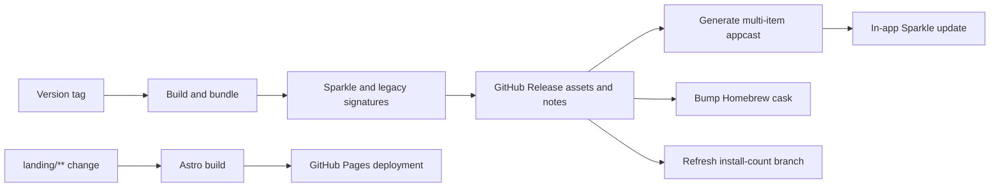

# Release and delivery

## 文件目的

這份文件描述 TokenBar 從 tag 到 appcast、GitHub Release、Homebrew、舊版遷移與 landing Pages 的交付鏈。runtime workflow 與 script 是執行 source；本文件只整理順序、邊界與已驗證的事故結論。

## 目錄

- [Delivery map](#delivery-map)
- [Application release](#application-release)
- [Sparkle and appcast](#sparkle-and-appcast)
- [Migration principle](#migration-principle)
- [Legacy and beta migration](#legacy-and-beta-migration)
- [Homebrew and install count](#homebrew-and-install-count)
- [Landing deployment](#landing-deployment)
- [Post-release verification](#post-release-verification)

---

## Delivery map

## Application release

The release workflow is tag-driven. It validates and bundles the native app, produces the archive and update metadata, creates the GitHub Release, publishes the appcast update, updates the Homebrew cask, and dispatches the install-count refresh. Stable and prerelease behavior is decided from the tag and release workflow, not from a hand-edited README.

| Artifact or action | Source of truth | Verification |
|---|---|---|
| Native app bundle | `.github/workflows/release.yml` and `scripts/bundle.sh` | Bundle launches and is ad-hoc signed as expected |
| Sparkle archive/signature | Release workflow and Sparkle tools | EdDSA signature verifies against the published archive |
| GitHub Release body | `release_notes.sh` plus optional override files | Body has accurate changes, links, and contribution credit |
| `appcast.xml` | `scripts/make_appcast.sh` and generated feed | XML parses, old items remain, channel semantics are correct |
| Homebrew cask | Release workflow generator plus tap repository | Version, URL, checksum, and style match the published asset |
| Install count | `update-install-count.yml` | Orphan badge branch contains the current filtered asset count |

> **授權邊界：** 發版是不可逆的公開狀態變更。除非使用者明確要求，不能自行 tag、push appcast、改 Release body、更新 cask 或發佈 asset。

## Sparkle and appcast

The feed is a single multi-item appcast. Stable items are channel-less; prerelease items carry the beta channel. The generator reads the existing feed, preserves prior items and signatures, and keeps a bounded history instead of overwriting the feed with one item.

This matters because a single-item writer can hide a still-valid stable version when a bridge or prerelease item is added. The appcast fix uses Sparkle's `generate_appcast` and keeps the application-side channel toggle as a lazy delegate for a possible future beta lane.

## Migration principle

能讓現有使用者無動作生效的遷移路徑優先；需要手動操作的步驟只作為 fallback，且任何自動化都不可越過授權邊界。

## Legacy and beta migration

The shipped native app replaced the archived Tauri app at the stable bundle identity. Stable releases may carry a legacy updater metadata artifact so remaining users can cross the old app boundary. The retired beta bridge cannot install a stable bundle with a different filename and bundle identity through Sparkle; its supported path is the in-app Switch action that installs the stable cask and lets the stable app migrate settings on first launch.

> **Bridge rule：** A bridge update error that says “improperly signed” can be a bundle-selection failure rather than a cryptographic failure. For the retired bridge population, use the in-app Switch path or the documented Homebrew install path; do not promise cross-identity Sparkle installation.

The bridge population is shrinking and the beta cask is not the normal installation path. Do not design new release work around increasing that population.

## Homebrew and install count

The current tap name is intentionally retained until a second app justifies a tap migration. A future migration must move all casks, delete their old copies in the same old-tap commit, retain the old public repository, and provide an app-level migration path because users who rely on Sparkle may not run Homebrew often enough to see a tap warning.

The install-count workflow writes a single JSON file to an orphan branch rather than adding a noisy commit to `main`. Its count filters release assets by installable archive extensions and intentionally excludes update metadata downloads.

## Landing deployment

The landing site is an independent Astro build. `.github/workflows/pages.yml` runs `npm ci` and `npm run build` in `landing/`, supplies the public site URL, uploads `landing/dist`, and deploys through GitHub Pages. App CI ignores landing-only changes; Pages deployment is the runtime gate for site-only changes.

Keep English and `zh-tw` copy aligned, preserve original TokenBar design, and treat the landing page as a presentation consumer of product facts rather than a runtime source.

## Post-release verification

The release notes path has two generated forms and at least three published surfaces: the GitHub Release body, the Sparkle appcast description, and the legacy update metadata notes. Generation is non-deterministic, so local preview text is not proof of the CI artifact.

A durable escaping regression occurred when a note first contained literal `<`: awk replacement semantics turned `&lt;` into `<lt;`. Generator changes must use fixtures containing literal `<`, `&`, and `>` and verify the CDATA/HTML round-trip.

| After release | Check |
|---|---|
| GitHub Release | Claims match the actual diff; no previous release fix is re-claimed |
| `appcast.xml` | Description is accurate HTML, item/channel/enclosure/signature are intact |
| Legacy metadata | Notes match the same user-facing change set and signature remains valid |
| Homebrew | Cask points to the new release and checksum matches the asset |
| Landing | Pages build and the deployed route serves the expected locale and assets |
| Update path | Stable app can discover the new stable item; bridge behavior is described honestly |

If wording is wrong, fix the published text without rebuilding the app when possible. Do not treat a release-note correction as permission to create a new release.
