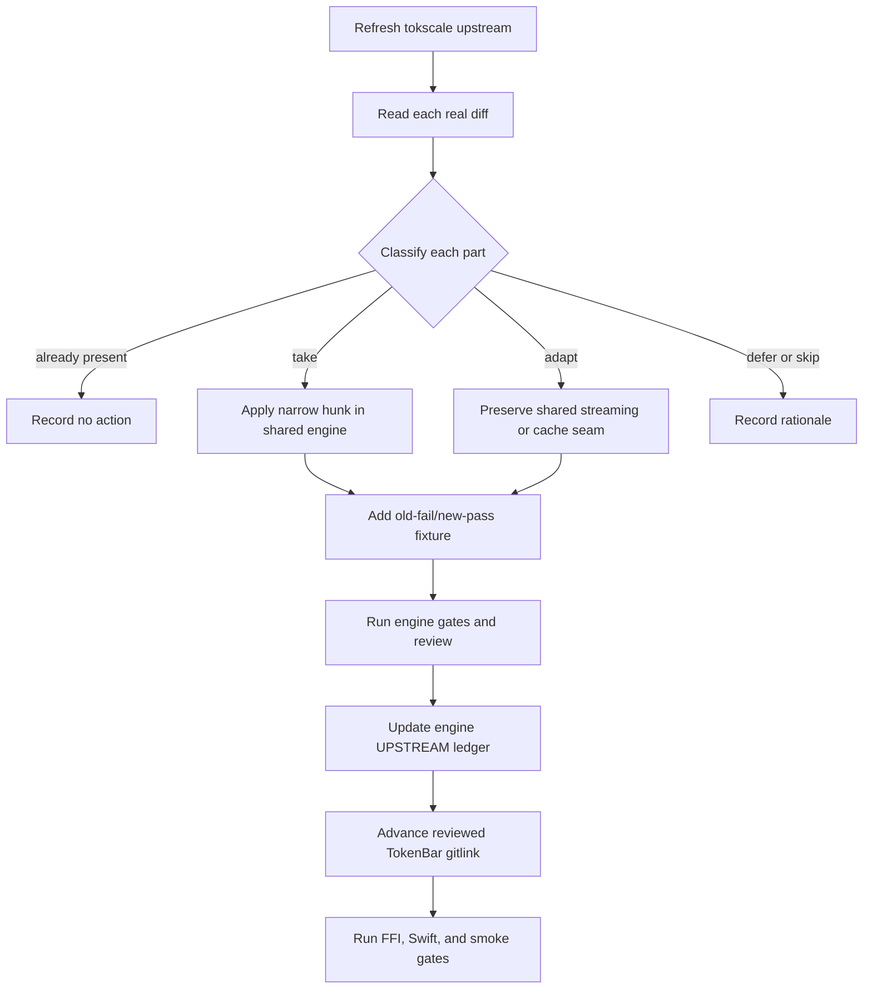

# Shared tokscale engine alignment

## 文件目的

TokenBar consumes the public [`tokscale-core`](https://github.com/Nanako0129/tokscale-core) engine through the pinned `vendor/tokscale-core` submodule. This document explains the consumer boundary and the method for safely aligning the shared engine. The exact upstream baseline, commit table, local patch table, and upstream report numbers for TokenBar's current reviewed pin live in the engine's immutable [`UPSTREAM.md`](https://github.com/Nanako0129/tokscale-core/blob/434b95ff987c638d4f005bd1f625a1d9b9dcdebe/UPSTREAM.md); [`vendor/README.md`](../../vendor/README.md) records TokenBar's source and pin. Newer engine work is not part of TokenBar until a separate consumer change advances that gitlink and passes the consumer gates.

## 目錄

- [Current boundary](#current-boundary)
- [Selective-port method](#selective-port-method)
- [Shared adaptation families](#shared-adaptation-families)
- [Schema and parser output](#schema-and-parser-output)
- [Sibling-source rule](#sibling-source-rule)
- [Upstream alignment](#upstream-alignment)
- [Handoff checklist](#handoff-checklist)

---

## Current boundary

The engine's true baseline is recorded in `tokscale-core/UPSTREAM.md`; the Cargo package version is not a reliable baseline marker. The shared tree contains upstream cherry-picks plus streaming, cache, report, pricing, and defensive adaptations extracted from TokenBar. TokenBar keeps its application-specific FFI, C ABI, Swift, and build wiring outside the submodule.

> **不要在 consumer branch 直接改 submodule source。** Shared Rust changes first land and pass review in `tokscale-core`; TokenBar then advances only the reviewed gitlink and runs its consumer gates. A clean build alone cannot prove that streaming or cache semantics were preserved.

Native 現在 pin reviewed engine commit `434b95ff987c638d4f005bd1f625a1d9b9dcdebe`（local-first graph pricing contract、embedded and partial cost provenance）。Windows 的現行 pin 由 Windows repository 的 gitlink與 consumer gates 擁有；本 Native pin 不重述或變更它。同 pin 只證明兩邊採用同一份 shared source，不構成 cross-port parity 主張，也不取代 cross-check 這道跨語言 gate；兩個 consumer 仍各自擁有 FFI、C header、Swift／C# bridge 與 build surfaces。Shared Rust changes land in the engine first；each consumer then advances its gitlink and runs its own app gates, while app-owned ABI changes are ported and independently cross-checked. See [`architecture.md`](architecture.md#windows-downstream-consumer) and the completed [`shared-rust-engine-extraction.md`](plans/shared-rust-engine-extraction.md).

### Grok attribution adoption

Public engine [PR #2](https://github.com/Nanako0129/tokscale-core/pull/2) merged at [`fd2f9167586c40a466c4570a466c2f03f6459e02`](https://github.com/Nanako0129/tokscale-core/commit/fd2f9167586c40a466c4570a466c2f03f6459e02). It fixes current Grok Build unified-log model attribution without hardcoding Grok 4.5：parent authority is isolated by PID generation, exact child authority is isolated by subagent session, and missing、malformed、cross-generation or conflicting evidence remains `grok-unknown`. A unique exact terminal event may fill only the matching earlier child inference；at that revision parent rows were never retroactively filled.

Follow-up engine [PR #3](https://github.com/Nanako0129/tokscale-core/pull/3) merged at [`84e0d66413d4e0d87b734f66f7a848b3bc323258`](https://github.com/Nanako0129/tokscale-core/commit/84e0d66413d4e0d87b734f66f7a848b3bc323258) and removes that parent-side gap. Because every authority was still built forward in file order, an inference row preceding the first model-bearing event for its own `(pid, generation)` stayed `grok-unknown` even when the same process later emitted unambiguous evidence and never restarted — the shape produced by any retained log window that begins mid-process. The prepass now also collects generation-scoped parent evidence, in pass two's own precedence, and pass two consults that generation's unique parent model as the last step before `grok-unknown`. Exact、child-scope and known-child-session authority are unchanged, evidence never crosses an `AuthManager::new` boundary, and conflicting evidence inside a generation still fails closed. The guard is unique **recorded** evidence rather than proof of history：a window that omits a process start record and hides a switch inside the unrecorded region attributes those earlier rows to the later model, which is the inference the existing session-unique legacy backfill already makes.

| Boundary | State |
|---|---|
| Cache identity | Grok parser identity advances `1 → 3` across the two adopted revisions（`1 → 2` in PR #2, `2 → 3` in PR #3）, so same-fingerprint parser-v1 and parser-v2 shards rebuild cold. Active `CACHE_FORMAT_VERSION` remains 2, other parser identities do not change, and the inert schema-32 monolith stays untouched. |
| Cost authority | Raw unified rows still have zero cost and `CostSource::Unknown`. Recovering an exact model only lets the existing post-cache pricing stage produce `Estimated`; it does not change provider-reported cost or usage totals. |
| Consumer adoption | Windows adopted this attribution revision in [PR #20](https://github.com/Nanako0129/TokenBar-Windows/pull/20), merge `eb3a7f3`; Native has since advanced independently to reviewed pin `434b95ff987c638d4f005bd1f625a1d9b9dcdebe`. |
| Presentation | TokenBar [issue #118](https://github.com/Nanako0129/TokenBar/issues/118) may group a recovered raw identity such as `grok-4.5-build` for display. Presentation aliases do not repair parser attribution and must not absorb `grok-unknown`. |
| Upstream status | [`junhoyeo/tokscale#849`](https://github.com/junhoyeo/tokscale/issues/849) remains open. Closed, unmerged [PR #924](https://github.com/junhoyeo/tokscale/pull/924) does not contain this current-schema attribution fix. |

The immutable implementation ledger for the Windows-adopted attribution revision remains [`UPSTREAM.md` at `84e0d66`](https://github.com/Nanako0129/tokscale-core/blob/84e0d66413d4e0d87b734f66f7a848b3bc323258/UPSTREAM.md); the current Native pin's exact engine ledger is [`UPSTREAM.md` at `731a2dc`](https://github.com/Nanako0129/tokscale-core/blob/434b95ff987c638d4f005bd1f625a1d9b9dcdebe/UPSTREAM.md). The Windows consumer migration reviewed the complete engine delta from `b31e394` and ran its normal gates: hosted x64 and ARM64 builds, packaged-FFI, and the 119-case cross-check, plus a same-snapshot comparison in which `totalTokens` stayed byte-identical at 333,370,649 while the model bucket count moved 4 → 3. That adoption was limited to the reviewed gitlink advance. The current pin is not: it carries `excluded_scan_paths` in the engine and an app-owned `tb_window_usage` signature change, so the Windows port is a notified consumer rather than a same-source one.

## Selective-port method

| Step | Rule |
|---|---|
| Reference | Re-fetch and record the upstream commit being assessed; do not use a stale plan line number as evidence |
| Diff | Read the actual diff, including multipart commits whose title understates runtime changes |
| Port | Apply only the selected hunk in the shared engine repository; use context-aware patching and fail loudly on mismatch |
| Adapt | Keep shared streaming lanes, report filters, and cache identity explicit; keep TokenBar-only FFI mapping in `crates/tb_core_ffi` |
| Verify | Test parser output, cache rebuild, streaming behavior, and materialized parity in the engine before advancing a consumer |
| Record | Update the exact engine ledger, then pin the reviewed engine commit and run TokenBar's consumer gates |

## Shared adaptation families

| Family | Contract |
|---|---|
| Streaming reports | `scan_messages_streaming`, per-client dedup sets, cross-source authority selectors, `StreamingAggregator`, `SessionizeAccumulator`, and Agents report parity remain local seams |
| Cache | Fingerprints, mtime probes, topology-sensitive in-process report tokens, sibling dependencies, pruning exceptions, schema decisions, and cached attribution rebuilds are local until upstream has the same architecture |
| Pricing | Cache-rate backfill and refreshable pricing are local behavior; upstream cost-provenance ports must not erase them |
| FFI | Report client slices, hourly/Agents filtering, bounded totals, and thin mappers are TokenBar-specific consumers |
| Discovery | Cowork, local client lanes, and platform-specific scanner roots may be local even when the parser originates upstream |
| Defensive fixes | Saturating folds, placeholder-row removal, trace-scoped identity, malformed-input handling, and bounded Windows atomic-replacement retries require their own regression evidence |

## Schema and parser output

The shared engine owns its cache-schema counter. It is schema **32** after the Grok Build `turn_completed.usage` primary path (parser output for existing Grok sources changes under the same fingerprint, so schema-31 context-only rows must rebuild). Historical trail: M20 advanced 29 → 30 for OpenCode v2 hybrid databases, M15-B kept 30 for a new Kiro source, M16 advanced 30 → 31 because existing Codex, Claude, Copilot, Jcode, provider, and Antigravity outputs changed under unchanged source fingerprints, M19-A kept 31 because bounded Windows atomic replacement changes only write transport, and M17 kept 31 because its independently fingerprinted unified source selects authority after raw cache retrieval without changing legacy serialized output. M18 also kept 31: routed and long-context pricing is applied only after raw source-message cache retrieval, so model IDs, fingerprints, parser output, and serialized layout remain unchanged. M21/M25 kept 31 for new clients and post-cache grouping aliases. Do not mirror an upstream schema number merely because the same upstream commit is being ported. Bump the shared schema when serialized message fields, parser output, dedup keys, attribution, or parser-resume state changes make old cached values semantically stale; do not bump for a new independently fingerprinted source, post-cache pricing/report arithmetic, or filesystem retry changes.

A parser-output change must include a same-fingerprint stale-cache regression. A test that only parses a fresh source does not prove that existing users receive the correction.

## Sibling-source rule

When a parser reads a primary file plus metadata, journal, history, or WAL sibling, treat the sibling as part of the source identity. The four required sites are:

| Site | Required behavior |
|---|---|
| Fingerprint | Include every sibling whose content can change parsed meaning |
| Active lane | Streaming and materialized consumers use the same fingerprint function |
| Mtime probe | Live tail sees sibling-only writes |
| Pruning | Modified-after scans retain sessions when a sibling is newer |

This rule applies to JSONL journals, Roo-family history, SQLite WAL files, Claude parent/workflow transcripts, and other secondary sources. A local adaptation is incomplete when only the parser or only the cache loader changes.

## Upstream alignment

The public rolling inventory is tracked in [issue #45](https://github.com/Nanako0129/TokenBar/issues/45). It is an inventory and decision surface, not a promise to clear every deferred capability. Correctness work is prioritized over new client breadth during maintenance. Every selected item must be re-evaluated against the current tokscale upstream head and current shared-engine tree before implementation.

The Copilot nested-agent bookkeeping in the engine's `UPSTREAM.md` records upstream issue [#879](https://github.com/junhoyeo/tokscale/issues/879) as closed and pull request [#880](https://github.com/junhoyeo/tokscale/pull/880) as merged (upstream commit `20d9096a68a40d4a4e83581b0e0dd308aadc5ab7`; GitHub PR merge commit `b7277d49a14ae905c17195be214d632e365b3ca6`). The exact merged diff has been compared with the M10-E hardening: its trace-scoped hierarchy and stale-cache rebuild semantics are equivalent, so no additional production or cache-schema port is needed. The assessment therefore closes as bookkeeping-only. This is no longer an external-upstream wait state; do not resurrect the superseded intermediate report when describing that status.

## Handoff checklist

| Question | Evidence |
|---|---|
| Is the selected upstream hunk present in the shared engine? | Exact file-level diff or stable patch comparison |
| Did a shared adaptation get overwritten? | Engine `UPSTREAM.md` local-patch table and targeted diff |
| Did parser output or attribution change? | Local schema decision plus stale-cache regression |
| Does a sibling source reach all consumers? | Fingerprint, lane, mtime, and prune tests |
| Does FFI expose a pre-aggregation filter? | C header, Rust mapper, Swift decoder, report parity fixture |
| Is the result still selective? | Focused engine fidelity note explaining included and excluded hunks, plus an exact reviewed consumer pin |
