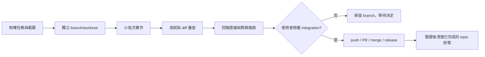

# Engineering workflow and authorization

## 文件目的

這份文件定義 TokenBar 的 worktree、branch、review、checkpoint、外部貢獻與 integration 邊界。它把「可以實作」與「可以改變遠端或主線狀態」分開，讓每次 handoff 都保留可審查證據。

## 目錄

- [工作流總覽](#工作流總覽)
- [Branch and worktree](#branch-and-worktree)
- [Review and checkpoints](#review-and-checkpoints)
- [External contributions](#external-contributions)
- [Authorization gates](#authorization-gates)
- [Dirty-checkout isolation](#dirty-checkout-isolation)

---

## 工作流總覽

計畫核准只代表可以按計畫工作，不代表可以 push、開 PR、merge、tag 或發版。每個不可逆的遠端狀態變更都要有明確的使用者授權。

## Branch and worktree

| 規則 | 做法 |
|---|---|
| Branch naming | 使用 `<type>-<kebab-summary>`，`type` 與 commit 前綴一致，例如 `docs-knowledge-base` 或 `fix-ffi-resilience`。 |
| Worktree | 需要隔離 dirty checkout 時使用獨立 worktree；不要以 stash、reset 或切 branch 方式碰使用者未提交的主 checkout。 |
| Commit scope | 讓每個 commit 對應單一可審查 concern；文件遷移可拆成 routing 與 canonical knowledge 兩個批次。 |
| Commit subject | 使用 `type(scope): imperative subject`；不把協作者署名要求當成 commit convention。 |
| Important changes | 觸及 FFI、core、vendor、契約、release chain、使用者可見行為或多檔風險時走 PR，不直接 fast-forward。 |
| Local build | 由 `Makefile` 與 `Package.swift` 決定 build order，不在 workflow 文件複製另一套 linker 事實。 |

## Review and checkpoints

每完成一個可驗收批次，就留下 checkpoint：修改檔案、canonical source、驗證命令、結果與尚未授權的下一步。文件任務也要做 diff-check、relative-link、metadata、敏感字串與檔案集合檢查；不因「只有 Markdown」而略過結構稽核。

| Change class | Minimum review |
|---|---|
| 簡單文字或單行註解 | `git diff --check` 與目標檔案檢查 |
| 多檔文件、adapter 或 contract | 完整 diff、relative links、metadata、privacy scan、fresh handoff 檢查 |
| Runtime、FFI、vendor、release | 對應 hermetic/runtime gates、self-review、必要時外部 review，再等待 integration 授權 |

## External contributions

外部 PR 先在拋棄式分支讀完整 diff，再以目前 base 重驗。若變更位於 parser、aggregate、dedup 或 FFI hot path，追蹤每個 client lane 的語意，不只看 contributor 的摘要。修正應附一個在修正前會失敗的 regression test，並保留 contributor authorship。

| 階段 | 判定 |
|---|---|
| Review branch | 可以 rebase 以便理解 diff，但不可把 rebase 後的 review branch force-push 回 contributor。 |
| Supplement | 若 maintainerCanModify 已確認，將補修套在未 rebase 的 PR head，並以 fast-forward 推送。 |
| Reply | 先準備技術回覆給使用者過目；回應 AI reviewer 只寫事實、根因、處置與 commit，不加社交肯定。 |
| Merge | 使用 rebase-and-merge 保留 authorship；合併後才清理乾淨的 topic worktree 與 branch。 |

## Authorization gates

| 動作 | 預設狀態 | 需要的明確授權 |
|---|---|---|
| 在目前 worktree 寫 code 或 docs | 允許，限任務範圍 | 不需另問，但要遵守本文件與 private boundary |
| 建立 commit | 只有使用者要求時 | 使用者明確要求 commit，或明確指定交付方式 |
| Push branch | 等待 | 使用者明確說可以 push |
| 開 PR | 等待 | 使用者明確說可以開 PR |
| Merge 或 fast-forward main | 等待 | 使用者明確說可以 merge |
| Tag、release、改 appcast/cask | 等待 | 使用者明確要求該次發版或修正 |
| 修改 dirty main checkout | 禁止 | 本任務不接受；另行取得明確授權後才可評估 |

> **授權邊界：** 綠燈不是授權。完成驗證後停止在回報點，讓使用者決定是否整合。

## Dirty-checkout isolation

若另一個 checkout 仍是 dirty，除非使用者另行明確授權，否則只能唯讀取用；不得修改、stash、reset、切換 branch 或刪除它。Private local instructions 一律留在 `.agent-local/`，不得加入 tracked tree。Branch 與 worktree 是協作隔離邊界，不保證 Git 操作不會覆寫 ignored adapter 檔案；若 handoff 或 integration 發生 collision，由主 session 回報並停止，不得藉此取得修改 dirty main checkout 的授權。

Public docs record the sanitized project conclusion, not a local guide's path, command history, credential details, or machine-specific tooling setup.
